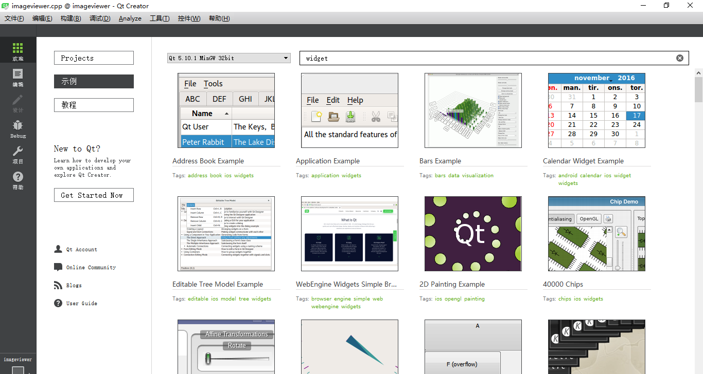
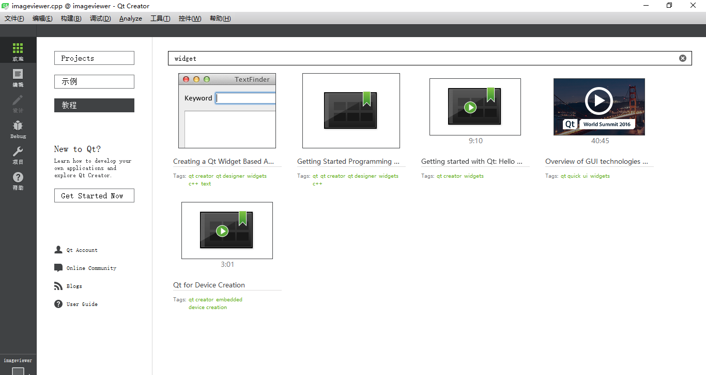

# 实习<三>显示图像基本信息
将图像的基本信息显示在对话框中，基本信息包括：图像行列值、投影参数及元数据信息等。

## 实习要求
此部分的实习内容相对容易，即将CRSImage中读取的图像的基本信息显示在对话框中，具体的内容参考Qt控件的使用。
具体可参考：
- [Qt Widget Demo]

```
					Qt Widget Demo
```


```
					Qt Widget Video
```

- Qt入门-[对话框简介](https://www.devbean.net/2012/09/qt-study-road-2-dialogs-intro/)
- Qt入门-[对话框数据传递](https://www.devbean.net/2012/09/qt-study-road-2-data-between-dialogs/)
- Qt入门-[标准对话框 QMessageBox](https://www.devbean.net/2012/09/qt-study-road-2-standard-dialogs-qmessagebox/)

---
|[Home](https://cugwhp.github.io/OOPCPP/CourseDesign/CourseDesignNew.html#%E8%AF%BE%E8%AE%BE%E5%86%85%E5%AE%B9) | [Return](#实习要求)| [Prev](./D2_FileIO.md) | [Next](./D4_Statistics.md)|