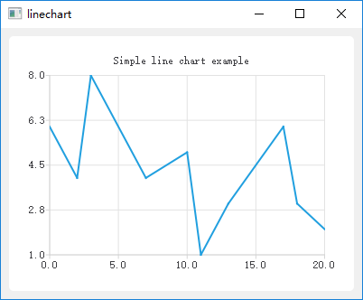
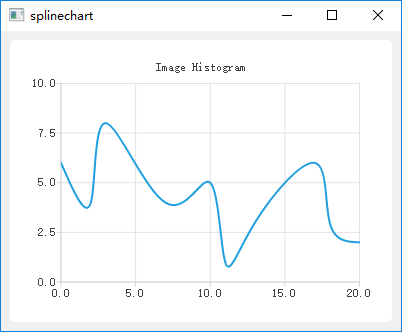

# 实习<四>统计信息显示
统计每个波段的最大值、最小值、均值、方差、直方图以图形化界面展示出来。

## 统计值
- 界面参考工程[frozencolumn Project](../Code/frozencolumn)

## 直方图
将直方图以折线图的方式予以展现。有关界面参考如下：
- lineChart

[lineChart Project](../Code/lineChart)

- splineChart

[splineChart Project](../Code/splineChart)
