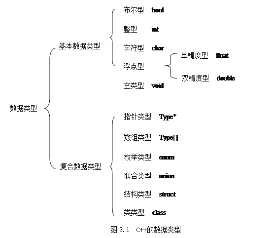

# C++重点知识点总结及习题
[TOC]

# 第1章 C++的特点

**C++的特点：**
- 1.支持抽象数据类型  
- 2.多态性，一个接口，多重算法，支持早期联编和滞后联编
- 3.继承性，保证了代码复用，支持分类的概念

一个c++程序由一个或多个函数构成，并且在这些函数中只有一个主函数main，它是程序执行的入口。

C++程序严格区别字母的大小写。

# 第2章 基本数据类型、运算符与表达式

【内容提要】
数据类型
变量与常量
运算符与表达式
简单输入与输出
【重点与难点】
## 2.1 数据类型

​    在C++程序里，每个名字都有一个与之相关联的类型，这个类型决定了可以对这个名字所指代的实体应用什么操作，并决定这些操作将如何做出解释。

图中Type表示非控数据类型。

### 2.1.1 基本数据类型

- 逻辑型：又称布尔型，用关键字bool表示。有两个值true或false。true可以转换成整数1，false可以转换成整数0。与此对应，整数也可以隐式的转换成bool值：非0的整数转换成true,0转换成false。

- 字符型：用关键字char表示。取值包含具体实现所用的字符集里的一个字符。字符型数据通常占用1个字节的存储空间。

- 整型：用关键字int表示。取值是计算机所能表示的所有整数。

- 浮点型：包括单精度型(float)和双精度型(double)。单精度型通常占用4个字节的存储空间，双精度型通常占用8个字节的空间。

- 空类型：用关键字void表示。用于说明某个函数没有返回值。没有void类型的对象。
- 在基本的数据类型前可以添加修饰符，以改变基本类型的意义。
  - signed：有符号。   

  - unsigned：无符号。
    unsigned和signed只用于修饰char和int，且signed修饰词可以省略。当用unsigned修饰词时，后面的类型说明符可以省略。对于有符号和无符号的整型数据，它们所占的存储空间的大小相同，但它们的表数范围却不相同（对字符型意义相同）。

  - short：短型。只用于修饰int，且用short修饰时，int可以省略。

  - long：长型。只用于修饰int和double。当用long修饰int时，int可以省略。


    数据类型的描述确定了其<u>内存所占空间的大小</u>，也确定了其表示范围。用sizeof(数据类型)可以确定某数据类型的字节长度。请读者查看在你所用的机器上，下面类型的最大值和最小值是什么：char、short、int、long、float、double、long double 、unsigned。 

### 2.1.2 复合数据类型

-  数组：由具有相同数据类型的元素组成的集合。 

-  结构体：由不同的数据类型构成的一种混合的数据结构，构成结构体的成员的数据类型一般不同，并且在内存中分别占据不同的存储单元。 

-  共用体：是类似于结构体的一种构造类型，与结构体不同的是构成共同体的数据成员共用同一段内存单元。

-  枚举：将变量的值一一列举出来，每个枚举成员（枚举符）都与一个整数相对应。按默认方式，枚举符所赋的值从0开始递增。枚举的值也可以用整型的表达式赋值进行初始化。如果某个枚举中所有枚举符的值均非负，该枚举的表示范围是[0: 2K -1]，其中2K是能使所有枚举符位于此范围内的最小的2的幂；如果存在负的枚举符值，该枚举的取值范围就是[-2K：2K -1]。

-  指针类型:指针类型变量用于存储另一变量的地址，而不能用来存放基本类型的数据。它在内存中占据一个存储单元。 

-  类类型:类是体现面向对象程序设计的最基本特征，也是体现C++与C最大的不同之处。类是一个数据类型，它定义的是一种对象类型，由数据和方法组成，描述了属于该类型的所有对象的性质。


## 2.2变量与常量

### 2.1.1 变量
变量：指在运行期间其值可以改变的量。
变量有三个特征：<u>变量类型、变量名、变量值</u>。

- 命名：遵循标识符命名规则。
  标识符是对实体定义的一种定义符，用来标识用户定义的常量名、变量名、函数名、文件名、数组名、和数据类型名和程序名等。只能由字母、数字和下划线组成，且以字母或下划线开头。命名时注意以下几点：
  1. C++的关键字不能用作用户自定义的实体名；
  2. 以下划线开头的名字是保留给实现或者运行环境，用于特殊目的，在应用程序里不要采用这样的名字；
  3. 大写与小写字母是区分的；
  4. 见名知义。
  5. 维持统一的命名风格。
- 定义：
  格式： <类型名><变量名>[[=<表达式>],…]
- typedef：为某种类型声明一个新名字，而不是定义一种新类型。
  格式：typedef <已有类型名> <新类型名>

### 2.1.2 常量
- 定义：程序执行期间其值不变的量。主要有下列几类常量。
  - 布尔常量
  - 字符常量
    用单引号括起的一个字符。在内存中，字符数据以ASCII码存储，如字符‘a’的ASCII码为97。以转义字符‘\’开始的字符常量后跟不同的字符表示不同的特殊字符。
  - 字符串常量
    由一对双引号括起来的零个或多个字符序列。 
> 字符串可以写在多行上，不过在这种情况下必须用反斜线‘\’表示下一行字符是这一行字符的延续。 
> 字符串常量实际上是一个字符数组，组成数组的字符除显示给出的外，还包括字符结尾处标识字符串结束的符号‘\0’，所以字符串“abc”实际上包含4个字符：‘a’、‘b’、‘c’和‘\0’。
> 注意字符常量与字符串常量在表示、存储、运算方面的区别。

	- 整型常量
	可以用十进制、八进制或十六进制表示。 
	十进制常量：一般占一个机器字长，是一个带正负号的常数（默认情况下为正数）。 
	八进制常量：由数字0开头，其后由若干0-7的数字组成，如0378，0123等。
	十六进制常量：以0x或0X开头，其后由若干0-9的数字及A-F（或小写a-f）的字母组成，如0x123，0x3ab。
	
	- 浮点型常量
	只能以十进制形式表示。共有两种表示形式：小数表示法和指数表示法。 
	如：11.3、.2、2.3e10、-2.3E-1等。
	
	- 枚举常量
	枚举声明形式: enum<枚举名>{<枚举符表>}；
	枚举符可以有两种形式：
	<枚举符名>/<枚举符名>=<整形常量> 
	
	- 符号常量
	定义形式：const<类型名> <符号常量名>=<表达式>[,…]；
	[]表示可选项，以下都采用这种标记。
	定义的符号常量必须初始化。一个符号常量可看作是一个只读变量，由const定义的常量的值不可以改变。const的最常见的用途是作为数组的界和作为分情况标号。

## 2.3 运算符与表达式

在程序中，表达式是计算求值的基本单位，它是由运算符和运算数组成的式子。运算符是表示进行某种运算的符号。运算数包含常量、变量和函数等。C++语言的运算符按其在表达式中与运算对象的关系（连接运算对象的个数）可分为：单目运算、双目运算、三目运算。

​								表2.1  C++运算符一览表
|        名称        |              运算符               | 举例                    | 优先级       | 结合性  |
| :--------------: | :----------------------------: | --------------------- | --------- | ---- |
|      作用域区分符      |               ::               | ::x                   | 1         | 左结合性 |
|      分量运算符       |             .  ->              | p.next,p->next        | 2         |      |
|     函数调用运算符      |               （）               | fac()                 |           |      |
|      下标运算符       |               []               | p[10]                 |           |      |
| 后增量、后减量  前增量、前减量 |         ++  --  ++  --         | p++  --p              | 2  3      | 右结合性 |
|      求字节运算符      |             sizeof             | sizeof(int)           | 3         |      |
|      正号、负号       |              +  -              | -1,+3                 |           |      |
|      指针运算符       |             * 和 &              | *p,&x                 |           |      |
|    分配、回收空间运算符    |          New  delete           | p=new int;  delete p; |           |      |
|    强制类型转换运算符     |             （type）             | (int)x                |           |      |
|      算术运算符       |          * / %   + -           | 3%5(取模)               | 4  5      | 左结合性 |
|      左移、右移       |             <<  >>             | 8>>3, 8<<3            | 6         |      |
|      关系运算符       |        <<= > >=  == !=         | 3<5  3!=5             | 7  8      |      |
|       位运算符       | &(按位“与”)  ^(按位“异或”)  \|(按位“或”) | 1&2  1^2  1\|2        | 9  10  11 |      |
|      逻辑运算符       |         &&    \|\|  !          | x&&y  x\|\|y  !x      | 12  13  3 |      |
|      条件运算符       |              ?  :              | a>b?x:y               | 14        | 右结合性 |
|      赋值运算符       |    = 及其扩展（+= -= *= /= %= 等）    | a=2  a+=2             | 15        |      |
|      逗号运算符       |          a=1,b=2,c=3           | 16                    | 左结合性      |      |

## 2.4 简单输入与输出
​         在C++中，I/O使用了流的概念-字符（或字节）流。每一个I/O 设备传送和接收一系列的字节，称之为流。输入操作可以看成是字节从一个设备流入内存，而输出操作可以看成是字节从内存流出到一个设备。要使用C++标准的I/O流库的功能，需要包括两个头文件：<u>iostream.h</u>用于提供基本的输入输出功能，<u>iomanip.h</u>用于提供格式化的功能。

### 2.4.1 I/O的书写格式
​         头文件iostream.h包含有cin和cout对象，对应于标准输入流和标准输出流。流读取运算符“>>”表示流的输入，可以从cin输入流中读取字符；流插入运算符“<<”表示流的输出，可以向cout输出流插入字符。

如：

``` c++
cout << "hello world." << endl;	//输出helloworld，然后换行
int i,j;
cin>>i>>j;        //输入i，j的值
```

### 2.4.2使用控制符（基本数据类型输入输出的格式控制）

C++中提供了大量的用于执行格式化输入输出的格式控制符，具体名称及作用请参看表2.2。

 							表2.2  I/O流的常用控制符

| 控制符                          | 描述                        | 所在头文件      |
| ---------------------------- | ------------------------- | ---------- |
| dec                          | 置基数为10                    | iostream.h |
| hex                          | 置基数为16                    |            |
| oct                          | 置基数为8                     |            |
| setfill(c)                   | 设填充字符为c                   |            |
| setprecision(n)              | 设显示小数精度为n位                |            |
| setw(n)                      | 设域宽为n个字符                  |            |
| setiosflags(ios::fixed)      | 固定的浮点显示                   | iomanip.h  |
| setiosflags(ios::scientific) | 指数表示                      |            |
| setiosflags(ios::left)       | 左对齐                       |            |
| setiosflags(ios::right)      | 右对齐                       |            |
| setiosflags(ios::skipws)     | 忽略前导空白                    |            |
| setiosflags(ios::uppercase)  | 16进制数大写输出                 |            |
| setiosflags(ios::lowercase)  | 16进制数小写输出                 |            |
| setiosflags(ios::showpoin)   | 显示小数点                     |            |
| setiosflags(ios::showpos)    | 显示符号（正负号）                 |            |
| setiosflags(ios::showbase)   | 在数值前输出进制（0表示八进制，0x表示十六进制） |            |

## 【典型例题】

- 例题1：对以下各种数据类型比较所占用存储空间的大小：

​        (1）char、int、short int、long int、double、long double. 

​        (2) signed int、unsigned int.

​	解答：
​	(1) 本题主要考查的知识点是各种类型所占用的存储空间的大小以及相应的表数范围。在32位计算机中，char占1个字节，short int 占2个字节，int占4个字节，long int占4个字节，double占8个字节。sizeof运算符用于求解某种数据类型的大小。short和long在修饰整型时可以省略int。答案为：	$1==sizeof(char) <= sizeof(short) <= sizeof(int) <= sizeof(long) <=sizeof(double)$

​	 (2)对于一种确定的数据类型有符号数与无符号数所占的存储空间相同，表数范围不同。修饰符signed和unsigned只能用于修饰字符型和整型。答案为：$char, int, short , long$


- 例题2：下列哪一项能用作用户自定义的标识符：

​        (a)const    (b)2var    (c)my name    (d)var2

​	解答：

​	本题主要考查标识符命名规则。C++关键字不能用于用户自定义标识符，(a)中const是关键字；第一个字符必须是字母或下划线，(b)中2var是以数字开头；不能含有空格，(c)中my name含有空格。答案为：d。

 

- ​例题3：指出下列程序中的错误：<u>__________________________________________</u>。  

```c++  int main()
{
        const int x;
        x=100;
        return 0;
}
```

​	解答：

​	本题主要考查对符号常量的理解。const定义的符号常量必须初始化,由const定义的常量的值不可以改变。所以本题有两处错误：第一、没有对符号常量x进行初始化；第二、给符号常量赋值是错误的。

 

- ​例题4：给下列表达式加上全部的括号(假设所用变量均已定义): 

```c++
a+b-c--%b
a>b?b:c>d?a:c<a?c:d
a+=a+b||e
a&b+c++
-a&&b-c
k=b=c=a
```

解答：

​	本题主要考查表达式中运算符的优先级与结合性。请参阅表2.1。为了避免出错，建议读者在书写表达式时完整书写括号。

```c++
a+b-c--%b			// (1)答案为：(a+b)-((c--)%b)
a>b?b:c>d?a:c<a?c:d	// (2)答案为：a>b?b:(c>d?a:(c<a?c:d))
a+=a+b||e			// (3)答案为：a+=((a+b)||e)
a&b+c++				// (4)答案为：a&(b+(c++))
-a&&b-c				// (5)答案为：(-a)&&(b-c)
k=b=c=a				// (6)答案为：k=(b=(c=a))
```


- 例题5：请根据下列题意写出相应的表达式。

(1) 有a、b、c、max四个变量a、b、c中的最大值，并将结果放入max中。

(2) 年龄在1到100之间（包含1和100，年龄用变量age表示）。

(3) 公式。

(4) 判断一年是否为闰年，年用year表示。满足下列两个条件之一即为闰年：①能被4整除但不能被100整除 ②能被400整除。

解答：

（1）   主要考查对条件表达式的理解和书写。答案为：max=a>b?(a>c?a:c):(b>c?b:c)。

（2）   主要考查对逻辑表达式的理解和书写。答案为：1<=age&&age<=100。

（3）   主要考查如何在计算机中表示一个数学公式。答案为：(a+b)*h/2。

（4）   主要考查对逻辑表达式的理解和书写。答案为：(year%4==0&&year%100!=0)||(year%400==0)。

 

- 例题6:下列选项中两个表达式的运算结果相同的是（  ）。

​    (a)3/2和3.0/2.0    (b)3/2和3.0/2   (c) 3/2.0和3.0/2.0    (d) 3/2.0和3/2

解答：本题考查数据类型及表达式中数据类型的隐式转换。3/2中两个操作数都为整型，运算结果仍为整型即1；3.0/2和3/2.0中一个操作数为整型另一个为浮点型，运算时整型隐式转换为浮点型，运算结果也为浮点型即1.5；3.0/2.0两个操作数均为浮点型，结果也为浮点型即1.5。答案为：(c)。

 

- 例题7:下列程序的运行结果为：______________。

```c++
#include <iostream>
using namespace std;
void main()
{
    int a=2,b=4,i=0,x;
    x = a>b && ++i;
    cout << "x：" << x << endl;
    cout << "i：" << i << endl;
}
```

​	解答：本题主要考查“短路”表达式的运算。对于表达式中的“与”运算而言，只要有一个操作数为假，结果为假。所以当第一个操作数为假时，不在求解其它操作数。对于表达式中的“或”运算而言，只要有一个操作数为真，则结果为真。所以当第一个操作数为真时，不在求解其它操作数。本题中a>b为假，所以表达式a>b&&++i为假，而++i没有执行。故i为0。答案为：$x=0, i=0$

 

- 例题8:求解下列各表达式的值（其中x的值为100）。

  (1) (a=1,b=2,c=3)

  (2) 1|3<<5

  (3) 'a'+3&&!0%1

  (4)  x%2？“odd”:” even” 

  解答：(1) 逗号表达式的值是其最后一个表达式的值。答案为：3。

  ​	(2) <<运算符的优先级高于|运算符，所以先算3<<5结果为96（二进制1100000），然后与1做按位与运算则结果为97（二进制1100001）。答案为：97。

  ​	(3) 参与本题的运算符，按优先级由高到低依次是：!运算符、算术运算符、逻辑运算符。'a'+3时字符型首先隐式转换成整型然后相加结果为100，!0%1即1%1结果为0，100&&0结果为0。答案为：0。

  ​	(4) 算术表达式的优先级高于条件表达式，所以先算x%2结果为0，0?”odd”:”even”结果为”even”。本题完成判断一个数是奇数还是偶数，若该数为奇数，则表达式的值为”odd”，为偶数，则表达式的值为”even”。答案为：”odd”。

 

- 例题9:下列程序运行结果为：_______________。

```C++
#include <iostream>
#include <iomanip>
using namespace std;

void main()
{ 
	int a=23;
 	double b=23.123456789;
	cout << a <<'\t' << b <<endl;
	cout << setprecision(0) << b <<endl;
 	cout << setiosflags(ios::fixed) << setprecision(7) << b << endl;
	cout<<setiosflags(ios::scientific)<<b<<endl;
 	cout<<setprecision(6);
 	cout<<setiosflags(ios::showbase);
	cout<<hex<<a<<'\t'<<a<<endl;
 	cout<<dec;
	cout<<setw(10)<<setfill('*')<<setiosflags(ios::left)<<a<<endl;
	cout<<setfill('');
}
```

解答：本题主要考查对格式化输入输出的掌握。

​	①本题主函数中第三行输出a,b，’\t’为转义字符，其含义是跳过一个制表位。不设置输出宽度时，默认输出6位有效数字，超出部分四舍五入。所以该行输出为：23      23.1235。

​	② setprecision(n)设置显示精度，最少显示一位有效数字。如果不重新设置，则其保持效力，所以使用完后要还原为6位默认值。第四行中设置setprecision(0)与setprecision(1)作用相同，结果显示一位有效数字即为：2e+001。

​	③setiosflags(ios::fixed)为固定的浮点显示，其后跟setprecision(n)表示小数点后显示精度为n。所以第五行输出结果为：23.1234568。

​	④setiosflags(ios::scientific)为指数显示，当其整数部分宽度大于设置的显示精度（默认为6位）时，以指数形式显示结果。否则根据设置的（或默认的）显示精度显示n位有效数字。所以第六行输出结果为：23.12346。

​	⑤setiosflags(ios::showbase)为指定在数值前输出进制。hex置基数为16，且该操作保持效力，所以使用完后应该恢复为默认值10进制。第九行输出结果为：0x17    0x17。

​	⑥setw(n) 设域宽为n个字符，setfill(c) 设填充字符为c ，setiosflags(ios::left)为左对齐。第十一行输出结果为：23********。


##【习题】

一、选择题

1.  下列数据类型不是C++语言基本数据类型的是（  ）。

    (a）字符型    (b）整型     (c）浮点型    (d）数组

2.  下列字符列中，可作为C++语言程序自定义标识符是（  ）。

    (a)x          (b）-var     (c)new      (d)3i

3.  下列数中哪一个是8进制数（  ）。

    (a)0x1g       (b)010       (c)080      (d)01b

4.  已知a=1,b=2,c=3，则表达是++a||-b&&++c的值为（  ）。

    (a)0          (b)1         (c)2        (d)3

5.  下列表达式选项中，（  ）是正确的。

    (a)++(a++)    (b)a++b     (c)a+++b    (d)a++++b

6.  已知枚举类型定义语句为：（ ）。

    ```c++
    enum color{RED,BLUE,PINK=6,YELLOW,GREEN,PURPLE=15};
    ```

    则下列叙述中错误的是（  ）。

    (a)枚举常量RED的值为1        (b)枚举常量BLUE的值为1

    (c)枚举常量YELLOW的值为7     (d)枚举常量PURPLE的值为15

7.  下列程序的运行结果正确的是（  ）。

```c++
#include<iostream.h>

#include<iomanip.h>

void main()
{
    const doublepi=3.1415926;
    cout << setprecision(3) << pi << endl
    << setiosflags(ios::fixed) << pi <<endl
    << setprecision(8) << setfill('*') << setw(12) << pi << endl;
    return;
}

```

(a)3.142

3.142

**3.14159260

(b)3.14

3.142

**3.14159260

(c)3.14

3.14

3.14159260**

(d)3.14

3.142

***3.1415926

 

8.  若int x=3,y=5;则表达式x&y++%3的值为（  ）。

    (a)0          (b)1          (c)2          (d)3

9.  下列常量正确的是（  ）。

    ​(a) ”hello World”    (b)1FL        (c) 3.14UL     (d)1.8E-3       

10.  若char x=97;,则变量x包含几个字符（ ）。

     (a)1个        (b)2个      (c)4个       (d)8个

二、填空题

1.  c++语言标示符是以字母或__________开头的，由字母、数字、下划线组成。
2.  在C++语言中，char型数据在内存中的存储形式是__________。
3.  在内存中，存储字符‘x’占用1个字节，存储字符串“x”要占用________个字节。
4.  符号常量可以用宏定义define和__________表示。
5.  转义字符序列中的首字符是_________。
6.  空字符串的长度是__________。
7.  表达式cout<<’\n’;还可以表示为__________。
8.  若要为unsignedint定义一个新的名字UINT应采用的语句是__________。
9.  以下程序不借助第3个变量实现a,b值得交换，请填空。

```c++
#include <iostream>
using namespce std;

Void main()
{
	int a,b;
	cout << ”输入a,b：”;
	cin >> a >> b;
	a = _________;	//a+b
	b = _________;	//a-b -> a+b-b = a
	a = _________;	//(a-b
	cout << a << ’\t’ << b <<endl;
}

```


 

\10. 大多数C++程序都要包含头文件__________。该文件中包含了所有输入/输出流操作所需的基本信息。当使用带参数的操作时，程序中必须包含头文件__________。

 

三、编程题

1.  编写一个程序，输入一个三位数，分别输出该数的百位、十位和个位。

2.  编写一个程序打印出各种基本数据类型、几个你自己定义的复合数据类型的大小。使用sizeof运算符。


【参考答案】

一、选择题

1． d

2． a

3． b

4． b

5． c

6． a

7． b

8． c

9． d

10． a

二、填空题

1． 下划线

2． ASCII

3． 2

4． const

5． \

6． 0

7． cout<<endl;

8． typedef unsignedint UINT;

9． a+b      a-b      a-b

10． iomanip.h      iostream.h

三、编程题

1．

\#include<iostream.h>

void main()

{

   int num,var1,var2,var3;

   cout<<"请输入一个三位数："<<endl;

   cin>>num;

   if(num>999||num<100)     //用于检查输入数据的合法性

​            cout<<"您的输入有误!"<<endl;

   else

   {

​            var1=num/100;

​            var2=(num-var1*100)/10;

​            var3=num%10;

​            cout<<"百位数为："<<var1<<endl

​                      <<"十位数为："<<var2<<endl

​                      <<"个位数为："<<var3<<endl;

   }

}

2．

\#include<iostream.h>

\#include<iomanip.h>

void main()

{ 

​          int array[10];

​          enummonth{Jan,Feb,Mar,Apr,May,Jun,Jul,Aug,Sep,Oct,Nov,Dec};

​          char*p;

​           cout<<"The size of charis:"<<sizeof(char)<<endl

​                <<"Thesize of int is:"<<sizeof(int)<<endl

​                <<"Thesize of short int is:"<<sizeof(short int)<<endl

​              <<"The size of long int is:"<<sizeof(longint)<<endl

​              <<"Thesize of float is:"<<sizeof(float)<<endl

​              <<"Thesize of double is:"<<sizeof(double)<<endl

​                    <<"The size oflong double is:"<<sizeof(long double)<<endl

​                    <<"The size ofsigned int is:"<<sizeof(int)<<endl

​                    <<"The size ofunsigned int is:"<<sizeof(unsigned)<<endl

​                    <<"The size ofarray is:"<<sizeof(array)<<endl

​                    <<"The size ofmonth is:"<<sizeof(month)<<endl

​                             <<"Thesize of p is:"<<sizeof(p)<<endl;

​           }

# 第3章C++程序的流程控制

【内容提要】

顺序控制语句

选择控制语句

循环控制语句

跳转语句

 

【重点与难点】

3.1 顺序控制语句

指按照语句在程序中出现的先后次序一条一条的顺次执行。包含声明语句，表达式语句，输入输出语句等。

3.1.1 表达式语句

​    任何一个表达式（上一章中给出了详细介绍）后面加上一个分号就构成了表达式语句（没有分号的不是语句）。常见的表达式语句有以下几种：空语句、赋值语句、函数调用语句等。

        空语句：指只有一个分号而没有表达式的语句，它不作任何操作和运算。

​           格式为：  ； 

​           空语句被用在程序的语法上要求一条语句而逻辑上却不需要的时候。

        函数调用语句：是由函数调用表达式加一个语句结束标志（分号“；”）构成的语句。函数的定义和使用请参见第五章中的详细介绍。

3.1.2 输入/输出语句

​    C++程序没有输入/输出语句，它的输入/输出功能由函数（scanf、printf）或流控制来实现。printf和scanf是标准的输入输出函数，主要在C程序设计中使用，其声明包含在头文件stdio.h中。在C++中，I/O流完全取代了它们，使用I/O流输入输出时，必须包含头文件iostream.h。

​    从键盘输入语句格式为： cin>>表达式1[>>表达式2>>…]；

​    向屏幕输出语句格式为： cout<<表达式1[<<表达式2<<…]；

​    注意：连续输入多项数据时应键入空白字符（包括空格键、回车键和Tab键）将相邻的两项数据分开。而连续输出时，cout不会在相邻数据项间加分隔符，为了增强显示效果，用户可通过控制符自定义显示宽度，换行等（部分控制符在iomanip.h头文件中声明）。

3.1.3 复合语句

   C++语言允许把一组语句用一对花括号括起来，构成一个复合语句。复合语句被视为一个独立的单元它可以出现在程序中任何单个语句可以出现的地方复合语句不需要用分号作为结束。注意空语句；和空复合语句 { } 是等价的。

 

3.2 选择控制语句

​    针对于不同情况采用不同的处理方式的问题，用选择结构来实现。选择语句包含：if语句和switch语句。

3.2.1 if语句

        if语句：

​    格式：if(<条件表达式>) <语句>

作用：当<条件表达式>为真时，执行<语句>，否则直接执行if语句后边的语句。

这里的<语句>可以是一条语句，也可以是几条语句，但对于多条语句的情况必须用{ }将几条语句括起来构成复合语句，在if语句中当做一个整体处理。

        if…else语句：

​    格式：if(<条件表达式>)  

​               <语句1>

​          else

​               <语句2>

作用：当<条件表达式>为真时，执行<语句1>；当<条件表达式>为假时，执行<语句2>。

这里<语句1>和<语句2>可以是一条语句也可以是复合语句。

说明：

①if语句有时可以用条件表达式替代。

②if语句支持多种形式的嵌套使用，但一般嵌套层次不超过三层。另外约定else总是与它上边最近的一个if配对。为了防止语法或逻辑错误的发生，建议在较复杂的情形中使用花括号区分。

3.2.2 switch语句

​    格式：switch(<表达式>){

case <常量表达式1>：<语句序列1>

case <常量表达式2>：<语句序列2>

…

case <常量表达式n>：<语句序列n>

[default：<语句序列n+1>]

}

   作用：计算<表达式>判断它与哪个<常量表达式>匹配，执行第一个相匹配的<常量表达式>后的语句，直到遇到break转去执行switch语句以外的语句；如果均不匹配则执行default后定义的语句（在default省略的情形中，直接执行switch语句以外的语句）。

​    说明：

​    ①switch语句中的<表达式>的值只能是整型、字符型或枚举型表达式。

②switch语句中，case和其后的<常量表达式>间必须有空格否则会产生逻辑错误。case后的<常量表达式>的值是互不相同的，且它的类型与switch后的<表达式>的类型一致。

③通常情况下，每个case分支语句结束后都要加一个break语句来结束switch语句。但在要表示一个范围，或描述一类对象时（如A,B,C都属于合格，D属于不合格）有可能几条case分支语句后才有一个break语句。

④switch语句与嵌套的if语句都可以用于处理多分支选择的问题。

 

3.3 循环控制语句

对于同一个语句或同一组语句序列需要重复多次，则采用循环结构。C++提供了三种循环控制语句：while语句，do…while语句，for语句。

3.3.1 while语句

​    格式：while(<条件表达式>)

​               <语句>

作用：判断<条件表达式>是否为真，若为真则执行<语句>，然后重复判断，直到<条件表达式>为假时跳出while循环执行其后的语句。

说明：

①这里的<语句>可以是单条语句也可以是复合语句。

②当<条件表达式>在循环开始就不满足，则不执行while循环也就是说while循环有可能一次都不执行。

3.3.2 do…while语句

​    格式： do{

​              <语句>

​             }while(<条件表达式>)；

​    作用：当流程到达do后，立即执行循环体语句，然后再对条件表达式进行判断。若<条件表达式>的值为真，则重复执行循环体语句，直到<条件表达式>为假时退出循环，执行do…while循环后的语句。

​    说明：这种循环中<语句>至少执行一次，当条件在循环开始时就不满足时这种做法是危险的，所以应尽量使用while语句而避免使用do…while语句。

3.3.3 for语句

​    格式：for(<表达式1>；<表达式2>；<表达式3>)

​             <语句>

作用：<表达式1>可以称为初始化表达式，一般用于对循环变量进行初始化或赋初值；<表达式2>可以称为条件表达式，当它的判断条件为真时，就执行循环体<语句>，否则终止循环，退出for循环；<表达式3>可以称为修正表达式，一般用于在每次循环体执行之后，对循环变量进行修改操作。

说明：

①这里的<语句>可以是一条语句也可以是复合语句。

②for循环中三个表达式可能省略一个、两个或三个都省略，但它们之间分号在三种情况下都不可以省略。

 

3.4 跳转语句

3.4.1 break语句

​    格式：break；

​    作用：结束当前正在执行的循环（for、while、do…while）或多路分支（switch）程序结构，转而执行这些结构后面的语句。

​    说明：在循环结构中使用时，如果有多层循环，只跳出其所在的最近的循环层。

3.4.2 continue语句

​    格式：continue；

   作用：结束当前正在执行的这一次循环（for、while、do…while），接着执行下一次循环。即跳过循环体中尚未执行的语句，接着进行下一次是否执行循环语句的判定。

 

【典型例题】     

例题1：下列程序的运行结果为__________。

​       #include<iostream.h>

​       void main( )

​       {

​        char c=’@’ ;

​        if (c>='A' && c<='Z')  cout<<"是大写字母 " ;

​        else if (c>='a' && c<='z')  cout<<"是小写字母";

​            else  cout<<"是其它字符";

​        }

解答：

本题主要考查if语句的嵌套使用方法。首先判断字符变量c是否满足c>='A'&& c<='Z'，如果满足则输出"是大写字母 "；否则判断c是否满足c>='a' && c<='z'，如果满足则输出"是小写字母"否则输出"是其它字符"。else总是与离它最近的前一个if配对。

答案为：是其它字符。

例题2：已定义：char grade;  ，若成绩为A、B、C时输出合格，成绩为D时输出不合格，其他情况提示重新输入。要完成以上功能，则下列switch语句正确的是（  ）。

(a)  switch(grade){

 case  ‘A’:

 case  ‘B’:

 case  ‘C’: cout<<”合格”;break;

 case  ‘D’: cout<<”不合格”;break;

 default: cout<<”请重新输入：”;

}

(b)  switch(grade){

 case  ‘A’:

 case  ‘B’:

 case  ‘C’: cout<<”合格”;

 case  ‘D’: cout<<”不合格”;

 default:cout<<”请重新输入：”;

}

(c)  switch(grade){

 case‘A’, ‘B’, ‘C’: cout<<”合格”;break;

 case ‘D’: cout<<”不合格”;break;

  default:cout<<”请重新输入：”;

}

(d)  switch(grade){

 case  A:

 case  B:

 case  C: cout<<”合格”;break;

 case  D: cout<<”不合格”;break;

  default:cout<<”请重新输入：”;

}

解答：

本题主要考查switch语句的使用。在switch语句执行过程中，找到第一个相匹配的表达式后，转去执行该case后的语句，直到遇到break语句后跳出switch语句执行其后的语句。对于选项b，若grade的值为A则执行结果为“合格不合格请重新输入”，不满足本题的要求；switch语句多个case分支不能简写为多个表达式之间用逗号隔开的一个case分支，选项c错误；case后的表达式只能是整型、字符型或枚举型常量表达式，选项d中case后的A、B、C、D是变量。答案为：a。

 

例题3：找出并改正下列程序段中的错误：

(1) if(x>0);-------------①

 y=x+1;-------------②

else;----------------③

   y=x-1;-------------④

(2) While(i) --------------------①

{ cout<<i<<endl; ----------②

​    i--;}--------------------③

(3) int i=1,sum; --------①

while(i<=100)  ------②

{ sum+=i; -----------③

​    i++;}-------------④

(4) int i=1,sum=0;-------------①

do{ -----------------------②

   sum+=i; -----------------③

   i++;}while(i<=100) ------④

解答：

本题中包含了初学者在编程中容易犯的一些错误，提醒读者注意。

(1)本题考查对if语句的语法结构的掌握。本题的错误在于在if和else后不应加分号。答案为：将①、③句末的分号去掉。

(2)C++是大小写敏感的语言。答案为：将①中While改为while。

(3)本题目的是完成1到100求和，结果放在sum中，但是sum在参与运算前应该首先对其赋值。答案为：将①改为 int i=1,sum=0;

(4)本题主要考查对do…while的语法结构的掌握以及与while结构进行对比区别两者在作用和语法上的不同。答案为：将第④行while后加分号即while(i<=100);

 

例题4：循环语句for(inti=0;i<=5&&!i;i++) cout<<i<<endl;执行循环次数为（  ）。

​      (a) 1次      (b)3次     (c) 5次      (d)6次

解答：

本题考查对for循环的理解以及表达式运算。执行for循环i的初值为0，第一次循环时表达式0<=5&&!0结果为1所以执行循环体输出0；然后i自加为1，计算表达式1<=5&&!1结果为0，所以退出循环。答案为：a。

 

例题5：程序段：

inti,sum=0;

for(i=1;i<=100;sum+=i,i++);

与上边程序段不等价的是（  ）。

(a) int sum=0,i=1;

do{

 sum+=i++;

 }while(i<=100);

(b) int i=1,sum=0;

while(i<=100)

{           

  sum+=i++;

}

(c) int i=1,sum=0;

while(1)

{

if(i>100)

  break;

sum+=i++;

}

(d) int i,sum=0;

for(i=1;i<=100;i++,sum+=i);

解答：

本题主要考查对各种循环结构的以及它们之间转换关系的理解。本题中的程序段是求解1到100的和，循环结束后i的值为101，sum的值为5050。选项a、b分别用do…while和while循环完成求解1到100的和；选项c是永真循环，通过break语句退出循环，其作用也是求解1到100的和；选项d中i先自加然后求和，其作用为求解2到101的和，循环结束后i的值为101，sum的值为5150。答案为：d。

 

例题6：运行下列程序的结果为（1）____________________。（2）___________________。

（1）

\#include<iostream.h>

void main()

{

  int x,y,cmultiple;

  cout<<"输入两个整数:";

  cin>>x>>y;

  cmultiple=x;

  while(1)

  {

   if(cmultiple%y==0)break;

​    cmultiple+=x;

   }

  cout<<"最小公倍数:"<<cmultiple<<endl;

}

输入：24

​      7

（2）

\#include<iostream.h>

void main()

{

  int x,y,var1;

  cout<<"输入两个整数：";

  cin>>x>>y;

 if(x<y)var1=x,x=y,y=var1;

  var1=x%y;

  while(var1)

   {

   x=y;y=var1;var1=x%y;

​    }

   cout<<"最大公约数:"<<y<<endl;

}

输入：24

7

解答：

本题考查理解程序的能力。(1)中求解两个数x,y的最小公倍数思路为若x能够被y整除则x就是这两个数的最小公倍数，否则判断x的整数倍是否能被y整除，直到x的某个倍数可以被y整除，则该数即为这两个数的最小公倍数。(2)中求解两个数x,y的最大公约数思路为用两个数中较大的数作为被除数，较小的数作为除数，如果能够整除则较小的数就是这两个数的最大公约数，否则，将较小的数作为新的被除数，将两个数的模作为除数，重复以上工作直到模为0，则这个除数就是x和y的最大公约数。

答案为：(1) 最小公倍数:168   (2) 最大公约数:1

 

例题7：以下程序的功能是输出1到100之间每位数的乘积大于每位数的和的数，如对数字12有1*2<1+2，所以不输出这个数；对数字23有2*3>2+3所以输出这个数。请填空。

\#include<iostream.h>

void main()

{

​     int num,product=1,sum=0,n;

​     for(num=1;num<=100;num++)

​     {

​       product=1;sum=0;

​        ________①__n=num ______;

​        while(_____②__n___)

​        {

​           product*=n%10;sum+=n%10;

​           _______③__n/=10____;

​        }

​        if(product>sum) cout<<num<<endl;

​     }

}

解答：

本题中变量num用于表示1到100的整数，变量product用于存放每位数的乘积，变量sum用于存放每位数的和，变量n用于存放求解每位数的中间结果。外层for循环用于控制判断1到100的数，内层while循环用于计算每位数的积与每位数的和，if语句用于判断该数的每位数的乘积是否大于每位数的和，若满足此条件，则输出这个数。在①处要对n赋值，最初它是num的副本而后用于存放计算每位数的中间结果；②处为退出while循环的条件，当当前这个数的每位数都被取出，则内层循环结束；③改变循环变量的语句，使得循环在某种情况下可以结束，这里取n除10的商，直到商为0时结束内层循环。

答案为：① ②  ③

 

 

例题8：以下程序的功能是判断一个数是否为素数。请填空。

\#include<iostream.h>

void main()

{

​     int num;

​     cout<<"输入一个正整数：";

​     _________①________;

​     int isprime=1;

​     for(int i=2;i<=num-1;i++)

​        if(________②________)

​        {

​           isprime=0;

​           ______③______;

​        }

​     if(isprime)

​       cout<<num<<" 是一个素数。"<<endl;

​     else

​       cout<<num<<" 不是一个素数。"<<endl;

}

解答： 

本题中变量num存放要判断的数，变量isprime用于记录该数是否为素数，当isprime为1时即该数为素数，否则为合数。判断思路为如果num能被2到num-1的任意一个数整除则该数不是素数。①处需要输入待判断的数，②处为判断条件，当检测到2到num-1中第一个能整除num的数时则可判断出该数不是素数，此时退出循环，故③为退出语句。

答案为： ①cin>>num    ②num%i==0    ③break

 

例题9：编写一个程序，输入一个正整数，判断它是否能被3，5，7同时整除。

解答：

参考程序如下

\#include<iostream.h>

void main()

{

​     int num;

​     cout<<"请输入一个正整数：";

​     cin>>num;

​     if(num<0) 

​       cout<<"输入有误!";

​     else

​        if(num%3==0&&num%5==0&&num%7==0)

​           cout<<num<<" 能被3、5、7同时整除。"<<endl;

​        else

​           cout<<num<<" 不能被3、5、7同时整除。"<<endl;

 

}

 

例题10：编写一个程序，让用户输入年和月，然后判断该月有多少天。

解答：

算法思想：判断某年某月有多少天，每个月的天数有四种可能：1、3、5、7、8、10、12月为31天，4、6、9、11月为30天，闰年的2月有29天，不是闰年则2月为28天。因为每月的天数有多种可能，我们选择用switch语句解决本题。程序流程是首先输入要判断的年月，然后判断该年月应有多少天，最后输出结果。

参考程序如下：

\#include<iostream.h>

void main()

{

  int year,month,days,leap;

  cout<<"请输入年月:";

 cin>>year>>month;

  switch(month)

  {

   case 1:

   case 3:

   case 5:

   case 7:

   case 8:

   case 10:

   case12:days=31;break;

   case 4:

   case 6:

   case 9:

   case11:days=30;break;

   case2:if(year%400==0)

​           leap=1;

​        else if(year%4==0&&year%100!=0)

​                   leap=1;

​              else leap=0;

​        if(leap)  days=29;

​        else    days=28;

}

   cout<<year<<"年"<<month<<"月的天数为:"<<days<<endl;

}

 

例题11：编写一个程序。计算若一头母牛，它每年年初生一头小母牛，每头小母牛从出生起第四个年头开始每年也生一头小母牛，按此规律，第10年时有多少头母牛？

解答：

算法思想：

        

假设f(n)表示第n年的母牛数，已知f(0)=0,f(1)=2,f(2)=3,f(3)=4,推得在第n年时应有f(n-3)头母牛生育出f(n-3)头母牛，所以第n年共有f(n-1)+f(n-3)头母牛。据此得出数学表达式：f(n)=f(n-1)+f(n-3)。在下边的参考程序中分别用变量sum、sum1、sum2、sum3表示f(n),f(n-1),f(n-2),f(n-3)其中n从4变化到10。

 

参考程序如下：

\#include<iostream.h>

void main()

{

​    int sum1=2,sum2=3,sum3=4,sum=0,n=10;

​    for(inti=4;i<=n;i++)

​    {

​       sum=sum1+sum3;

​       sum1=sum2;

​       sum2=sum3;

​       sum3=sum;

​    }

​    cout<<"第十年有"<<sum<<"头牛!"<<endl;

}

 

例题12：计算当通项时停止计算。

解答：

算法思想：

本题主要考查学生对循环结构的运用以及对数学问题编程技巧的掌握。本题为有规律的若干项相加，所以采用循环结构处理。循环的条件是当时继续运算直到这个条件不满足时就达到了题目要求的精度，则停止运算。循环体中完成三件事，首先是求出本次（第i次）循环中的的值，然后计算当前的e，最后完成循环变量增1的操作。在求解本题时主要注意计算中所采用的变量的数据类型以及如何完成运算精度的控制。

参考程序如下：

\#include <iostream.h>

int main()

{

​       double e=1.0;

​       double x=1.0;

​       int i=1;

​      while(x>=1.0e-7)

​       {

​        x=x/i;

​        e=e+x;

​        i=i+1;

​       }

​       cout <<"e = " << e<<endl;

​       return 0;

}

【习题】

一、             选择题

1．  在循环语句中使用break语句的作用是（  ）。

(a)结束本次循环    (b)结束该层循环    (c)结束所有循环   (d)结束程序执行

2．  对if后的括号中的表达式，要求i不为0的时候表达式为真，该表达式表示正确的为（  ）。

(a)i       (b)!i     (c)i<>0       (d)i=0

3．  下列循环语句的执行次数是（  ）。

while(!1)cout<<”ok!”;

(a)0次      (b)1次    (c)2次      (d) 无数次

4．  运行下列程序结果为（  ）。

\#include<iostream.h>

void main()

{

   int i;

   for (i=0;i<=10;i++){

​       if (i%2) cout<<i;

​       else continue;

   }

}

(a)246810     (b)12345      (c)678910     (d)13579

 

二、             填空题

1．    结构化程序设计的三种基本结构是__________、__________、__________。

2．    continue语句实现的作用是________________________________________。

3．若输入”china 2008!”,运行下列程序的输出结果为___________________________。

\#include <iostream.h>

\#include <stdio.h>

void main( )

{

​    char c;

​    int letters=0,digits=0,others=0;

​    cout<<"Please input aline charaters"<<endl;

​    while ((c=getchar( ))!='\n')

​    {

​        if(c>='a' && c<='z' || c>='A' && c<='Z' )

​           letters++;

​        else

​           if (c>='0' && c<='9')

​               digits++;

​           else

​               others++;

​    }

   cout<<"letters:"<<letters<<endl

​       <<"digits"<<digits<<endl

​       <<"others"<<others<<endl;

}

4．本程序完成1!+2！+……+18!的计算，请将程序补充完整。

\#include<iostream.h>

\#include<iomanip.h>

void main()

{

​    double sum=0,fac=1;

​    for(int i=1;i<=18;i++)

​    {   

​        ___________①____________

 

​       ____________②___________

​    }

​    cout<<"1!+2!+……+18!="

​        <<setiosflags(ios::fixed)<<setprecision(0)

​       <<sum<<setprecision(6)<<endl;

}

 

三、             编程题

1.      输入某学生成绩，若成绩在90-100输出＂优秀＂，若成绩在80-89输出＂良好＂，若成绩在70-79输出＂中＂，若成绩在60-69输出”及格”，若成绩在0-59输出”不及格”。

2.      输入三人数，按从小到大的大顺序输出。

3.      在100～200中找出同时满足用3除余2，用5除余3和用7除余2的所有整数。

4.      求100～999中的。所谓水仙花数是指一个三位数，它的每位数字的立方之和等于该数。例如，因为153＝13＋53＋33，所以153为水仙花数。

5.      求1000之内的所有完数。所谓完数是指一个数恰好等于它的所有因子之和。例如，6＝1＋2＋3，所以6为完数。

6.      编一程序显示如下图案：

*

\* * *

\* * * * *

\* * * * * * *

\* * * * * * * * *

\* * * * * * * 

\* * * * *

\* * * 

*

7.    编一程序显示如下图案：

A

A B C

A B C D E

A B C D E F G

 

8.    猴子吃桃问题。猴子第一天摘下若干个桃子，当即吃了一半，还不过瘾，又多吃了一个。第二天早上又将剩下的桃子吃掉一半，又多吃了一个。以后每天早上都吃了前一天剩下的一半零一个。到第10天早上想再吃时，发现只剩一个桃子了，求猴子第一天究竟摘了多少个桃子？

9.    编程序模拟剪刀，石头和纸游戏。游戏规则为：剪刀剪纸，石头砸剪刀，纸包石头．玩游戏者从键盘上输入Ｓ（表示剪刀）或Ｒ（表示石头）或Ｐ（表示纸），要求两个游戏者交替输入，计算机给出输赢的信息。

10.    编写程序输出菲波那切数列的前20项。即前两项为1，以后每一项为前两项之和。

11.    打印九九乘法表。


【参考答案】

一、选择题

\1. b 

\2. a

\3. a

\4. d

二、填空题

1．顺序结构、选择结构（分支结构）、循环结构

2．跳出本次循环。

3．

please input a line charaters

letters:5

digits:4

others:2

 

4．①fac*=i;  ②sum+=fac;

 

 

三、编程题

1．

\#include<iostream.h>

void main()

{

​      double grade;

​      char* degree;

​      cout<<"请输入学生成绩：";

​      cin>>grade;

​      if(grade>100||grade<0)

​      {

​             cout<<"您的输入有误!"<<endl;

​             return;

​      }

​      else

​             if(grade>=70)

​                    if(grade<80)

​                           degree="中";

​                    else if(grade<90)

​                                  degree="良好";

​                            else

​                                  degree="优秀";

​             else if(grade>=60)

​                       degree="及格";

​                     else

​                       degree="不及格";

 

​      cout<<"分数:"<<grade<<endl

​             <<degree<<endl;

}

2．

\#include<iostream.h>

void main()

{

​      int num1,num2,num3,num;

​      cout<<"请输入三个**整数**：";

​      cin>>num1>>num2>>num3;

​      if(num1>num2)

​      {

​             num=num1;

​             num1=num2;

​             num2=num;

​      }

​      if(num1>num3)

​      {

​             num=num1;

​             num1=num3;

​             num3=num;

​      }

​      if(num2>num3)

​      {

​             num=num2;

​             num2=num3;

​             num3=num;

​      }

​      cout<<"三个数按从小到大输出为："<<endl

​             <<num1<<endl

​             <<num2<<endl

​             <<num3<<endl;

}

3．

\#include<iostream.h>

void main()

{

​      cout<<"在100～200中同时满足用3除余2，用5除余3和用7除余2的整数为："<<endl;

​      for(int i=100;i<=200;i++)

​      {

​             if(i%3==2&&i%5==3&&i%7==2)

​                    cout<<i<<endl;

​      }

}

4．

\#include<iostream.h>

\#include<math.h>

void main()

{

​      int x,y,z,sum;

​      cout<<"100～999中的水仙花数为："<<endl;

​      for(int i=100;i<=999;i++)

​      {

​             x=i/100;

​             y=i%100/10;

​             z=i%10;

​             sum=pow(x,3)+pow(y,3)+pow(z,3);

​             if(i==sum)

​                    cout<<i<<endl;

​      }

}

5．

\#include<iostream.h>

void main()

{

​      int sum;

​      cout<<"1000之内的所有完数为："<<endl;

​      for(int i=1;i<=1000;i++)

​      {

​             sum=0;

​             for(int j=1;j<=i/2;j++)

​                    if(i%j==0)

​                           sum+=j;

​             if(i==sum)

​                    cout<<i<<endl;

​      }

}

 

6．

\#include<iostream.h>

void main()

{

​      int i,j,n;

​      cout<<"请输入上三角行数：";

​      cin>>n;

​      for(i=1;i<=n;i++)

​      {

​             for(j=1;j<=(n-i)*2;j++)

​                    cout<<' ';

​             for(j=1;j<=2*i-1;j++)

​                    cout<<"* ";

​             cout<<endl;

​      }

​      for(i=n-1;i>=1;i--)

​      {

​             for(j=1;j<=(n-i)*2;j++)

​                    cout<<' ';

​             for(j=1;j<=2*i-1;j++)

​                    cout<<"* ";

​             cout<<endl;

​      }

}

7．

\#include<iostream.h>

\#include<iomanip.h>

void main()

{

​      int i,j;

​      char x;

​      for(i=1;i<=4;i++)

​      {

​             x='A';

​             for(j=1;j<=2*(4-i);j++)

​                    cout<<' ';

​             for(j=1;j<=2*i-1;j++)

​             {

​                    cout<<setw(2)<<x;

​                    x+=1;

​             }

​             cout<<endl;

​      }

}

8．

\#include<iostream.h>

void main()

{

​      int peach=1;

​      for(int day=1;day<10;day++) //day表示n天前

​             peach=2*(peach+1);

​      cout<<"猴子第一天摘了"<<peach<<"个桃子！";

}

9．

\#include<iostream.h>

void main()

{

​      char play1,play2;

​      char* result;

​      cout<<"请两位玩家顺序输入Ｓ（表示剪刀）或Ｒ（表示石头）或Ｐ（表示纸）：";

​      cin>>play1>>play2;

​      if((play1=='R'||play1=='S'||play1=='P')&&(play2=='R'||play2=='S'||play2=='P'))

​      {

​             switch(play1)

​             {

​             case 'S':

​                    if(play2=='R') result="玩家2赢！";

​                    else if(play2=='P') result="玩家1赢！";

​                         else result="平局！";

​                    break;

​             case 'R':

​                    if(play2=='P') result="玩家2赢！";

​                    else if(play2=='S') result="玩家1赢！";

​                         else result="平局！";

​                    break;

​             case 'P':

​                    if(play2=='S') result="玩家2赢！";

​                    else if(play2=='R') result="玩家1赢！";

​                         else result="平局！";

​                    break;

​             }

​             cout<<result<<endl;

​      }

​      else

​             cout<<"输入有误!"<<endl;

}

10．

\#include<iostream.h>

void main()

{

​      int item,item1=1,item2=1;

​      cout<<"菲波那切数列的前20项为："<<endl;

​      cout<<item1<<endl

​             <<item2<<endl;;

​      for(int i=3;i<=20;i++)

​      {

​             item=item1+item2;

​             cout<<item<<endl;

​             item1=item2;

​             item2=item;

​      }

}

11．

\#include<iostream.h>

\#include<iomanip.h>

void main()

{

​      cout<<setw(3)<<'*';

​      for(int title=1;title<=9;title++)

​             cout<<setw(3)<<title;

​      cout<<endl;

​      for(int row=1;row<=9;row++)

​      {  

​             cout<<setw(3)<<row;

​             for(int line=1;line<=row;line++)

​                    cout<<setw(3)<<row*line;

​             cout<<endl;

​      }

}

 

 

**第4章        ****数组******

【内容提要】

一维数组

二维数组

多维数组

【重点与难点】

4.1 数组的基本概念

​    数组是由一组具有相同数据类型的元素组成的集合。数组的类型就是这组元素的数据类型。构成数组的这组元素在内存中占用一组连续的存储单元。可以用一个统一的数组名标识这一组数据，而用下标来指明数组中各元素的序号。根据数组维数的不同，可分为一维数组、二维数组和多维数组，常用的是一维和二维数组。

4.1 一维数组

4.1.1一维数组的定义与初始化

-  一维数组的定义

​    定义格式：  类型 数组名[常量表达式]；

​    说明：

​    ①类型为第二章中介绍的数据类型，这里的类型是数组的类型也就是数组中每个元素的类型。

​    ②数组名是一个标识符，代表数组在内存中的起始地址。数组中各元素在内存中连续存储。

​    ③常量表达式又称下标表达式，就是数组中的元素个数。通常采用符号常量，这样使得程序的伸缩性更强。

-  一维数组的初始化

在定义数组时对其中的全部或部分元素指定初始值，这称为数组的初始化。

初始化的格式为：  类型  数组名[常量表达式]={值1，值2，…，值n}；

​         说明：

​         ①只有存储类别为静态的或外部的数组才可以进行初始化。

​         ②当初始化的元素比数组中的元素个数少时，则按顺序对前一部分元素赋初值，其余元素自动初始化为0或空字符‘\0’（对字符数组）；当初始化的元素超过数组元素个数时，编译器会报错。****

​    ③当初始化元素个数与数组实际元素个数相等时，可以省略数组长度但[]不能省略。

​    ④对字符数组进行初始化可以对每个数组元素一一赋初值，也可将一个字符串直接赋值给一个数组。但要注意数组长度除了包含字符串中字符个数还包含一个’\0’字符。

 

4.1.2 访问数组元素

​    格式：   数组名[下标]

​    说明：对于一个有n个元素的数组，其下标从0开始到n-1。在引用时要防止越界引用，这样会引起逻辑错误。可以通过sizeof(数组名)/sizeof(数组类型)来求得实际的数组长度。

 

4.2 二维数组

4.2.1 二维数组的定义与初始化

-  二维数组的定义

​    定义格式：  类型 数组名[常量表达式1][常量表达式2]；

​    说明：

​    ①数组名是一个标示符，代表数组在内存中的起始地址，二维数组按“先行后列”的顺序被存储在一维的存储空间中的。

​    ②常量表达式1表示数组的行数，常量表达式2表示数组的列数。 

-  二维数组的初始化

对二维数组的初始化主要有两种形式：

第一、  数值按行用花括号分组对二维数组初始化。

第二、  所有数值按顺序在一个花括号中给出。

​    说明：

​    ①对以上两种形式，如果没有给出所有数组元素，则剩余元素自动初始化为0。

②若在一个花括号中对所有元素赋初值或者按行用花括号分组而组内元素部分或全部赋值，则可以缺省第一维的长度，但是[]不能省略，并且在任何情况下，二维数组第二维的长度均不可省略。 

 

4.2.2 访问数组元素

​    格式：  数组名[下标1][下标2]

​    说明：

​    若该数组为n行m列的二维数组，则下标1从0到n-1，下标2从0到m-1。

【典型例题】

例题1：下面定义数组的语句正确的是（  ）。

(a) int i=6;char a[i]= “hello”;

(b) const int i=5;chara[i]= “hello”;

(c) char a[6]=”hello”;

(d) char a5=”hello”;

解答：

本题主要考查字符数组在定义及初始化时需要注意的问题。数组定义中数组长度不能指定为除const变量以外的变量，选项a中i为变量；选项b中字符串“hello”含有6个字符，而数组a的长度是5所以编译器报错；选项d中a5是一个字符变量而不是字符数组，而“hello”含有6个字符，无法放在一个字符变量中。所以答案为：c

 

例题2：已知数组a定义为：int a[][3]={{1,2,3},{4}};， 则a[1][2]的值为（  ）。

(a)2      (b)3     (c)4      (d)0

解答：

在对数组进行初始化时只给出部分元素的初始值，则剩余元素自动初始化为0。答案为：d。

 

例题3：已知数组定义为inta[2][4];，下列对数组元素引用正确的为（ ）。

(a)a[1,2]      (b)a[1][2]      (c)a(1,2)      (d)a[1][4] 

解答：

对二维数组的引用格式为：数组名[下标1][下标2]；n行m列的二维数组其第一维的下标从0到n-1，第二维的下标从0到m-1。选项a和c引用格式错误，d中下标越界。

答案为：b。

 

例题4：下列程序段错误的是（  ）。

(a)char str1[8];

cin>>str1;

(b)char str1[8];

strcpy(str1,”first”); 

(c)char str1[8];

for(inti=0;i<7;i++)

​     cin>>str1[i];

str1[7]=’\0’;

(d)char str1[8],str2[8]=”first”;

str1=str2; 

解答：

本题主要考查如何为字符数组赋值。为字符数组赋值可以直接从键盘输入一个字符串、用strcpy函数将一个字符串复制到该字符数组或者用循环语句逐个为字符数组元素赋值。不能直接将一个数组赋值给另一个数组。答案为：d。

 

例题5：下列说法正确的是（  ）。

(a)数组可以存放不同类型的元素。      (b)定义int a[2];,则数组a有两个数组元素。

(c)定义int a[3];,则该数组中元素分别为：a[0],a[1],a[2],a[3]。

(d)在编译时，不必确定数组的大小。

解答：

数组中所有的元素具有相同类型，选项a错误；定义int a[3];则数组a中含有三个元素分别为a[0],a[1],a[2]，选项c错误；编译时必须确定数组的大小，即在定义数组时必须给出数组长度。

答案为：b。

 

例题6：运行下列程序结果为________________。

\#include<iostream.h>

\#include<iomanip.h>

void main()

{

​    int array1[3][3]={{1,2,13},{4,5,16},{7,8,9}},i=0,j=2,sum1=0,sum2=0;

​    for(;i<3;i++)

​    {

​        sum1+=array1[i][i];

​        sum2+=array1[i][j--];

​    }

​    cout<<sum1<<setw(5)<<sum2<<endl;

}

解答：

本题中程序的作用是对一个给定的3×3矩阵求出其主对角线元素值之和与逆对角线元素值之和然后输出计算结果。其中主对角线上的元素即为行和列下标相同的元素，逆对角线元素下标满足行下标从小到大依次递增同时列下标从大到小依次递减的元素。答案为：15   25。

 

例题7：下列程序的作用是检查字符串s中是否包含字符串t，若包含，则返回并输出t在s中的开始位置（下标值），否则返回-1。请将程序补充完整。

\#include<iostream.h>

int main()

{

​    int i,j,k;

​    char s[20]="Today is sunday!",t[10]="sun";

​    for(i=0;s[i]!='\0';i++)

​    {

​        for(j=i,k=0;_______①_________ &&s[j] ==t[k];j++,k++);

​        if(________②________)

​        {

​            cout<<"t在s中的开始位置下标为:"<<i<<endl;

​            return i;

​        }

​    }

​    return -1;

}

解答：

本程序用于解决检查一个字符串是否包含于另一个字符串。程序的思想是从s串的第0个字符起与t串进行比较，若到t串结束时所比字符均相等则说明t在s中，返回t在s中的开始位置，程序结束；否则从s的第1个字符起重复以上操作，依此类推直到匹配或s串结束为止。程序中变量i用于记录本轮中正在与t串相比较的s串的子串的首字符位置（下标），k用于记录t串中当前比较字符的位置（下标），j用于记录s串中当前比较的字符的位置（下标）。因此，答案为：①t[k]!='\0' ②t[k]=='\0'

 

例题8：编程实现任意输入10个数，然后按从小到大的顺序输出这10个数。

解答：

算法思想：关于排序问题的实现算法非常多。有插入排序、希尔排序、快速排序、选择排序、归并排序、基数排序等。在时间空间复杂度方面这些算法各有优缺点。有关这方面的内容可以参考数据结构方面的介绍。在这里给出了一个采用简单选择排序的参考程序。其思路为循环n-1次（n为元素个数），每次循环都从剩下的数中选择出最小的一个。如下给出排序过程：

下标i        0  1   2   3

list[i]      100 34  20  200

第1轮       **34 100 ** 20  200

​             **20**  100  **34**  200

第2轮       20 **34***   \**100***200

第3轮       20 34   100 200

 

参考程序：

\#include <iostream.h>

\#include<iomanip.h>

int main()

{

​    const int COUNT=10;

​    int list[COUNT];

​    int i,j,tmp;

​    cout<<"请输入10个数："<<endl;

​    

​    for(i=0;i<COUNT;i++)  //输入数组元素

​        cin>>list[i];

 

​    for(i=0;i<COUNT-1;i++)       //排序

​    {

​        for(j=i+1;j<COUNT;j++)

​            if(list[j]<list[i])

​            {

​                tmp=list[i];

​                list[i]=list[j];

​                list[j]=tmp;

​            }  

​    }

 

​    for(i=0;i<COUNT;i++)        //输出排序后的结果

​        cout<<setw(5)<<list[i];

​    cout<<endl;

 

​    return 0;

}

 

【习题】

一、选择题

1.在C++中对数组下标说法正确的是（  ）。

(a)初始化数组的值的个数可以多于定义的数组元素的个数，多出部分将被忽略。

(b)初始化数组的值的个数可以少于定义的数组元素的个数。

(c)初始化数组的值的个数必须等于定义的数组元素的个数。

(d)初始化数组的值可以通过跳过逗号的方式来省略。如int a[3]={1,,2};

2.数组定义为:inta[2][2]={1,2,3,4};则a[1][0]%3为（  ）。

(a)0        (b)1        (c)2        (d)4

3.数组定义为：inta[][2]={5,6,1,2,3,8};则能用于计算数组下标的是（  ）。

(a)sizeof(a)/sizeof(int)          (b)sizeof(a[])/sizeof(3)

(c)sizeof(a[][2])/sizeof(int)     (d)sizeof(a)/sizeof(a[2][1])

4.运行下列程序结果为（  ）。

\#include<iostream.h>

void main()

{

int a[4]={1,2,3,4};

for(int i=3;i>=0;i--)

​    cout<<a[i];

}

(a)1234        (b)1324        (c)4231        (d)4321

5.运行下列程序结果为（  ）。

\#include<iostream.h>

void main()

{

​    int i,j,t,a[2][2]={8,7,6,5};

​    for(i=0;i<1;i++)

​        for(j=i+1;j<2;j++)

​        {

​            t=a[i][j];

​            a[i][j]=a[j][i];

​            a[j][i]=t;

​        }

​    for(i=0;i<2;i++)

​    {

​        for(j=0;j<2;j++)

​            cout<<a[i][j];

​        cout<<endl;

​    }

}

(a)87        (b)78      (c)86      (d)68

65           65         75         57

二、填空题

1．数组包含__________行、__________列和__________个元素。

2．定义数组int a[10];，若要给该数组的第三个元素赋值100，其语句为__________。

3．已知数组a中的元素个数为4，下列语句的作用是将下标为i的元素移动到下标为i－1的单元，其中1≤i＜4。a中原有数据为1，2，3，4，移动后a中元素结果为2,3,4,4。请将下列程序补充完整。

\#include<iostream.h>

void main()

{

 int a[4]={1,2,3,4};

 for(int i=0;______①______;i++) 

​     a[i]=______②______;

}

4．程序填空

运行下列程序后当str是对称的时，输出“是回文”，否则输出“不是回文”，请将程序补充完整。

\#include<iostream.h>

void main()

{

 char str[20];

 cin.get(str,20);//输入字符串

 int i=0, j=0;

 while (str[j])_______①___________;

 for(j--; i<j && str[i]==str[j]; i++,j--);

 if(_____②_____)cout<<"是回文";

 else

​     cout<<"不是回文";

}

5．运行下列程序的结果为___________________。

\#include<iostream.h>

\#include<iomanip.h>

void main()

{

 intarray1[3][3]={1,2,3,4,5,6,7,8,9},array2[3][3],i,j;

 for(i=0;i<3;i++)

​     for(j=0;j<3;j++)

​         array2[j][i]=array1[i][j];

 for(i=0;i<3;i++)

 {

​     for(j=0;j<3;j++)

​         cout<<setw(3)<<array2[i][j];

​     cout<<endl;

 }

}

6．运行下列程序的结果为____________________。

\#include<iostream.h>

void main()

{

 int num[6],i,j;

 cout<<"请输入1到50的六个正整数：";

for(i=0;i<6;i++)

​     cin>>num[i];

 for(i=0;i<6;i++)

 {

​     for(j=1;j<=num[i];j++)

​         cout<<"*";

​     cout<<endl;

 }

}

输入为：2 4 1 6 31 

三、编程题

1．编写一个程序实现矩阵的乘法运算。

2．输入一个4×4矩阵各元素的值，求解该矩阵中的马鞍点（即该点的值在它所在的行中最大，在它所在的列中最小）。窗体顶端窗体底端

3．写统计输入的正文中有多少单词的程序，这里的单词指的是用空白符分隔开的字符串。

4．编写程序实现一个简单的加密器，实现英文字符串的加密。加密规则如下：将字符替换成它后面的第三个字符。如”abc”换成”def”。

5．编写一程序，将字符数组s2中的全部字符拷贝到字符数组s1中。不用strcpy函数。拷贝时，’\0’也要拷贝过去。’\0’后面的字符不拷贝。

6．有17个人围成一个圈(编号0-16)，从第0号的人开始从1报数，凡报到3的倍数的人离开圈子，然后再继续数下去。直到最后只剩下一个人为止。问此人原来的位置是多少号？

7．给定一个升序数组，该数组的元素值为1，3，5，7，9，11，13，任意输入一个数判断该数在数组中是否存在。若存在，给出它在数组中的位置，否则显示该数不存在。

8．打印输出杨辉三角形（共输出10行）。

 

【参考答案】

一、选择题

1.b

2.a

3.a

4.d

5.c

6.

二、填空题

1．m        n       m×n

2.a[2]=100;

3．①i<3    ②a[i+1]

4．①j++ ②i==j

5．

1  4  7

 2  5  8

 3  6  9

6．

 **

****

*

******

***

*

三、编程题

1．

\#include<iostream.h>

\#include<iomanip.h>

void main()

{

​         constint A1=2,A2=3,A3=2;

​         inti,j,k;

​         doublearray1[A1][A2]={{1.0,2.0,3.0},{4.0,5.0,6.0}},

​                   array2[A2][A3]={{1.0,1.0},{1.0,1.0},{1.0,1.0}},

​                   array3[A1][A3]={0,0,0,0};

​         for(i=0;i<A1;i++)

​                   for(j=0;j<A3;j++)

​                            for(k=0;k<A2;k++)

​                                     array3[i][j]+=array1[i][k]*array2[k][j];

​         for(i=0;i<A1;i++)

​         {

​                   for(j=0;j<A3;j++)

​                            cout<<setw(4)<<array3[i][j];

​                   cout<<endl;

​         }

}

2．

\#include<iostream.h>

void main()

{

​         intarray[4][4],i,j,k,max,col,flag=0;

​         cout<<"请输入4行4列矩阵：";

​         for(i=0;i<4;i++)

​                   for(j=0;j<4;j++)

​                            cin>>array[i][j];

   for(i=0;i<4;i++)

​         {

​                   max=array[i][0];col=0;

​                   for(j=1;j<4;j++)

​                   {

​                            if(array[i][j]>max)

​                            {

​                                     max=array[i][j];

​                                     col=j;

​                            }

​                   }

​                   for(k=0;k<4;k++)

​                   {

​                            if(array[k][col]<=max&&k!=i)

​                                     break;

​                   }

​                   if(k==4)

​                   {

​                            cout<<"马鞍点在"<<i<<"行"<<col<<"列:"<<array[i][col];

​                            flag=1;

​                   }

​         }

​         if(!flag)

​                   cout<<"这个矩阵中没有马鞍点！";

}

3．

\#include<iostream.h>

void main()

{

​         constint MAX=100;

​         charstr[MAX];

​         inti,num=0;

​         cin.get(str,100);//输入字符串，以回车结束

​         for(i=0;i<MAX&&str[i]!='\0';i++)

​         {

​                   if(str[i]=='')

​                            num++;

​         }

​         if(num!=0)num++;

​         cout<<"单词数为："<<num<<endl;

}

4．

\#include <iostream.h>

void main()

{

​         constLENGTH = 100;

​         charstr[LENGTH];

​         cout<<"请输入字符串:";

​         cin>>str;

​         for(inti=0; i<LENGTH;i++)

​         {

​                   if(str[i]== '\0') break;

​                   str[i]= str[i] + 3;

​         }

​         cout<<"加密后的字符串为："<<str<<endl;

}

5．

\#include<iostream.h>

void main()

{

​         inti,j,len1=0,len2=0;

​         chars1[20]="hello ",s2[10]="world";

​         for(i=0;i<20;i++)

​                   if(s1[i]!='\0')

​                            len1++;

​                   else

​                            break;

​         for(i=0;i<10;i++)

​                   if(s2[i]!='\0')

​                            len2++;

​                   else

​                            break;

​         if((len1+len2)>19)

​         {

​                   cout<<"存储空间不足!";

​                   return;

​         }

​         i=len1;

​         j=0;

​         while(i<20&&s2[j]!='\0')

​                   s1[i++]=s2[j++];

​         s1[i]='\0';

​         cout<<s1<<endl;

}

6．

\#include<iostream.h>

void main()

{

​         intarray[17],n=17,i,j=1;

​         for(i=0;i<17;i++)

​                   array[i]=1;

​         i=1;

​         while(n!=1)

​         {

​                   if(array[(j-1)%17]==0)

​                   {

​                            j++;continue;

​                   }

​                   

​                   if(i%3==0)

​                   {

​                            array[(j-1)%17]=0;

​                            n--;

​                   }

​                   j++;i++;     

​         }

​         for(i=0;i<17;i++)

​         {

​       if(array[i]==1) cout<<"最后一个人原来的位置（下标）是:"<<i<<endl;

​         }

}

7．

\#include<iostream.h>

void main()

{

​         intarray[7]={1,3,5,7,9,11,13},x,low=0,high=6,mid,flag=0;

​         cout<<"请输入待查找的数："<<endl;

​         cin>>x;

​         while(low<=high)

​         {

​         mid=(high+low)/2;

​         if(x==array[mid])

​         {

​                   cout<<"找到了，该数的下标为："<<mid<<endl;

​                   flag=1;

​                   break;

​         }

​         else

​                   if(x<array[mid])

​                            high=mid-1;

​                   else

​                            low=mid+1;

​         }

   if(!flag)

​                   cout<<"该数不存在！"<<endl;

}

8．

\#include<iostream.h>

\#include<iomanip.h>

void main()

{ 

​         constint ROW=10;

​         constint COL=10;

​         intyh[ROW][COL],row,col;

​         for(row=0;row<ROW;row++)

​         {

​                   yh[row][0]=1;yh[row][row]=1;

​         }

​         for(row=2;row<ROW;row++)

​         {

​                   for(col=1;col<row;col++)

​                   {

​                            yh[row][col]=yh[row-1][col-1]+yh[row-1][col];

​                   }

​         }

​         for(row=0;row<ROW;row++)

​         {

​                   for(col=0;col<=row;col++)

​                            cout<<setw(5)<<yh[row][col];

​                   cout<<endl;

​         }

}

# 第4章 C++函数与程序结构

【内容提要】

函数的定义与函数原型

函数的调用方法与函数的参数传递规则

带有默认参数的函数

内联函数

函数重载

数组参数

变量的四种存储类型、作用域和生存期

多文件结构

【重点与难点】

5.1 函数的定义与函数原型

5.1.1 函数的定义

​    在程序中要调用的每个函数都必须给出定义且只能定义一次。

定义格式：

​        函数类型 函数名（形式参数列表）

​        {

​            函数体

}

​    说明：

​    ①函数的类型就是它的返回值（函数处理结果）的类型，其返回值由return语句给出。函数可以有返回值也可以没有返回值，当没有返回值时，函数类型声明为void型。每个函数都有类型，如果在定义中没有给出类型则默认为int型。

​    ②函数可以有0个或多个参数，无论有没有参数，函数名后的括号均不能省略；当有多个形式参数时，各参数之间用逗号隔开。每个形式参数由参数类型和参数名组成。

​    ③任何情况下不能在一个函数中定义另一个函数。

5.1.2 函数原型

​    函数原型告诉编译器函数名、函数类型、函数参数个数及类型，编译器可以对函数调用进行检查。

​    格式：

​            函数类型  函数名（形式参数列表）；

​    说明：

​    ①如果在首次使用函数之前已经对函数进行了定义，则不需要函数原型，函数定义就作为函数原型。否则在函数调用前必须给出函数原型说明。

​    ②函数原型与函数定义关于函数类型、函数名、参数类型以及参数个数都是一致的。

​    ③形式参数列表中的每个参数可以只给出参数类型，参数名称只是为了增强程序可读性，可以省略。

 

5.2 函数的调用方法与函数的参数传递规则

5.2.1 函数的调用方法

-  使用函数（即函数调用）主要有三种方式：将函数用作一个独立的表达式语句；用作某条语句的一部分；用作另一个函数的实参。

-  格式：

​        函数名（实际参数列表）

-  函数调用的过程：首先传递参数，其次执行函数体，最后返回到调用该函数的位置。 

5.2.2 参数传递规则

​    在函数调用时，实参要向形参传递信息使形参具有确切的含义（即使形参具有对应的存储空间和初值）。参数传递主要有两种方式：按值传递和引用传递。

-  按值传递

按值传递参数时，生成实际参数值的副本并传递给被调用函数的形式参数，形参值的改变不会影响到实参。

-  引用传递

引用传递是将形参作为实参的别名，所以通过形参可以直接访问实参数据，也就是说对形参值的改变就是对实参值的改变。引用传递中需在定义形式参数时在形参前加引用符“&”。

-  地址传递

地址传递是将实参的地址传递给形参，所以对形参所指地址中的内容进行修改也会使实参值发生改变。按地址传递中需将形式参数的类型定义为指针类型。

 

5.3带有默认参数的函数

​    程序员可以指定参数的默认值。当调用程序没有给出实参时，按指定的默认值为形参赋值。函数调用时实参与形参按照从左到右顺序匹配，当实参全部匹配而形参还有剩余时，则剩下的形参采用默认值。在对默认值进行定义时应该从右向左定义，在一个没有默认值的参数的左边又出现有默认值的参数是错误的。默认参数应在函数名首次出现时定义。

 

5.4 内联函数

​    当程序执行到调用普通函数时程序就转去执行该函数，执行完该被调用函数后再返回到调用函数。对于内联函数在编译阶段编译器就把每个出现调用该内联函数的地方都用该函数体中的代码替代。因此内联函数的使用会减少函数调用的开销，但是会增加程序的长度。

​    定义内联函数时在函数定义前加关键字inline。

​    内联函数适用于经常使用的小函数。对于内联函数的函数体有一些限制：

①内联函数中不能含有任何循环以及switch和goto语句；

②内联函数中不能说明数组；

③递归函数（自己调用自己的函数）不能定义为内联函数。 

 

5.5函数重载

​    函数重载是指同一个函数名可以对应多个函数实现。也就是说这些函数具有相同的函数名，完成含义相同的工作，但是它们具有不同的参数（即参数个数或参数类型不同），在函数调用时根据参数的类型、个数决定具体调用哪个函数。

​    函数重载时首先进行参数完全匹配，当无法完全匹配时，按隐式数据类型转换的方向进行匹配，仍无法匹配时，则报错。函数重载解析与函数定义或声明的顺序无关。

​    当多个函数参数个数及类型均相同，只有函数返回值类型不同时则报错。

 

5.6 数组参数

数组作为函数的参数时，它传递的是数组中第0个元素的地址（指针）。因此在被调用函数中对形参数组值的改变将被应用到实参数组。

数组长度不是参数类型的一部分，函数不知道传递给它的数组的实际长度，当编译器对实参类型进行参数类型检查时并不检查数组的长度，因此在定义形参时可以只写数组名[]，方括号中是否写长度作用相同。有时在被调用函数中需要知道数组长度，那么可以采用下面两种方法传递数组长度信息。

① 提供一个含有数组长度的额外参数，即定义一个用于存放数组长度的形参。

② 将被调用函数的形式参数声明为数组的引用，当形式参数是一个数组类型的引用时数组长度成为形式参数类型的一部分，编译器会检查数组实参的长度与在函数形参类型中指定的长度是否匹配。

 

5.7变量的作用域与生存期

5.7.1 局部变量与全局变量

-  程序的内存区域

  一个程序将操作系统分配给其运行的内存块分为4个区域。

①   代码区，存放程序的代码，即程序中各个函数中的代码块。

②   全局数据区，存放程序全局数据和静态数据。

③   堆区，存放程序的动态数据。

④   栈区，存放程序的局部数据，即各个函数中的数据。

-  局部变量

在一个函数内部说明的变量是内部变量，它只在该函数范围内有效。也就是说，只有在包含变量说明的函数内部，才能使用被说明的变量，在此函数之外就不能使用这些变量了。所以内部变量也称“局部变量”。

-  全局变量

在函数外部定义的变量称为外部变量。外部变量不属于任何一个函数，其作用域是：从外部变量的定义位置开始，到本文件结束为止。外部变量可被作用域内的所有函数直接引用，所以外部变量又称全局变量。

说明：

①   在同一源文件中，允许外部变量和内部变量同名。在内部变量的作用域内，外部变量将被屏蔽而不起作用。

②   外部变量的作用域是从定义点到本文件结束。如果定义点之前的函数需要引用这些外部变量时，需要在函数内对被引用的外部变量进行说明。外部变量说明的一般形式为：

extern 数据类型  外部变量[，外部变量2……]；

外部变量的定义，必须在所有的函数之外，且只能定义一次。而外部变量的说明，出现在要使用该外部变量的函数内，而且可以出现多次。

 

5.7.2静态变量

-  静态局部变量

定义格式： static 数据类型  内部变量表；

存储特点：

①   静态局部变量属于静态存储。在程序执行过程中，即使所在函数调用结束也不释放。换句话说，在程序执行期间，静态内部变量始终存在，但其它函数是不能引用它们的。

②   定义但不初始化，则自动赋以"０"（整型和实型）或'\0'（字符型）；且每次调用它们所在的函数时，不再重新赋初值，只是保留上次调用结束时的值！

-  静态全局变量

①   在全局变量前加一个static，使该变量只在这个源文件中可用，称之为全局静态变量。全局静态变量就是静态全局变量。

②   静态全局变量对组成该程序的其他源文件是无效的。

5.7.3  生命期

-     静态生命期

​    这种生命期与程序的运行期相同，只要程序一开始运行，这种生命期的变量就存在，当程序结束时，其生命期就结束。

-     局部生命期

​    在函数内部声明的变量或者是块中声明的变量具有局部生命期。

-     动态生命期

​    这种生命期由程序中特定的函数调用（malloc()和free()）或操作符（new和delete）来创建和释放。

 

【典型例题】

例题1：下列函数定义语句正确的是（  ）。

(a)

void fun1(int i,int j);

{

​    cout<<i+j;

}

(b)

void fun1(int i,int j)

{

​    void fun2()

​    {

​        cout<<”This is fun2.”<<endl;

}

cout<<i+j;

}

(c)

void fun1(int i,int j)

{

​    cout<<i+j;

​    return 1;

}

(d)

void fun1(int i,int j)

{

​    cout<<i+j;

}

解答：

本题主要考查对函数定义方法的掌握。函数定义的形式为

函数类型  函数名（形式参数列表）

​        {

​            函数体

}

 

选项a中多了一个分号；函数可以嵌套调用但是不能嵌套定义，选项b在函数内部定义函数是错误的；若果函数类型定义为void型，则该函数没有返回值，选项c定义了void型函数却有返回值，这是错误的。答案为：d

 

例题2：下列关于C++函数的叙述中，正确的是（）。

(a)每个函数至少要具有一个参数

(b)每个函数都必须返回一个值

(c)函数在被调用之前必须先声明或定义 

(d)函数不能自己调用自己

解答：

本题主要考查对函数的要素及其调用方法的理解。函数可以有参数，也可以没有参数（无参函数），选项a错误；函数可以有返回值，也可以没有返回值，当没有返回值时将这个函数定义为void型，选项b错误；如果一个函数自己调用自己则称为递归调用，这是允许的。选项d错误。函数在调用之前必须已经声明或定义过。答案为：c。

 

例题3：下面的函数声明语句正确的是（  ）。

(a)int fun(int var1=1,char* var2=”Beijing”,doublevar3);

(b)int fun(int,char* =”Beijing”,double=3.14159);

(c)int fun(int var1=1,char* var2=”Beijing”,doublevar3=3.14159);

intfun(int,char*,double var3= 12.34);

(d) int fun(intvar1=1,char*,double var3=3.14159);

 

解答：

本题主要考查带默认参数的函数原型声明方法。函数调用时实参与形参按照从左到右顺序匹配，在对默认值进行定义时应该从右向左定义。选项a和d都没有遵从对默认值定义时应该从右向左定义的原则，即对于第一个有默认值的参数而言，它后面还有参数没有定义默认值这是错误的。选项c对函数中第3个参数定义了两次，错误。答案为：b

本题考查默认参数问题。

 

例题4：运行下列程序结果为_________________________。

\#include <iostream.h>

int f(int[ ],int);

void main()

{

​    int a[]={-1,3,5,-7,9,-11};

​    cout<<f(a,6)<<endl;

}

int f(int a[],int size)

{

​    int i,t=1;

​    for(i=0;i<size;i++)

​          if(a[i]>0) t*=a[i];

​    return t;

}

解答：

本题主要考查对数组参数的理解与应用。本程序的作用是计算数组中元素值为正数的元素的乘积。函数f含有两个形式参数，第一个参数存放一个整型数组的首地址，第二个参数存放该数组的长度，在该函数中仍然通过数组名[下标]的方式对数组元素进行引用。在主函数中定义了一个数组a，然后调用函数f，传递实参时第一个实参a（数组名）为数组a的首地址，第二个参数6为数组a的长度。答案为：135

 

例题5：运行下列程序结果为（  ）。

\#include<string.h>

\#include<iostream.h>

void main( )

{

​    charstr[][10]={"vb","pascal","c++"},s[10];

​    strcpy(s,(strcmp(str[0],str[1])<0?str[0]:str[1]));

​    if (strcmp(str[2],s)<0) strcpy(s,str[2]);

​    cout<<s<<endl;

}

解答：

本程序的作用是将"vb","pascal","c++"三个字符串中最小的一个放入数组s，并输出s。采用二维数组str存放三个字符串，则str[0]、str[1]、str[2]中分别存放三个字符串的首地址，strcmp()函数用于比较两个字符串的大小，strcpy()函数用于将第二个参数所指字符串复制到第一个参数所指数组。C++中有一些操作字符串的标准的库函数，头文件string.h包含所有字符串处理函数的说明。常用的一些函数如下： 

strcpy(char destination[],const char source[]);

//把第二个字符串拷贝到第一个字符串

strncpy(char destination[],const char source[], int numchars);

strcat(char target[], constchar source[]);

strncat(char target[], constchar source[], int numchars);

int strcmp(const charfirststring[], const char secondstring);

//比较两个字符串是否相等

strlen( const char string[]);//返回字符串长度

本题答案为：c++

 

例题6：运行下列程序的结果为__________。

\#include<iostream.h>

void fun1(const double& i)

{

​    cout<<i<<endl;

}

void fun2(double &j)

{

​    cout<<j<<endl;

}

void fun3(double k)

{

​    cout<<k<<endl;

}

void main()

{

​    fun1('a');

​    fun2('a');

​    fun3('a');

}

(a)97       (b)97      (c)a        (d)程序出错，无法运行。

   97         a           a

   97         97          a

解答：

文字量、常量和需要类型转换的参数都可以传递给const&参数，但不能传递给非const的引用参数。也就是说对非const引用参数不允许做类型转换。本题中对于函数fun1以及fun3在调用时参数都发生了隐形数据类型转换，而对于函数fun2它的参数为非const的引用参数，不允许作类型转换，所以对fun2的调用出错。因此程序出错无法运行。答案为：d。

 

例题7：运行下列程序的结果为_______________。

\#include<iostream.h>

\#include<iomanip.h>

int findmax(int Iarg[]);

float findmax(float Farg[]);

double findmax(double Darg[]);

 

main()

{

  int Iarg[6]={15,88,34,12,31,10};

  floatFarg[6]={145.5,32.3,363.2,19.3,70.1,35.4};

  doubleDarg[6]={15.54323,2.47763,63.29876,19.67863,78.34541,35.44009};

  cout<<"largest value in the Iargis "<<(findmax(Iarg))<<"\n";

  cout<<"largest value in the Fargis "<<(findmax(Farg))<<"\n";

  cout<<"largest value in the Dargis "<<(findmax(Darg))<<"\n";

  return 0;

}

int findmax(int Iarg[])

{

   int max=0;

   for(int i=0;i<6;i++)

   {

​     if(Iarg[i]>max)

​     {

​       max=Iarg[i];

​     }

​    }

return max;

}

float findmax(float Farg[])

{

   float max=0;

   for(int i=0;i<6;i++)

   {

​     if(Farg[i]>max)

​     {

​       max=Farg[i];

​     }

​    }

return max;

}

double findmax(double Darg[])

{

   double max=0;

   for(int i=0;i<6;i++)

   {

​     if(Darg[i]>max)

​     {

​       max=Darg[i];

​     }

​    }

return max;

}

解答：

本题主要考查函数重载。本程序用于求解并输出一个整型数组的最大元素、一个浮点型数组的最大元素和一个双精度型数组的最大元素。在主函数中调用三次findmax()函数，根据传递实参数组类型不同，自动调用不同的函数完成求解操作，这里findmax()函数实现了重载。

答案为：

largest value in the Iarg is88

largest value in the Farg is363.2

largest value in the Darg is78.3454

 

例题8：运行下列程序的结果为_______________。

\#include<iostream.h>

int fun(int,int);

void main()

{

 cout<<"n="<<fun(0,0)<<endl;

}

int fun(int n,int s)

{

   int s1,n1;

   s1=s+n*n;

   if(s1<100)

   {

​     n1=n+1;

​     fun(n1,s1);

   }

   else

​    return n-1;

}

 

解答：

本题主要考查对递归调用程序的理解。

| f       | s1   | n1   |
| ------- | ---- | ---- |
| f(7,91) |      |      |
| f(6,55) | 91   | 7    |
| f(5,30) | 55   | 6    |
| f(4,14) | 30   | 5    |
| f(3,5)  | 14   | 4    |
| f(2,1)  | 5    | 3    |
| f(1,0)  | 1    | 2    |
| f(0,0)  | 0    | 1    |

压栈情况如上图所示。当调用f(7,91)时返回7-1=6程序结束。

答案为：n=6

 

例题9：运行下列程序结果为____________________。

\#include<iostream.h>

void fun()

{

​    for(int i=1;i<=3;i++)

​    {

​        static int var1=1;

​        int var2=1;

​        cout<<"var1="<<var1++

​            <<",var2="<<var2++<<endl;

​    }

}

void main()

{

​    fun();

}

 

解答：

本题考查对静态局部变量的理解。静态局部变量存放在内存的全局数据区。函数结束时，静态局部变量不会消失，每次函数调用时，也不会为它重新分配空间，它始终驻留在全局数据区，直到程序运行结束。静态局部变量只在第一次调用时被初始化。在本程序中for循环3次，但是对静态变量var1的初始化只在第一次循环时完成，后两次循环不执行初始化。而变量var2在三次循环中都会被初始化。答案为：

var1=1,var2=1

var1=2,var2=1

var1=3,var2=1

 

例题10：

\#include<iostream.h>

void fun1(int);

void main()

{

​    void fun1(double);

​    fun1(1);

 

}

void fun1(int i)

{

​    cout<<"int:"<<i<<endl;

}

void fun1(double i)

{

​    cout<<"double:"<<i<<endl;

}

解答：

本题主要考查重载与作用域的关系问题。本程序中虽然定义了重载函数fun1。但是在主函数中仅声明了参数类型为double的函数fun1，然后就对fun1进行调用（调用前没有看到以整型数据作为形参的fun1函数的定义或声明）。那么尽管调用时赋的实参1是整型，也无法调用以整型数据作为形参的fun1函数。只能通过隐式数据类型转换与以double类型作为形参的fun1函数匹配。也就是说，在这里实际上没有实现重载。

所以，结果为：double:1。

 

例题11：运行下列程序的结果为var1=300,var2=400

var1=①_,var2=_②_。

\#include<iostream.h>

void output(int var1,int var2)

{

​    cout<<"var1="<<var1<<",var2="<<var2<<endl;

​    var1=100;

​    var2=200;

}

void main()

{

​    int var1=300;

​    int var2=400;

​    output(var1,var2);

​    cout<<"var1="<<var1<<",var2="<<var2<<endl;

}

解答：

本题主要考查变量的作用域问题。在主函数中定义的变量var1和var2其作用域为本程序范围，在函数output中形参var1和var2的作用域在output函数范围内，因为它和主函数中定义的变量同名，所以在该函数范围内会屏蔽主函数中定义的同名变量，其中的访问变量var1和var2的操作都是针对于形参变量，与主函数中定义的变量无关。当对output函数的调用结束后，形参变量消失，返回主函数，在主函数中访问的变量var1和var2仍为主函数中所定义的变量。所以，答案为：①300、②400

 

例题12：写一个函数，它以一个名字作为命令行参数，打印输出“hello，name”（其中name为输入命令行参数）。

解答：

本程序主要考查对命令行参数的理解及使用。

说明：

void main(int argc,char*argv[]){…}

即是说，除按通常的那种无参方式来使用main函数外，如果需要的话，main函数还可带有两个上述格式以及数据类型的形式参数。

main带有形式参数时，其对应实参值由用户在执行该程序时指定，而后通过操作系统将它们传递给main函数。main函数所含两个参数的含义如下：

argc-----第一参数，记录命令行参数的个数（其值为实际命令行参数的个数加1）；

argv-----第二参数，为字符串数组，存放执行程序名以及各实际命令行参数。各数组元素的含义为：

argv[0]：本执行程序的文件名

argv[1]：第1个实际命令行参数（如果有）；

…

argv[argc-1]：第argc-1个实际命令行参数。

​    

在vc6.0开发环境下设置命令行参数方法如下：

projectàsettings…àdebugà”programarguments:”中，输入以空格分隔的各参数。

在命令提示符环境中，可通过如下形式运行程序：

程序文件名  参数1 …

参数之间用空格隔开。 

 

参考程序为：

\#include<iostream.h>

void main(int argc,char*argv[])

{

​    cout<<"hello,"<<argv[1]<<endl;

}

 

例题13：使用重载函数的方法定义两个函数，用来分别求出两个int型数的点间距离和double型数的点间距离。两个int 型点分别为A(5,8),B(12,15)；两个double型点分别为C(1.5,5.2),D(3.7,4.6)。

解答：

本题主要考查重载函数的应用。假设有两点A(x1,y1),B(x2,y2)则两点之间距离为。函数sqrt()的作用是求平方根，使用该函数应包含头文件math.h。这个程序中要实现求整型的两点之间距离和双精度型的两点之间距离，作用相同，但操作的对象类型不同，结果类型不同，所以用函数重载解决。

参考程序如下：

\#include<iostream.h>

\#include<math.h>

 

void main()

{

​    double distance(int,int,int,int);

​    double distance(double,double,double,double);

​    int x1=5,y1=8,x2=12,y2=15;

​    double xd1=1.5,yd1=5.2,xd2=3.7,yd2=4.6;

​    double disi=distance(x1,y1,x2,y2);

​    cout<<"两个int 型数的点间距离：";

​    cout<<disi<<endl;

​    double disd=distance(xd1,yd1,xd2,yd2);

​    cout<<"两个double 型数的点间距离：";

​    cout<<disd<<endl;

}

double distance(int a1,intb1,int a2,int b2)

{

​    cout<<"\n调用计算两个int型数的点间距离函数\n";

​    double s=sqrt((a1-a2)*(a1-a2)+(b1-b2)*(b1-b2));

​    return s;

}

 

double distance(doublea1,double b1,double a2,double b2)

{

​    cout<<"\n调用计算两个double型数的点间距离函数\n";

​    return sqrt((a1-a2)*(a1-a2)+(b1-b2)*(b1-b2));

}

 

例题14：使用递归函数求解并输出fibonacci数列的前十项。

解答：

本题主要考查对递归函数的应用。对于fibonacci数列在前边已经介绍，这里使用递归完成，请读者对比递归于非递归编程的方法。

参考程序如下：

\#include<iostream.h>

\#include<iomanip.h>

int fib(int n)

{

​    if(n<3) return 1;

​    return (fib(n-2)+fib(n-1));

}

void main()

{

​    for(int i=1;i<=10;i++)

​        cout<<setw(5)<<fib(i);

}

 

例题15：打印某一年的年历。

解答：

关于本题的编程细节请参见程序中的注释。

参考程序如下：

 

\#include<iostream.h>

\#include<iomanip.h>

 

int FirstDayOfYear(int y);

int DaysOfMonth(int m);

void PrintMonth(int m);

void PrintHead(int m);

bool IsLeapYear(int y);

 

int weekDay;

int year;

 

void main()

{

​    cerr<<"请输入您想要打印的年份:\n";

​    cin>>year;

​    if(year<1900)

​    {

​        cerr<<"年份不能小于1900。\n";

​        return;

​    }

​    weekDay=FirstDayOfYear(year);//一年的第一天星期几

 

​    //打印年标题

​    cout<<"\n\n\n\n\n                        "<<year<<"年日历\n";

​    cout<<"\n ===================================================";

 

​    //打印每个月

​    for(int i=1;i<=12;i++)

​        PrintMonth(i);

​    cout<<endl;

}

 

//某个月打印函数

void PrintMonth(int m)

{

​    PrintHead(m); //打印月标题

​    int days=DaysOfMonth(m);  //该月的天数

​    for(int i=1;i<=days;i++)

​    {

​        cout<<setw(6)<<i;

​        weekDay=(weekDay+1)%7;

​        if(weekDay==0)  //打印下一天时判断是否换行

​        {

​            cout<<endl;

​            cout<<"          ";//行首空格

​        }

​    }

}

 

//打印月标题

void PrintHead(int m)

{

​    cout<<"\n\n"<<setw(6)<<m<<"月      日    一    二    三    四    五    六\n";

​    cout<<"         ";

​    for(int i=0;i<weekDay;i++)

​        cout<<"     ";

}

 

//判断某月天数的函数

int DaysOfMonth(int m)

{

​    switch(m){

​        case 1:

​        case 3:

​        case 5:

​        case 7:

​        case 8:

​        case 10:

​        case 12:return 31;

​        case 4:

​        case 6:

​        case 9:

​        case 11:return 30;

​        case 2:if(IsLeapYear(year))

​                   return 29;

​               else

​                   return 28;

​    }

​    return 0;

}

 

//判断是否为闰年

bool IsLeapYear(int y)

{

​    return((y%4==0&&y%100!=0)||year%400==0);

}

 

//判断某年的第一天

//因为每年都是52个整星期多一天，因此n年多出的天数还是n天，

//再加上1900年到year年间因闰年多出来的天数，

//再加上1900年元旦的星期序号1与7取模便得出是第几天。由于2000年正好是闰年，所//以可以计算到2099年。

int FirstDayOfYear(int y)

{

​    int n=y-1900;

​    n=n+(n-1)/4+1;

​    n=n%7;

​    return n;

}

【习题】

一、选择题

1.下列函数定义语句正确的是（  ）。

(a)

void fun(int var1)

{

​    int var1=0;

​    cout<<var1<<endl;

}

(b)

void fun(int var1,var2)

{

​    cout<<var1+var2<<endl;

}

(c)

int fun(int var1)

{

​    if(var1)

​        return 1;

else

​    return 0;

}

(d)

int fun(int var1)

{

​    if(var1)

​        return 1;

​    else

​        cout<<0<<endl;

}

 

2.下列叙述中正确的是(  )

(a)C++语言程序中，main()函数必须在其它函数之前，函数内可以嵌套定义函数。

(b)C++语言程序中，main()函数的位置没有限制，函数内不可以嵌套定义函数。

(c)C++语言程序中，main()函数必须在其它函数之前，函数内不可以嵌套定义函数。

(d)C++语言程序中，main()函数必须在其它函数之后，函数内可以嵌套调用函数。

 

3.下列对return语句叙述错误的是（  ）。

(a)在函数定义中可能有return语句，也可能没有return语句。

(b)在函数定义中可以有多条return语句。

(c)在函数定义中每条return语句可能返回多个值。

(d)如果函数类型不是void型，则函数定义中必须有return语句。

 

4.C++语言中函数返回值的类型是由（  ）决定的。

(a)return语句中的表达式类型          (b)调用该函数的主调函数类型

(c)定义函数时所指定的函数类型         (d)以上说法都不正确

 

5.C++中，关于参数默认值的描述正确的是（  ）。

(a)只能在函数定义时设置参数默认值

(b)设置参数默认值时，应当从右向左设置

(c)设置参数默认值时，应当全部设置 

(d)设置参数默认值后，调用函数不能再对参数赋值

 

6.使用重载函数编程序的目的是（  ）。

(a)使用相同的函数名调用功能相似但参数不同的函数        (b)共享程序代码

(c)提高程序的运行速度                                  (d)节省存储空间

 

7.系统在调用重载函数时，下列不能作为确定调用哪个重载函数的依据的选项是（  ）。

(a)函数名      (b)参数个数      (c)函数类型      (d)参数类型

 

8.运行下列程序结果为（  ）。

\#include<iostream.h>

inline int abs(int x)

{

 return x<0?-x:x;

}

void main()

{

 int var1=10,var2=-10;

 cout<<”|var1|+|var2|=”<<abs(var1)+abs(var2)<<endl;

}

(a) |var1|+|var2|=0             (b)|var1|+|var2|=20 

(c) |var1|+|var2|=10             (d) |var1|+|var2|=-10

 

9.数组作为函数的形参，把数组名作为函数的实参时，传递给函数的是（  ）。

(a)数组中各元素的值

(b)数组中元素的个数

(c)数组中第0个元素的值

(d)该数组的首地址

 

10.运行下列程序结果为（  ）。

\#include <iostream.h>

int f(int[][3],int,int);

void main()

{

​    int a[][3]={0,1,2,3,4,5,6,7,8};

​    cout<<f(a,3,3)<<endl;

}

int f(int a[][3],int row,intcol)

{

​    

​    int i,j,t=1;

​    for(i=0;i<row;i++)

​         for(j=0;j<col;j++)

​             {a[i][j]++;

​              if(i==j) t*=a[i][j];

​              }

​    return t;

}

(a)0        (b)48        (c)105        (d)45

 

11.运行下列程序的输出结果为（  ）。

\#include<iostream.h>

int var;

main()

{

   int var=2;

   ::var=0;

   if(var>1)

   {

​     intvar=5;

​     cout<<var;

​    }

​    cout<<var;

​    cout<<::var<<endl;

​    return 0;

}

(a)20        (b)000        (c)520       (d)500

二、填空题

1.一个C++语言程序总是从__________开始执行。

2.____________使编译器可以检查传入函数的参数个数、类型和顺序。

3.在函数原型说明中必须包含的要素有函数类型（如果省略则默认为int型）、__________、__________。

4.__________限定符声明只渎变量。

5.若某个函数没有返回值，则该函数的类型应定义为__________类型。

6.一个函数直接或间接地调用自身，这种现象称为函数的__________。

7.在一个函数的定义或声明前加上关键字__________则就把该函数定义为内联函数，它主要是解决__________问题。

8.函数的参数传递的方式分为两类，分别是__________方式和__________方式。

9.在c++中，可以有多个同名而处理不同参数类型或个数的函数，称为函数__________。

10.标识符的四种作用域是__________、__________、__________、__________。

11.要让函数中的局部变量在函数调用之间保持其数值，则要用存储类说明符__________声明。

12.运行下列程序的结果为__________。

\#include <iostream.h>

void swap(int &,int&);

void main()

{

 int a=66,b=4;

 cout<<"a="<<a<<",b=“

​     <<b<<endl;

 swap(a,b);

 cout<<"a="<<a<<",b=“

​     <<b<<endl;

}

void swap(int &x,int&y)

{

 int t=x;

 x=y;

 y=t;

}

 

13.运行下列程序的结果为__________。

\#include <iostream.h>

\#include <iomanip.h>

void fun(int array[ ],int n);

void main(  )

{

​    int a[10]={1,1};

​    int i;

​    fun(a,10);

​    for(i=0;i<10;i++)

​          cout<<setw(4)<<a[i];

​    cout<<endl;

}

void fun(int array[ ],int n)

{

​    int i;

​    for(i=2;i<n;i++)

​         array[i]=array[i-1]+array[i-2];

}

14.运行下列程序，若输入1 23 4 5则输出结果为_______________________。

\#include<iostream.h>

void rev(int n)

{

​    int x;

​    cin>>x;

​    if(n==1)

​        cout<<x;

​    else

​    {

​        rev(n-1);

​        cout<<x;

​    }

}

void main()

{

​    rev(5);

}

 

\15. 运行下列程序结果为________________。

\#include<iostream.h>

void fun(char PrChar='$',intnum=10);

main()

{

  char ch;

  int num;

  ch='#';

  num=20;

  fun(ch,num);

  fun();

  fun('&');

  return 0;

}

void fun(char ch,int num)

{ 

   for(int i=0;i<num;i++)

   {

​     cout<<ch;

   }

​    cout<<"\n";

}

16.运行下列程序结果为____________________________。

 #include<iostream.h>

void fun( );

void main(  )

{

​    int i;

​    for(i=0;i<5;i++)

​           fun();

}

void fun(  )

{

​    static int m=0;

​    cout<<m++;

}

三、编程题

\1. 编写函数将华氏温度转换为摄氏温度，公式为；并在主函数中调用。

\2. 编写函数利用全局变量统计数组中奇数和偶数的个数。

\3. 利用重载编写求整数绝对值和求实数绝对值两个函数。

\4. 编写函数利用递归的方法计算x的n阶勒让德多项式的值。该公式如下：


5..编写程序，验证哥德巴赫猜想：任何大于2的偶数都是两个素数之和（在1000以内验证）。

 

【参考答案】

一、选择题

\1. c 

\2. b

\3. c

\4. c

\5. b

\6. a

\7. c

\8. b

\9. d

\10. d

\11. c

二、填空题

\1. main函数

\2. 函数原型

\3. 函数名、参数表

\4. const

\5. void

\6. 递归调用

\7. inline、程序的运行效率

\8. 值传递、引用传递（或地址传递）

\9. 重载

\10. 函数范围、文件范围、块范围、函数原型范围

\11. static

12.

a=66,b=4

a=4,b=66

13.   1  1   2   3  5   8  13 21  34  55

\14. 54321                          

15.

\####################

$$$$$$$$$$

&&&&&&&&&&

16.01234

三、编程题

1.

\#include<iostream.h>

double ftoc(double);

void main()

{

​         cout<<"华氏温度"<<104.0<<"度为摄氏"<<ftoc(104.0)<<"度！"<<endl;

}

double ftoc(double f)

{

​         double c;

​         c=(f-32)*5/9;

​         return c;

}

 

2.

\#include<iostream.h>

int numo=0,nume=0;

void sta(int a[],int);

void main()

{

​         const intN=10;

​         intarray[N]={0,2,3,4,5,6,7,8,10,12};

​         sta(array,N);

​         cout<<"奇数有"<<numo<<"个,"

​                   <<"偶数有"<<nume<<"个"<<endl;

}

void sta(int a[],int n)

{

​         for(inti=0;i<n;i++)

​                   if(a[i]%2==0)

​                            nume++;

​                   else

​                            numo++;

}

3.

\#include<iostream.h>

int abs(int);

double abs(double);

void main()

{

​         int a=-8;

​         doubleb=-3.14;

​         cout<<abs(a)<<","

​                   <<abs(b)<<endl;

}

int abs(int x)

{

​         return(x>=0?x:-x);

}

double abs(double x)

{

​         return(x>=0?x:-x);

}

4.

\#include<iostream.h>

double p(double,int);

void main()

{

​         cout<<38.14<<"的"<<5<<"阶勒让德多项式的值为："<<p(38.14,5)<<endl;

 

}

double p(double x,int n)

{

​         if(n==0)

​                   return1;

​         else 

​                   if(n==1)

​                            returnx;

​                   else

​                            return((2*n-1)*x*p(x,n-1)-(n-1)*p(x,n-2))/n;

}

5.

\#include<iostream.h>

\#include<math.h>

int isprime(int);

void main()

{

​         cout<<4<<"="<<2<<"+"<<2<<endl;

​         for(inti=6;i<=100;i+=2)

​                   for(intj=3;j<=i/2;j+=2)

​                   {

​                            if(isprime(j)&&isprime(i-j))

​                            {

​                                     cout<<i<<"="<<j<<"+"<<(i-j)<<endl;

​                                     break;

​                            }

​                   }

}

int isprime(int n)

{

​         int x=sqrt(n);

​         for(inti=2;i<=x;i++)

​                   if(n%i==0)

​                            return0;

​         return 1;

}

# 第6章   指针、引用和动态空间管理

【内容提要】

指针概述

指针与数组

指针与函数

指针与字符串

动态存储分配

引用的概念及应用

 

【重点与难点】

6.1 指针概述

​       指针变量用于存放一个对象在内存中的地址。通过指针变量可以间接访问对象。

6.1.1指针变量的定义

格式：

存储类型 数据类型  *指针变量名；

说明：

①通常把指针指向的变量的数据类型称为指针的数据类型；指针变量的类型确定后只能指向这种既定的数据类型。而任何一个指针变量本身数据值的类型都是unsigned long int。

②这里的“*”表示定义的是一个指针变量。

6.1.2指针运算符

& 取地址运算符

​       *  间接引用运算符

在指针变量的定义和指针变量的引用中都有*p。但引用指针时的*p与定义指针变量时含义是不同， 在指针变量的定义中如int *p;是指p是一个指向整型的指针，而在引用时*p是指p所指向的变量。

6.1.3指针运算

-  指针的赋值运算

当向指针变量赋值时，赋的值必须是地址常量或变量，不能是普通整数。指针赋值运算常见的有以下几种形式：把一个变量的地址赋予一个指向相同数据类型的指针；把一个指针的值赋予相同数据类型的另外一个指针；把数组的地址赋予指向相同数据类型的指针。

-  指针的算术运算

指针与整数的加减运算：指指针从当前指向位置向前或向后移动几个数据单元。由于指针可以指向不同数据类型，即数据长度不同的数据，所以这种运算的结果值取决于指针指向的数据类型。该运算通常用于对数组元素进行操作的场合。

两个指针相减运算：指在两个指针指向的变量类型相同时相减的结果为两个指针所指的地址之间相隔的数据元素的个数。

-  指针的关系运算

在两个指向相同类型变量的指针之间可以进行各种关系运算，它实现对两个指针所指变量地址值的比较。

6.1.4 const指针

-  指向常量的指针

格式：const 数据类型 *指针变量名；

说明：在程序中不能通过指针来改变它所指向的数据的值，但是指针本身的值可以改变。

 

-  指针常量

格式：数据类型 * const 指针变量名=初始地址值；

说明：指针本身的值不可改变，但它所指向的数据的值可以改变。

-  指向常量的指针常量

格式：const 数据类型 * const 指针变量名=初始地址值；

说明：指针本身的值不可改变，它所指向的数据的值也不能通过指针改变。 

 

6.2 指针与数组

-  数组元素的访问

​       在第四章中已经介绍了如何访问数组元素的简单方法，这里介绍访问数组元素的另两种方法。

①地址法：一个数组名代表它的起始地址。地址法即通过地址访问某一数组元素。

如定义 int a[5]；则对数组的第i+1个元素的访问可以用a[i]或*(a+i)。

对于二维数组如定义intb[2][3];则b[0],b[1]分别代表第一行和第二行的首地址。所以要访问数组元素b[i][j]可以用下列几种形式：*(*(b+i)+j)、*(b[i]+j)、*(b+i)[j]、*(b+3*i+j)。

②指针法：通过指针访问某一数组元素。

如定义一个指向数组元素的指针，int a[5],*p=a;，则对数组的第i+1个元素的访问可以用*(p+i)它等价于a[i]。

对于二维数组如定义int b[2][3],*q=b[0];则访问数组元素b[i][j]可以用以下几种形式：*(*(q+i)+j)、*(q[i]+j)、*(q+i)[j]、*(q+3*i+j)、q[i][j]。

-  数组指针与指针数组

①数组指针

格式：数据类型 （*指针名）[常量表达式]；  

说明：数组指针是一个指向一维数组的指针变量。 

②指针数组

格式：数据类型 *指针数组名[常量表达式]；

说明：数组元素为指针的数组，即数组中的每个元素为指向既定的数据类型的指针。

 

6.3 指针与函数

6.3.1 指针作为函数参数

若指针作为某函数的参数，对该函数的调用即为传地址调用。

6.3.2 指针型函数

当一个函数的返回值是指针类型时，这个函数就是指针型函数。它的作用是当需要返回大量数据时可以通过指针型函数完成，当然这需要有效组织数据所占的内存空间。这种情况多用于返回数组、字符串等。

定义指针函数的函数头的格式为：数据类型 *函数名（参数表）

6.3.3 函数指针

-  函数指针就是指向函数的指针。

定义格式：

​              数据类型 （*函数指针名）（参数表）；

​       说明：数据类型是指函数指针所指向函数的返回值的类型，参数表中指明该函数指针所指向函数的形参类型和个数。

-  函数指针变量在使用前应该先给它赋值，格式为：函数指针名=函数名；

-  当函数指针指向某函数以后，可以用下列形式调用函数：（*指针变量）（实参表列）

-  函数指针数组

定义格式：数据类型 （*函数指针名[常量表达式]）（参数表）；

说明：函数指针数组中的每个元素是一个指向既定类型函数的指针。每个元素所指向的函数具有相同的数据类型和相同的参数类型和参数个数。

 

6.4 指针与字符串

-     可以定义一个字符指针，通过指针的指向来访问所需的字符。

-     常用的字符串处理函数：

当程序中使用这些字符串处理函数时，需要在程序的开始加上头文件string.h。

①strcat（）

函数原型：char *strcat(char *s1,char *s2)

函数说明：字符串连接函数，将字符串s2连接到字符串s1的后面，并返回s1的地址值。

②strcmp（）

函数原型：int strcmp(const char *s1,const char *s2,[intn])

函数说明：字符串比较函数，比较两个字符串s1和s2的大小（如果有参数n，比较前n个字符的大小）。当字符串s1大于、等于或小于字符串s2时，函数返回值分别是正数、零和负数。

③strcpy（）

函数原型：char *strcpy(char *s1,const char *s2)

函数说明：将s2所指向的字符串复制到s1所指向的字符数组中，然后返回s1的地址值。

④strlen（）

函数原型：int strlen(const char *s)

函数说明：返回字符串s的长度。

 

6.5 动态存储分配

动态内存分配的存储空间在堆中，堆也称为自由存储单元。new运算符与delete运算符一起使用，就可以直接进行动态内存的申请和释放（也称为创建和删除）。

6.5.1 new运算符

new运算符用于申请所需的内存单元，返回指定类型的一个指针。

-  用new动态分配某种类型的变量

格式：指针=new 数据类型；

说明：指针应预先声明，指针指向的数据类型与new后的数据类型相同。若申请成功，则返回分配单元的首地址给指针；否则（比如没有足够的内存空间），则返回0（一个空指针）。

-  用new动态分配数组

格式：指针=new 数据类型[常量表达式]；

说明：常量表达式给出数组元素的个数，指针指向分配的内存首地址，指针的类型与new后的数据类型相同。

6.5.2 delete运算符

delete运算符用于释放new申请到的内存空间。

格式一：delete 指针；

作用：释放非数组内存单元。

格式二：delete[常量] 指针；

作用：释放数组内存单元。

其中，指针是指向需要释放的内存单元的指针的名字。并且delete只是删除动态内存单元，并不会将指针本身删除。

 

6.6 引用的概念及应用

引用是个变量的别名，当建立引用时，程序用另一个变量或对象（目标）的名字初始化它。引用通常用来做函数的参数或函数的返回值。

声明引用的格式为：类型 &引用名=变量名；

说明：

①引用在声明时必须初始化，否则会产生编译错误。

②引用一旦初始化，它就维系在一定的目标上，再也不分开。任何对该引用的赋值，都是对引用所维系的目标赋值，而不是将引用维系到另一个目标上。

③对void进行引用是不允许的。

④不能建立引用的数组。

⑤引用本身不是一种数据类型，所以没有引用的引用，也没有引用的指针。

⑥不可以有空引用。

【典型例题】

例题1：下列语句正确的是（  ）。

(a)int *p=0;

(b)intvar1=100,*p=var1; //cannot convert from 'int' to 'int *'

(c)intvar1=100;char *p=&var1;// cannot convert from 'int *' to 'char *'

(d)intvar1=100,*q;void *p=&var1;q=p;// cannot convert from 'void *' to  'int *'

解答：

本题主要考查对指针的理解。指针不能被赋予非地址值，指针不能被初始化或赋值为其他类型对象的地址值。选项a中p被初始化为没有指向任何对象，这是可以的；选项b中定义了一个整型变量和一个指向整型的指针，不能把一个整型变量赋值给一个指向整型的指针，指针用来存放变量的地址，所以选项b是错误的；选项c中将一个整型变量的地址赋给了指向字符型量的指针，这是错误的；选项d中将一个整型变量的地址赋给void型指针是错误的。所以答案为：a。

 

例题2：有如下定义     int array[3]={0,1,2},*p=array;，则要访问数组中的第二个元素，下列语句错误的是（  ）。

(a)*(array+1)       (b) array[1]      (c) *array + 1      (d) *(p+1)

解答：

数组名array和指针变量p都存放数组的首地址，所以选项a和d都是求出第二个元素的地址，然后取该地址中的值，所以这两个选项实现了对数组中第二个元素的访问；选项b为下标法访问数组元素；选项c的作用是求出数组中第一个元素的值，然后用这个值加1。所以，本题答案为：c。

 

例题3：程序改错题

\#include<iostream.h>

\#include<string.h>

void main()

{

​       const char *p="hello world!"; //①

​       int len=0;

​       while(p++) len++;//②

​       p-=len+1;

​       cout<<"the lenth of"<<p<<" :"<<len<<endl;//③

}答案为：while(*p++) len++;

解答：

本题主要考查对地址和地址中的值得区分和应用。这个程序的作用是求字符串的长度。这里计算长度的循环语句中的循环条件是只要当前字符不为’\0’表示字符串还没有结束，则长度加1，指针移到字符串中的下一个字符。所以程序中语句②错误，它没有判断字符而是判断地址是否存在，这是错误的。应改为：while(*p++)len++;

 

例题4：对于定义int *f()中，标识符f代表的是（  ）。

(a)一个指向函数的指针          (b)一个指针型函数，该函数返回值为指针

(c)一个指向整型数据的指针      (d)一个指向数组的指针

解答：

本题主要考查对指针函数和函数指针的理解。这里定义的是指针型函数，也就是说这个函数的返回值是指针。所以答案为：b。

 

例题5：运行下列程序结果为___________________。

\#include<iostream.h>

\#include<stdlib.h>

const intN=3;

voidprocess(float *p,int n,float (*fun)(float *p,int n));

floatarr_add(float arr[],int n)

{

​       int i;

​       float sum=0;

​       for(i=0;i<n;i++)

​          sum=sum+arr[i];

​       return(sum);

} 

floatodd_add(float *p,int n)

{

​       int i;

​       float sum=0;

​       for(i=0;i<n;i=i+2,p=p+2)

​          sum=sum+*p;

​       return(sum);

}

floatarr_ave(float *p,int n)

{

​       int i;

​       float sum=0,ave;

​       for(i=0;i<n;i++)

​          ave=sum/n;

​       return(ave);

} 

floatarr_max(float arr[],int n)

{

​       int i;

​       float max;

​       max=arr[0];

​       for(i=0;i<n;i++)

​              if(arr[i]>max)

​          max=arr[i];

​       return(max);

} 

voidprocess(float *p,int n,float (*fun)(float *p,int n))

{

​       float result;

​       result=(*fun)(p,n);

​       cout<<result;

} 

void main()

{

voidprocess(float *p,int n,float (*fun)(float *p,int n));

​       float arr_add(float arr[],int n);

​       float odd_add(float *p,int n);

​       float arr_ave(float *p,int n);

​       float arr_max(float arr[],int n);

​       static float a[]={1.5,3.8,5.6};

​       int n=N;

​       cout<<"\nthe sum of"<<n<<"element is :"<<"\n";

​       process(a,n,arr_add);

​       cout<<"\nthe sum of oldelement is :"<<"\n";

​    process(a,n,odd_add);

​       cout<<"\nthe sum of averageof"<<n<<" element is :"<<"\n";

​       process(a,n,arr_ave);

​       cout<<"\nthe sum of maximumof"<<n<<" element is :"<<"\n";

​       process(a,n,arr_max); 

}

解答：

本题主要考查对函数指针的理解。本程序的作用是通过调用一系列的函数完成一些运算。函数arr_add()，odd_add()，arr_ave()，arr_max()的作用分别是求数组元素的和，求奇数位元素的和（即求下标为偶数的元素的和），求数组中元素的平均值，求数组中元素的最大值。函数process(float *p,int n,float (*fun)(float *p,int n))的作用是通过函数指针调用不同的函数（其中第三个参数为函数指针）。在主函数中调用process()函数，传递的第一个实参为数组首地址，第二个实参位数组长度，第三个实参为函数名，用于传递函数的首地址。答案为：

the sum of3element is:

10.9

the sum ofold element is:

7.1

the sum ofaverage of3 element is:

0

the sum ofmaximum of3 element is:

5.6

例题6：对于下列函数定义，说法正确的是（  ）。

void fun1()

{

​       int var1=2,var2=3;

​       int *p=&var1,*q=&var2;

​       p=q;

​       

}

void fun2()

{

​       int var1=2,var2=3;

​       int &p=var1,&q=var2;

​       p=q;

}

(a)   fun1与fun2的作用完全相同。

(b)   运行fun1后p、q中均存放var2的地址；运行fun2后p、q均为var2的别名。

(c)   运行fun1后p中存放var1的地址，q中存放var2的地址；运行fun2后p为var1的别名，q为var2的别名。

(d)   运行fun1后p、q中均存放var2的地址；运行fun2后p为var1的别名，q为var2的别名。

解答：

本题主要考查引用和指针的区别。对于函数fun1()，p和q为指向整型的指针，它们分别被初始化为var1和var2的地址，p=q则使p中存放的地址为q中的地址即为var2的地址，所以最终p,q里都存放var2的地址。对于函数fun2()，p和q为引用，它们分别被初始化为var1和var2的别名，引用一旦被初始化，它就不能在指向其他对象。p=q的作用是让var1的值等于var2的值，即这个语句执行以后var1和var2的值都为3，而p和q仍然分别为var1和var2的别名。引用必须被初始化为指向一个对象，一旦初始化了它就不能再指向其他对象；指针可以指向一系列不同的对象也可以什么都不指向；如果一个参数可能在函数中指向不同的对象或者这个参数可能不指向任何对象则必须使用指针参数。答案为：d

 

例题７：编写一个程序完成字符串比较。当两个字符串长度相等时，对其中各个字符进行比较，比到第一个不相等的字符为止，字符大的该字符串就大；若两个字符串长度不等，则长度小的字符串小；当两个字符串长度相等，对应位字符也相等时，两个字符串相等。

解答：

参考程序为；

\#include<iostream.h>

intstrcmp1(const char *str1,const char *str2);

void main()

{

​       char s1[100],s2[100];

​       int result;

​       cout<<"请输入两个字符串：";

​       cin>>s1>>s2;

​       result=strcmp1(s1,s2);

​       if(result>0)

​              cout<<s1<<">"<<s2<<endl;

​       else 

​              if(result<0)

​                     cout<<s1<<"<"<<s2<<endl;

​              else

​                     cout<<s1<<"="<<s2<<endl;

}

intstrcmp1(const char *str1,const char *str2)

{

​       while(*str1!='\0'&&*str2!='\0')

​       {

​              if(*str1==*str2)

​              {

​                     str1++;str2++;

​              }

​              else

​                     return *str1-*str2;

​       }

​       return *str1-*str2;

}

 

例题８：输入10个国家名称，用指针数组实现排序输出。 

解答：

本题主要考查对指针数组的应用。这里用指针数组存放十个国家，并将指针数组作为参数。则数组中的每个元素都是一个指针用于存放字符串的首地址。通过字符串比较函数，比较字符串大小。排序可以采用任何一种排序方法，这里用简单选择排序。

参考程序为：

\#include<iostream.h>

\#include<string.h>

voidccmp(char *a[]);

void main()

{

​       char*cname[10]={"Afghanistan","Australia","Brazil",

​                           "Oman ","Romania","Singapore","Zambia",

​                                    "Spain","Mexico","Canada"};

​       ccmp(cname);

​       for(int i=0;i<10;i++)

​              cout<<cname[i]<<endl;

}

voidccmp(char *a[10])

{

​       char *p;int i,j;

​       for(i=0;i<9;i++)

​              for(j=i+1;j<10;j++)

​              {

​                     if(strcmp(a[i],a[j])>0)

​                     {

​                            p=a[i];

​                            a[i]=a[j];

​                            a[j]=p;

​                     }

​              }

}

【习题】

一、选择题

1.        要使变量i成为int型变量x的别名，正确的定义语句是（  ）。

(a) int &i=x;    (b) int i=&x;    (c) int &i=&x;    (d) int i=x;

2.        在下列指针表达式中，与下标访问a[i][j]不等效的是（  ）。

(a) *(a+i+j)     (b) (*(a+i))[j]    (c) *(*(a+i)+j)    (d) *(a[i]+j)

3.        已定义字符串charstr[5],则下列表达式中不能表示str[1]的地址的是（  ）。

(a) str+1        (b) str++        (c) &str[0]+1     (d)&str[1]

4.        已知：inta[]={1,2,3,4,5,6},*p=a,x；下面语句中x的值为5的是（  ）。

(a)p+=3;x=*(p++);   (b) p+=5;x=*p++ ;   (c) p+=4;x=*++p;   (d) p+=4; x=*p++

5.        若有说明：int i,j=6,*p;p=&i；则与i=j等价的语句是（  ）。

(a)i=*p;      (b) *p=*&j;      (c) i=&j;      (d)i=**p;

6.        设p1和p2是指向同一个int型一维数组的指针变量，k为int型变量，则不能正确执行的语句是（  ）。

(a) k=*p1+*p2;      (b) p2=k;      (c) p1=p2;      (d) k=*p1*(*p2);

7.        下面函数的功能是（  ）。

intfun(char *x)

　{

char*y=x;

while(*y++){};

returny-x-1;

}

(a) 求字符串的长度             (b) 求字符串存放位置

(c) 比较两个字符串的大小       (d) 将字符串x连接到字符串y后面

8.        执行以下程序段后，m的值为（  ）。

inta[2][3]={{1,2,3},{4,5,6}};

​       int m,*p=&a[0][0];

​       m=(*p)*(*(p+2))*(*(p+4));

(a) 15         (b) 14          (c) 13          (d) 12

9.        设有如下定义，下面关于ptr正确叙述是（  ）。

​        int (*ptr)();

(a) ptr是指向一维数组的指针变量。

(b) ptr是指向int 型数据的指针变量。

(c) ptr是指向函数的指针，该函数返回一个int型数据。

(d) ptr是一个函数名，该函数的返回值是指向int型数据的指针。

10.     若有如下语句：

​       int **pp,*p,a=10,b=20;

​       pp=&p;

​       p=&a;

​       p=&b;

​       cout<<*p<<”,”<<**pp<<endl;

则输出结果是（ ）。

(a) 10,20               (b)10,10               (c) 20,10               (d) 20,20

 

二、填空题

1.        运行下列程序结果为______________。

\#include<iostream.h>

void main()

{ inta[3]={10,15,20};

int*p1=a,*p2=&a[1];

*p1=*(p2-1)+5;

*(p1+1)=*p1-5;

cout<<a[1]<<endl;

}

 

2.        运行下列程序结果为max=15,min-=-5，请将程序补充完整。

\#include<iostream.h>

const intN=10;

voidmax_min(int arr[],int *pt1,int *pt2,int n)

{

​       int i;

​       *pt1=*pt2=arr[0];

​       for(i=1;i<n;i++)

​       {

​              if(arr[i]>*pt1) ________①__________

​              if(arr[i]<*pt2) ________②__________

​       }

​       return ;

}

void main()

{

​       void max_min(int arr[],int *pt1,int*pt2,int n);

​       int array[N]={1,8,10,2,-5,0,7,15,4,-5};

​       int *pt1,*pt2,a,b;

​       pt1=&a;

​       pt2=&b;

​       max_min(_________③____________);

​       cout<<"max="<<a<<",min="<<b<<"\n";

}

 

3.        运行下列程序结果为________________。

\#include<iostream.h>

\#include<stdlib.h>

char *month_name(int n)

{

​       static char *name[]={

​              "ILLEGALMONTH","JANUARY",

​              "FEBRUARY","MARCH","APRIL",

​              "MAY","JUNE","JULY","AUGUST",

​              "SEPTEMBER","OCTOBER","NOVEMBER","DECEMBER"};

​              return((n<1||n>12)?name[0]:name[n]);

}

void main()

{

​       char * month_name(int n);

​       cout<<"MONTHNO"<<3<<" "<<month_name(3)<<"\n";

}

 

4.        运行下列程序结果为_________________。

\#include<iostream.h>

voidcallbyval(int a,int b,int c)

{

a=3;b=2;c=1;

}

voidcallbypointer(int* a,int* b,int* c)

{

*a=3;*b=2;*c=1;

}

voidcallbyreference(int& a,int& b,int& c)

{

a=1;b=2;c=3;

}

void main()

{

inta=1,b=2,c=3;

int&a1=a;

int& b1=a;

int&c1=a;

callbyval(a,b,c);

cout<<a<<b<<c<<endl;

callbypointer(&a,&b,&c);

cout<<a<<b<<c<<endl;

callbyreference(a1,b1,c1);

cout<<a<<b<<c<<endl;

}

三、编程题

1.在很多场合填写金额时，为了防止篡改，要求同时填写数字和大写汉字金额。编写一个程序，输入数字金额，输出其汉字金额（该程序仅处理金额为0.00-99999.99元）。如金额10234.56元，写成壹万零贰百叁拾肆元伍角陆分。

2.使用引用参数编制程序，实现两个字符串变量的交换。例如开始时：

char  *ap=”hello”；

char  *bp=”how are you”；

交换后使ap和bp指向的内容别是：

ap：”how are you”

bp：”hello”

 

3.编程建立一个有序单链表，对该链表完成如下操作：

①输出该链表

②求表长

③插入一个元素，保持有序性

④删除链表中第i个位置上的数

 

【参考答案】

一、选择题

1.        a 

2.        a 

3.        b 

4.        d 

5.        b 

6.        b 

7.        a 

8.        a 

9.        c

10.        d


二、填空题

1.  10    

2.  ①*pt1=arr[i];②*pt2=arr[i];③array,pt1,pt2,N

3.  MONTH NO3 MARCH

4.  123

321

321

 

三、编程题

1.

参考程序为：

\#include<iostream.h>

\#include<stdlib.h>

void main()

{

​       double n;

​       const char* a[10]={"零","壹","贰","叁","肆","伍","陆","柒","捌","玖"};

​       const char* c[8]={"万","仟","佰","拾","元","角","分"};

​       int b[7]={0};

​       int i,j,m,k;

​              

​       cout<<"\n请输入金额(0.00~99999.99)：\n";

​       cin>>n;

​       if(n<0||n>99999.99)

​       {

​              cout<<"输入有误！\n";

​              exit(0);

​       }

​       if(n==0)

​              cout<<"汉字大写为：零元\n";

​       else

​       {

​       k=n*100;

​       i=6;

​       while(k!=0)

​       {

​              m=k%10;

​              b[i]=m;

​              k/=10;

​              --i;

​       }

 

​       cout<<"汉字大写金额为：\n";

 

​       for(j=0;j<=6;j++)

​       {

​              if(b[j]!=0)

​                     break;

​       }

​       for(k=6;k>=0;k--)

​       {

​              if(b[k]!=0)

​                     break;

​       }

​       for(i=0;i<=6;i++)

​       {

​              m=b[i];

​              if(b[i+1]!=0&&b[i]==0&&i<=3&&i>j&&i<=k)

​                     cout<<a[0];

​              if(m!=0)

​                     cout<<a[m]<<c[i];

​              else

​                     if(i==4&&n>=1)

​                            cout<<c[i];

​       }

​              cout<<endl;    

}

}

 

2.

参考程序为：

\#include<iostream.h>

voidSwap(char*& str1, char*& str2);

 

void main()

{

  char* ap="hello";

  char* bp="how are you?";

  cout <<ap <<endl <<bp<<endl;

 

  Swap(ap, bp);

  

  cout <<"交换以后:\n";

  cout <<ap <<endl <<bp<<endl;

}

 

voidSwap(char*& str1, char*& str2)

{

  char* temp=str1;

  str1=str2;

  str2=temp;

}

 

3.

参考程序为：

\#include<iostream.h>

\#include<malloc.h>

 

struct node

{

​       intdata;

​       node*next;

};

 

int creat(node* h)    //逆序建立线性链表

{ 

​       node*p,*s;

​       inta;

​       p=h;

​       cout<<"请按从大到小的顺序输入结点值,输入0结束：\n";

​       cout<<"请输入结点的值";

​       cin>>a;

​       while(a!=0)

​       {

​       if(!(s=(node*)malloc(sizeof(node))))   //分配结点空间，可以该用new操作

​                     return1;

​              else

​              {  

​                     s->data=a;

​                     s->next=p->next;      //每次将新建结点s插入到头结点后（逆序）

​                     p->next=s;

​                     cout<<"请输入结点值:";

​                     cin>>a;

​              }

​       }

​       return0;

}

 

void showlist(node* h)  //顺序显示链表内容

{

​       node*q;

​       q=h->next;

​       cout<<"链表内容如下："<<endl;

​       while(q!=NULL)     //遍历

​       {     

​              cout<<"->"<<q->data;

​              q=q->next;   

​       }

​       cout<<endl<<endl<<endl;

}

 

int len(node *h)   //求表长（不包含头结点）

{

​       node*p=h->next;

​       inti=0;

​       while(p)

​       {

​       i++;

​              p=p->next;

​       }

​       returni;

}

 

int insert(node *h)   //插入一个元素，保持有序性

{

​       inta;

​       node*s,*p=h;

​       cout<<"请输入要插入的数 \n";

​       cin>>a;

​       if(!(s=(node*)malloc(sizeof(node))))

​              return1;

​       else

​       {

​              s->data=a;

​              while(p->next&&p->next->data<a)

​              {

​                  p=p->next;

​              }

​              s->next=p->next;

​              p->next=s;

​       }

​       return0;

}

int del(node *h)  //删除链表中第i个位置上的数

{

​       inti,j;

​       node*p=h,*q;

​       cout<<"请输入要删除数的位置：";

   cin>>i;

​       if(i<=0||i>len(h))

​       {

​              cout<<"位置有误!\n";

​              return1;

​       }

​       else

​       {

​              for(j=1;j<i;j++)  

​              {

​                     p=p->next;   //p记录待删除结点的前一结点

​              }

​              q=p->next;  //q记录待删除结点

​              p->next=q->next;

​              free(q);

​       }

​       return1;

}

 

void main()

{

​       node*head;

 

​       if(!(head=(node*)malloc(sizeof(node))))

​              return;

​       else

​       {

​       head->next=NULL;

   creat(head);

​       showlist(head);

​       cout<<"链表长度为 ："<<len(head)<<endl<<endl;

   insert(head);

​       showlist(head);

​       del(head);

​       showlist(head);

​       }

}

# 第8章   类和对象的创建

## 【内容提要】

本章是介绍类和对象的定义、创建的相关内容，这一章围绕对象的生、死与实现来展开。

**①类和对象的关系以及区别**：类和对象的理解要深入，要比较起来看。类是抽象的，对象是具体的；类是模具，对象是由模具生产出来的构件；类是设计阶段的产物，对象是实现阶段的物品。

**②构造函数和析构函数：**类的构造函数和析构函数关系到对象的生死。构造函数有：默认构造函数、拷贝构造函数；析构函数要注意虚函数。****

**③对象数组和对象指针：**理解清楚，构建对象数组是需要有默认构造函数的；定义对象指针变量是不会调用对象的构造函数的。****

**④static****变量：**类的static变量属于类，而不是属于某个具体的对象，是所有类对象共有。同理，static成员函数，亦只可以访问类的static变量，而无法访问对象的成员变量。

**⑤友元函数：**破坏类的封装性的声明，记住声明为friend友元，仅仅只是注册而已，并非声明这个函数。

**⑥inline****函数：**inline函数是采用一种源码展开的编译模式，可以提高效率，但会增大程序的体量。一般而言，被频繁调用的3-5句简单函数（不包含循环）可以定义为inline。

 

【重点与难点】

8.1 类和对象

8.1.1 类的定义

​       类实质上是用户自定义的一种特殊的数据类型，它不仅包含相关的数据，还包含能对这些数据进行处理的函数，同时，这些数据具有隐蔽性和封装性。类中包含的数据和函数统称为成员，数据称为数据成员，函数称为成员函数，它们都有自己的访问权限。类定义一般分为两部分，即说明部分和实现部分。说明部分用于说明该类中的成员，实现部分用于对成员函数进行定义。 

-  类定义格式：

class 类名

​    {

​      private:

​        私有数据成员和成员函数

​      protected:

​        保护数据成员和成员函数

​      public:

​        公有数据成员和成员函数

};

各成员函数的实现

-  类成员的访问控制

类成员有三种不访问权限：私有（private）、保护（protected）、公有（public）。

私有成员只能被本类的成员函数访问及其友元访问。当声明中未指定访问控制时，系统默认该成员为私有成员。

保护成员一般情况下与私有成员的含义相同，在类的继承和派生中与私有成员有不同的含义，保护成员可被本类或派生类的成员函数访问，但不能被外部函数访问。

公有成员可以被程序中的任何函数访问，它提供了外部程序与类的接口功能。

-  类的数据成员与成员函数

​    类定义中声明数据成员的数据类型和名称，不能在类内说明数据成员的同时为其赋初值，只有在类的对象定义以后才能给数据成员赋初值。

对于成员函数可以在类内定义，也可以在类内给出函数原型，然后在类外对成员函数进行定义。成员函数在类内说明原型，在类外给出定义时其定义格式如下：

返回类型 类名::函数名(参数表)

​    {//函数体

​    }

在所定义的函数名前必须加上类名，以表示该函数属于哪个类。类名与函数名之间必须加上作用域运算符∷。

注意：如果在类的内部定义成员函数，该成员函数即被声明为内联函数。也可以在类中声明，在类外将该成员函数定义为内联函数。只要在定义前加关键字inline，以显示定义该成员函数为内联函数。这种函数一般是小的、频繁使用的函数。

内联函数的声明有显式声明和隐式声明两种形式。

隐式声明：直接将成员函数定义在类内部 

显示声明：将内联函数定义在类外，其声明的形式与在类外定义成员函数的形式类似，但为了使成员函数起到内联函数的作用，在函数声明前要加关键字inline，以显式地声明这是一个内联函数  

8.1.2 对象的定义和使用

对象的定义

类定义只是定义了一种新的数据类型，只有定义了类的实例即类的对象以后系统才会为该对象分配存储空间。对象定义可以在类定义的同时直接完成，即在类定义的最后“}”后直接跟对象名列表；也可以在类定义后要使用该对象时定义。

格式：类名对象名（参数列表）；

说明：可以同时定义多个对象，之间用逗号隔开。

对象成员的引用

​    格式：

对象名.数据成员；

对象名.成员函数（实参表）；

说明：

①在引用成员时要注意访问权限的控制问题。

​    ②对于指向对象的指针在引用其成员时不能使用“.”运算符。其格式为：

对象名->数据成员；

对象名->成员函数（实参表）；

 

8.2 构造函数和析构函数

8.2.1 构造函数 

构造函数是一种特殊的成员函数，被声明为公有成员，其作用是为类的对象分配内存空间，进行初始化。

关于构造函数有以下几点说明：

①构造函数的名字必须与类的名字相同。

②构造函数没有返回值，不能定义返回类型，包括void型在内。

③对象定义时，编译系统会自动地调用构造函数完成对象内存空间的分配和初始化工作。

④构造函数是类的成员函数，具有一般成员函数的所有性质，可访问类的所有成员，可以是内联函数，可带有参数表，可带有默认的形参值，还可重载。

⑤如果没有定义构造函数，编译系统就自动生成一个缺省的构造函数，这个缺省的构造函数不带任何参数，仅给对象开辟存储空间，不完成对数据成员赋初值。此时数据成员的值是随机的。系统自动生成的构造函数的形式为：

类名∷类名()

{

}

8.2.2 析构函数 

析构函数也是一种特殊的成员函数，也被声明为公有成员，其作用是释放分配给对象的内存空间，并做一些善后工作。 

①关于析构函数有以下几点说明：

②析构函数的名字必须是  ~类名。

③析构函数没有参数、没有返回值、不能重载。

④当对象撤销时，系统会自动调用析构函数完成内存空间的释放和善后工作。

⑤如果没有定义析构函数，系统会自动生成一个缺省的空析构函数。完成善后工作，其形式为：

类名::~类名()

{

}

对于构造函数和析构函数常见用法是在构造函数中用new动态申请空间，在析构函数中用delete释放内存空间。

8.2.3 拷贝构造函数

拷贝构造函数是一个特殊的构造函数，其作用是用一个已经存在的对象初始化本类的新对象。每个类都有一个拷贝构造函数，它可以是根据用户的需要自定义，也可以由系统自动生成。拷贝构造函数名与类名相同，但参数是本类对象的引用。拷贝构造函数没有返回值。

定义拷贝构造函数的格式为：

​    类名(类名&对象名)

​    {

​       //函数体

​    }

其中，对象名是用来初始化另一个对象的对象的引用。

 

构造函数只在对象被创建时自动调用，而拷贝构造函数在下列三种情况下会被自动调用：

①用一个对象去初始化本类的另一个对象时。

②函数的形参是类的对象，在进行形参和实参的结合时。

③函数的返回值是类的对象，函数执行完返回时。  

 

8.2.4 对象成员

-  定义对象成员

当用一个类的对象作为另一个类的成员时，该成员称为对象成员。声明对象成员的一般格式为：

​       class 类名{

类名1  对象成员名1；//需要此类在前面已经定义或声明。

．．．

}；

-  对象成员的初始化

在类中有对象成员时，创建本类的对象则本类的构造函数要调用其对象成员所在类的构造函数，并采用成员初始化列表对对象成员进行初始化。这种类的构造函数的定义格式为：

类名∷类名(参数总表)：对象成员1(形参表)，．．．，对象成员ｎ(形参表)

{  

//构造函数体  

}

 

说明：

对象成员的构造函数的调用顺序由对象成员在类中的声明顺序决定，与成员初始化列表中的顺序无关。析构函数的调用顺序正好与构造函数的调用顺序相反。

 

8.3对象数组与对象指针

8.3.1 对象数组

​       对象数组是指数组中的每个元素都是一个类的对象。当然这些对象属于同一个类。

-  定义一维对象数组的一般格式为：

类名 数组名[常量表达式]；

-  对象数组的引用

由于对象数组的元素是对象，只能访问其公有成员。引用格式为：

数组名[下标]．公有成员

8.3.2 对象指针

​       对象指针就是对象在内存中的首地址。指向类类型的指针变量用于存放对象指针。其定义格式为：

​       <类名> * <指针变量名>;

说明：

​              可以在定义的同时对该指针变量进行初始化即用“&对象名”的形式取出对象首地址赋给该变量，也可以在使用该指针变量时再对它赋值。

 

8.4 静态成员

静态成员是指类中用关键字static说明的那些成员。静态成员仍然服从访问控制。

8.4.1静态数据成员

​       静态数据成员是指类中用关键字static说明的那些数据成员。静态数据成员属于类而不属于某个对象。它实现同类对象之间的数据共享。

-  在类中声明静态数据成员时，必须加static说明。

-  对静态数据成员初始化只能在类外进行，一般在在类声明与main()之间的位置。

格式为：

​              数据类型类名∷静态数据成员名=值；

-  对静态数据成员的引用可以有两种形式：

类名∷静态数据成员 

对象名．静态数据成员

8.4.2静态成员函数

静态成员函数是指类中用关键字static说明的那些成员函数。可以用静态成员函数在未建立任何对象之前去处理静态数据成员。静态成员函数只能直接引用该类的静态数据成员和静态成员函数，不能直接引用非静态数据成员。

   调用静态的两种形式：

类名∷静态函数名();  或  对象名．静态函数名(); 

 

8.5 友元

C++引入了友元实现了在类的外部访问类的私有成员的功能。这样，即不放弃私有数据的安全性，又可在类的外部访问类的私有成员。但一定程度上说友元破坏了类的封装性，在使用友元时一定要慎重。友元关系是单向的，也是不能传递的。

8.5.1 友元函数

​       一个普通函数作为某个类的友元时即为友元函数。在该函数中可以访问其由friend声明语句所在的类的对象的私有成员和公有成员。在类中作如下声明，则说明该函数不是本类的成员函数，而是友元函数。

friend 函数类型 友元函数名(参数表);

友元函数的定义可以在类内也可以在类外，在类外定义时不需要加类名和普通函数定义没有区别。通常友元函数的定义在类外进行。

友元函数不是类的成员，因而不能直接引用对象成员的名字，也不能通过this指针引用对象的成员，必须通过作为入口参数传递进来的对象名或对象指针来引用该对象的成员。为此，友元函数一般都带有一个该类的入口参数。

8.5.2 友元成员函数

​       某个类的成员函数作为另一个类的友元即为友元成员函数。通过友元成员函数，可以访问由friend声明语句所在的类的对象的私有成员和公有成员。

当一个类A的成员函数作为另一个类B的友元函数时，在类B中的声明格式为：

​       friend 函数类型成员函数所在类类名::函数名（参数表）；

8.5.3 友类

​       当一个类作为另一个类的友元时即为友类。若类A是类B的友类，则类A中的所有成员函数都是类B的友元成员函数，所以可以通过对象名访问B的私有成员和公有成员。

当类A为类B的友类时，在类B中的声明格式为：

firiend class <友元类名>; 或 friend <友元类名>;

 

## 【典型例题】

例题1．下列程序段是否有错，若有错请改错。

\#include<iostream.h>

classpoint---------------------------------------------①

{

​       private:

​              int x,y;

​       public:

​              void setpoint(int,int);--------------------②

};

int point::setpoint(int xx, int yy)  ----------------③

{  

​       x=xx;--------------------------------------------- ④

​       y=yy;--------------------------------------------- ⑤

​       return1;------------------------------------------ ⑥

}

void main()

{

​       point p1;------------------------------------------------------------------------------ ⑦

​       p1.setpoint(2,4);--------------------------------------------------------------------- ⑧

​    cout<<”坐标为：(”<<p1.x<<”,”<<p1.y<<”)”<<endl;------------------------- ⑨

}

解答：

这里⑨错误，不能在类定义以外直接访问类的私有成员。要得该点的两个坐标，应该在类中定义获取私有成员x,y的公有成员函数，使得可以在类外通过类的公有成员函数对其私有成员进行间接访问。所以程序应改为：

class point

{

​       private:

​              int x,y;

​       public:

​              void setpoint(int, int);    //声明成员函数setpoint()的函数原型

​              **int getx();      //****声明成员函数getx()****的函数原型**

**              int gety();       //****声明成员函数gety****的函数原型**

};

void point::setpoint(int xx, int yy)       //定义成员函数setpoint()

{  

​       x=xx;

​       y=yy;

}

**int point ::getx()   //****定义成员函数getx()**

**{      return x;}**

**int point ::gety()   //****定义成员函数gety**

**{      return y;}**

 

例题2．在下列函数原型中，可以作为类student的构造函数的说明的是（  ）。

(a)voidstudent(int age);      (b)int student();      (c)student(int)const;      (d)student(int);

解答：

本题主要考查对构造函数的特点的掌握。构造函数的名字必须与类的名字相同。构造函数没有返回值，不能定义返回类型，包括void型在内。构造函数可以是内联函数，可带有参数表，可带有默认的形参值，还可重载。选项a、b均有返回值类型，不能作为构造函数。选项c为常成员函数，构造函数不能为常成员函数。答案为：d

 

例题3．下列说法正确的是（  ）。

(a)   可以定义修改对象数据成员的const成员函数。

(b)   不允许任何成员函数调用const对象，除非该成员函数也声明为const。

(c)   const对象可以调用非const成员函数。

(d)   const成员函数可以调用本类的非const成员函数。

解答：

c++编译器不允许任何成员函数调用const对象，除非该成员函数本身也声明为const。声明const的成员函数不能修改对象，因为编译器不允许其修改对象。对const对象调用非const成员函数是个语法错误。定义调用同一类实例的非const成员函数的const成员函数是个语法错误。答案为：b

 

例题4．运行下列程序后，”constructing A!” 和” destructingA!”分别输出几次（  ）。

\#include<iostream.h>

class A

{

​       int x;

public:

​       A()

​       {cout<<"constructing A!"<<endl;}

​       ~A()

​       {cout<<""<<endl;}

};

void main()

{

​       A a[2];

​       A *p=new A;

​       delete p;

}

(a)2次，2次      (b)3次，3次      (c)1次，3次      (d)3次，1次

解答：

本题主要考查在什么情况下系统会调用构造函数与析构函数。在主函数中定义了一个对象数组，其中有两个元素，该数组中的每个元素都是一个类的对象，所以这里会调用2次构造函数；new A时创建一个A类的对象，所以也会调用构造函数，因此一共调用3次构造函数。deletep;会撤消new运算分配的空间，它会调用1次析构函数。主函数结束时要释放数组所占空间，会调用2次析构函数，因此析构函数也调用了3次。答案为：b

 

例题5．运行下列程序的结果为__________________________。

\#include<iostream.h>

\#include<string.h>

class course

{

​       int id;

​       char name[50];

public:

​       course(intcsid,char *csname)

​       {

​              cout<<"constructingcourse!"<<endl;

​              id=csid;

​              strcpy(name,csname);

​       }

​       ~course()

​       {

​              cout<<"destructingcourse!"<<endl;

​       }

​       int getid()

​       {return id;}

​       char* getname()

​       {

​              returnname;

​       }

};

class student

{

​       char name[10];

​       int age;

​       course c1;

public:

​       student(char*sname,int sage,int cid,char *cname):c1(cid,cname)

​       {

​              cout<<"constructingstudent!"<<endl;

​              strcpy(name,sname);

​              age=sage;

​       }

​       ~student()

​       {

​              cout<<"destructingstudent!"<<endl;

​       }

​       void prints()

​       {

​              cout<<"name:"<<name<<endl

​                     <<"age:"<<age<<endl

​                     <<"courseid:"<<c1.getid()<<endl

​                     <<"coursename:"<<c1.getname()<<endl;

​       }

};

 

void main()

{

​       studentst1("tom",23,1,"c++ programming language");

​       st1.prints();

}

解答：

本题主要考查在为含有对象成员的类创建对象时，构造函数的调用顺序，对象成员的初始化问题以及对象撤消时调用析构函数的顺序。对于本程序，在主函数中创建student类的对象则调用其构造函数student()，该构造启动时，首先为数据成员分配空间，然后根据在类中声明的对象成员的顺序依次调用其构造函数，在这里调用course类的构造函数，最后才执行自己的构造函数的函数体。析构函数以调用构造函数相反的顺序被调用。

答案为：

constructingcourse!

constructingstudent!

name:tom

age:23

course id:1

coursename:c++ programming language

destructingstudent!

destructingcourse!

 

例题6．运行下列程序输出结果为_____________________。

\#include<iostream.h>

class A{

public:

​       A(int X){cout<<"ok!";}

​       A(){}

};

int main()

{

​       A a[3],a1(3);

​       return 0;

}

解答：

本题主要考查对重载构造函数的理解。这里创建对象数组时，对数组的每一个元素都将调用一次构造函数，如果没有显式给出数组元素的初值，则调用缺省构造函数。而创建对象a1时带有一个整型参数，所以调用以整型作为参数的构造函数，它输出ok！。所以，本题答案为：ok！

 

例题7．运行下列程序结果为________________________。

\#include<iostream.h>

const doublePI=3.14159;

class circle

{

​       double r;

​       

public:

​       static int num;

​       circle(double);

​       circle(circle &);

​       double getr();

};

circle::circle(doublei)

{

​       r=i;

}

circle::circle(circle &c)

{

​       num++;

​       cout<<"第"<<num<<"次调用拷贝构造函数！"<<endl;

  r=c.r*num;

}

double circle::getr()

{

​       returnr;

}

double getradius(circle c3)

{

​       return c3.getr();

}

circle fun1()

{

​       circle c4(5);return c4;

}

intcircle::num=0;

void main()

{

​       circle c1(1);

​       cout<<"c1:"<<c1.getr()<<endl;

​    circle c2(c1);

   cout<<"c2:"<<c2.getr()<<endl;

​    cout<<"c3:"<<getradius(c1)<<endl;

​       circle c4(1);

​       c4=fun1();

​       cout<<"c4:"<<c4.getr()<<endl;

}

 

解答：

本题主要考查在什么情况下会调用拷贝构造函数。构造函数只在对象被创建时自动调用，而拷贝构造函数在下列三种情况下会被自动调用：

①用一个对象去初始化本类的另一个对象时。

②函数的形参是类的对象，在进行形参和实参的结合时。

③函数的返回值是类的对象，函数执行完返回时。  

本题答案为：

c1:1

第1次调用拷贝构造函数！

c2:1

第2次调用拷贝构造函数！

c3:2

第3次调用拷贝构造函数！

c4:15

 

例题8．读程序写结果或者程序填空。

\#include<iostream.h>

class A

{

​       const int i;

​       int &j;

public:

​       A(int& var):i(10),j(var)

​       {}

​       void show()

​       {

​              cout<<"i:"<<i<<endl

​                     <<"j:"<<j<<endl;

​       }

};

void main()

{

​       int x=1;

​       A a1(x);

​       a1.show();

}

解答：

本题主要考查对符号常量和引用的理解。常量是不能被赋值的，一旦初始化后，其值就永不改变，引用变量也是不可重新指派的，初始化后，其值就固定不变了。

结果为：

i:10

j:1

 

例题9．运行下列程序结果为__________________。

\#include<iostream.h>

class Obj{

​       static int i;

public:

​       Obj(){i++;}

​       ~Obj(){i--;}

​       static int getVal(){return i;}

};

int Obj::i=0;

void f (){Objob2;cout<<ob2.getVal();}

int main(){

​       Obj ob1;

​       f();

​       Obj*ob3=newObj;cout<<ob3->getVal();

​       delete ob3;cout<<Obj::getVal();

​       return 0;

}

解答：

本题主要考查对静态数据成员的理解。在主函数中创建对象ob1则调用该类的构造函数，使得静态数据成员加1，为1；接着调用函数f()，在函数中创建对象ob2，这时再次调用构造函数，使得静态成员的值为2，ob2.getVal()返回静态数据成员i的值，即输出2。函数f（）结束，则ob2的生存期结束，自动调用其析构函数使静态数据成员i的值变为1。接着在主函数中用new运算符动态分配存储空间，又一次调用构造函数使i加1，所以再次输出时i的值为2。最后用delete释放ob3所指的对象空间，则会调用析构函数使i的值减1，因此输出i的值为1。本题答案为：221

 

例题10．若类A是类B的友元，类B是类C的友元，则下列说法正确的是（  ）。

(a)类B是类C的友元            (b)类A是类C的友元

(c)类A，B，C互为友元          (d)以上说法都不对

解答：

本题考查对友元关系的理解。友元关系是单向的，也是不能传递的。答案为：a

 

例题11．当输入为2  3时，下列程序输出“两个数的和为：5”。请将程序补充完整。

\#include<iostream.h>

class num

{

​       int x,y;

public:

​       num(int=0,int=0);

​       _________①____________

};

num::num(intx,int y)

{

​       _________②____________

​    

   _________③____________

}

int sum(num& n)

{

​       return n.x+n.y;

}

void main()

{

​       int i,j;

​       cout<<"请输入两个数："<<endl;

​       cin>>i>>j;

​       ________④__________//定义对象num1

​       cout<<"两数的和为："<<sum(num1)<<endl;

}

解答：

本题主要考查友元的应用以及对不同作用域变量的引用方法。

答案为：①friend int sum(num&);②num::x=x;③num::y=y;④num num1(i,j);

 

## 【习题】

一、选择题

1．下列各项中不能用于声明类的成员访问控制权限的关键字是（  ）。

(a)private     (b)protected      (c)public      (d)static

2．下列关于构造函数的说法错误的是（  ）。

(a)构造函数的名字必须与类的名字相同。

(b)构造函数可以定义为void类型。

(c)构造函数可以重载、可以带有默认参数。

(d)构造函数可以由用户自定义也可以由系统自动生成。

3．有如下类声明：

class student

{

int age;

char *name; 

};

则student类的成员age是（  ）。

(a)公有数据成员       (b)私有数据成员      (c)保护数据成员       (d)私有成员函数

4．有如下类定义

\#include<iostream.h>

class point

{

int x,y;

public:

point():x(0),y(0){}

point(int x1,int y1=0):x(x1),y(y1){}

};

若执行语句

point a(2),b[3],*c;

则point类的构造函数被调用的次数是（  ）。

(a)2次      (b)3次      (c)4次      (d)5次

5．在下列哪种情况下不会调用拷贝构造函数（  ）。

(a)用一个对象去初始化本类的另一个对象时。

(b)函数的形参是类的对象，在进行形参和实参的结合时。

(c)函数的返回值是类的对象，函数执行完返回时。  

(d)将类的一个对象赋值给另一个本类的对象时。

6．下列关于友元的描述错误的是（  ）。

(a)   友元关系是单向的且不可传递

(b)   在友元函数中可以通过this指针直接引用对象的私有成员。

(c)   友元可以是一个普通函数也可以是一个类。

(d)   通过友元可以实现在类的外部对类的私有成员的访问。

7．有如下程序

\#include<iostream>

usingnamespace std;

class AA{

​       int n;

public:

​       AA(int k):n(k){ }

​       int get( ){ return n;}

​       int get( )const{ return n+1;}

};

int main( )

{

​       AA a(5);

​       const AA b(6);

​       cout<<a.get( )<<b.get( );

​       return 0;

}

运行该程序结果为（  ）。

(a)56        (b)57        (c)67        (d)66

8．有如下程序：

\#include<iostream.h>

class Test {

public:

Test( ) {n+=2; }

~Test( ) {n-=3; }

static intgetNum( ) { return n; }

private:

static int n;

};

int Test::n =1;

int main( )

{

Test* p = newTest;

delete p;

cout <<"n=" << Test::getNum( ) << endl;

return 0;

}

执行后的输出结果是（）。

(a)   n=0       (b)n=1      (c)n=2       (d)n=3

9．下列程序的运行结果为（  ）。

\#include<iostream.h>

class A

{

public:

​       static int num;

​       A& fun()

​       {

​              num++;

​              return *this;

​       }

};

int A::num=0;

void g(A& a)

{

​       cout<<a.fun().num<<endl;

}

void main()

{

​       A a1;

​       g(a1);

}

(a)0      (b)1      (c)2     (d)3

10．运行下列程序结果为____________________。

\#include<iostream>

\#include<iomanip>

usingnamespace std;

classMyClass{

public:

​       MyClass(){cout<<'A';}

​       MyClass(char c){cout<<c;}

​       ~MyClass(){cout<<'B';}

};

int main(){

​       MyClass p1,*p2;

​       p2=new MyClass('X');

​       delete p2;

​       return 0;

}　　

执行这个程序幕上将显示输出______。

(a)ABX       (b)ABXB       (c)AXB       (d)AXBB

 

二、填空题

1．类的成员包括________成员和成员________。

2．释放对象所占的内存空间并完成善后处理工作的是___________函数。

3．拷贝构造函数以______________作为参数。

4．用指向对象的指针引用对象成员使用操作符__________。 

5．当一个对象生成以后，系统就为这个对象定义了一个__________，它指向这个对象的地址。

6．在类中声明静态成员的关键字是___________。

7．非成员函数应声明为类的____________函数才能访问这个类的private成员。

8．C++建立和初始化对象的过程由_______________完成。

9．对于常量数据成员和引用数据成员的初始化只能通过________________来完成。

10．在类中说明的具有类类型的成员称为_________________。

11．下列为类的定义语句，是否有错，若有错请改正。

class circle--------------------------------------------①

{

​       doubler=3;---------------------------------------②

public:--------------------------------------------------③

​       circle(double i)----------------------------------④

​       {

​              r=i;------------------------------------------⑤

​       }

​       double area();//面积-----------------------------⑥

​    double prm();//周长-----------------------------⑦

​       void printarea(double);-------------------------⑧

void printprm(double); -------------------------

}--------------------------------------------------------⑩

//成员函数的实现

 

12．下列程序输出结果为0,1.请将程序补充完整。

\#include<iostream.h>

class A{

​       int num;

public:

​       A():num(0){}

​       voidset(int num)

​       {________①___________}//给A的数据成员num赋值

​       intget()

{_________②__­_________}//获得数据成员num的值

};

int main()

{

​       A a;

​       cout<<a.get()<<”,”;

​       a.set(1);

​       cout<<a.get()<<endl;

​       return 0;

} 

13．下列程序输出：2，33.4，tom。请将程序补充完整。

\#include<iostream.h>

\#include<string.h>

class A

{

​       int i;

​    float j;

​    char c[20];

public:

​    A(int x, float y, char ch[]):i(x),j(y)

​    {  

​              ________①__________   //初始化成员c赋值

​       }

​       void printA()

​       {

​              ________②___________//输出三个私有数据成员

​       }

};

void main()

{

​       A a(2,33.4,"tom");

​       a.printA();

}

14．下列程序的输出结果为

　Object id=0

　Object id=1

　请将程序补充完整。

\#include<iostream.h>

class Point 

{

public: 

​       Point(int xx=0, int yy=0) {X=xx; Y=yy;countP++; } 

​       Point( ) { countP--; }

​       int GetX( ) {return X;}

​       int GetY( ) {return Y;}

​       static void GetC( ) {cout<<"Object id="<<countP<<endl;} 

private: 

​       int X,Y;

​       static int countP; 

};

__________________//静态数据成员的初始化

int main( ) 

{

​       Point::GetC( );

​       Point A(4,5); 

​       A.GetC( ); 

​       return 0;

}

\15. 插入排序算法的主要思想是：每次从未排序序列中取出一个数据，插入到已排序序列中的正确位置，InsertSort类的成员函数sort()实现了插入排序算法，请将画线处缺失的部分补充完整。

\#include<iostream.h>

classInsertSort{

public:

​       InsertSort(int*a0,intn0):a(a0),n(n0){}//a是数组首地址，n是数组元素个数

​       void sort()

​       {//此函数假设已排序序列初始化状态只包含a[0]，未排序序列初始为a[1]…a[n-1]

​              for (int i=1;i<n;++i)

​              {

​                     int j,t;

​                     for(_______________;j>0;--j)

​                     {

​                            if(t>a[j-1])break;

​                            a[j]=a[j-1];

​                     }

​                     a[j]=t;

​              }

​       }

protected:

​       int*a,n;//指针a用于存放数组首地址，n用于存放数组元素个数

};

 

三、编程题    

\1. 自定义一个正方体类，它具有私有成员x，表示正方体的每个面的正方形的边长。提供构造函数以及计算正方体的体积和表面积的公有成员函数，并编制主函数，对正方体类进行使用：说明正方体类对象，输入棱长，计算其体积和表面积并显示结果。

 

\2. 设计一个时间类Time，包括3个数据成员，时（hour）、分（minute）、秒（second），以及成员函数用于设置和读取时、分、秒，并按上午、下午各12小时或按24小时输出时间。

 

【参考答案】

一、选择题

1．d

2．b

3．b

4．c

5．d

6．b

7．b

8．a

9．b

10．d

二、填空题

1．数据、函数

2．析构

3．本类对象的引用

4．->

5．this指针

6．static

7．友元

8．类的构造函数

9．成员初始化列表

10．对象成员

11．②⑩ 改正如下：

②double r;

⑩末尾加分号。

12．①A::num=num; ②return num;

13．                                          

①strcpy(c,ch);

②cout<<i<<","<<j<<","<<c<<endl;

14．intPoint::countP=0;

15.  j=i,t=a[i]


三、编程题

1.参考程序如下：

\#include<iostream.h>

\#include<math.h>

class cube

{

​       double x;

public:

​       cube(double xx)

​       {

​              x=xx;

​       }

​       double volume();

​       double sarea();

​       

}; 

doublecube::volume()

{

​       return pow(x,3);

}

doublecube::sarea()

{

​       return pow(x,2)*6;

}

void main()

{

​       double a;

​       cout<<"请输入棱长：";

​       cin>>a;

​       cubec(a);

​       cout<<"该正方体的体积为："<<c.volume()<<endl

​              <<"该正方体的表面积为："<<c.sarea()<<endl;

}

2.参考程序如下：

\#include<iostream.h>

class Time

{

​       int hour;

​       int minute;

​       int second;

public:

​       int sethour(int);

​       int setminute(int);

​       int setsecond(int);

​       int gethour();

​       int getminute();

​       int getsecond();

​       void show12();

​       void show24();

};

intTime::sethour(int h)

{

​       if(h>=24||h<0)

​              return 0;  

​       else

​       {

​              hour=h;

​              return 1;

​       }

}

intTime::setminute(int m)

{

​       if(m>=60||m<0)

​              return 0;

​       else

​       {

​              minute=m;

​              return 1;

​       }

}

intTime::setsecond(int s)

{

​       if(s>=60||s<0)

​              return 0;

​       else

​       {

​              second=s;

​              return 1;

​       }

}

intTime::gethour(){return hour;}

intTime::getminute(){return minute;}

intTime::getsecond(){return second;}

 

voidTime::show12()

{

​       if(hour==12)

​              cout<<hour<<":"<<minute<<":"<<second<<"AM"<<endl;

​       else

​              cout<<hour%12<<":"<<minute<<":"<<second

​                 <<((hour<12&&hour>=0)?"AM":"PM")<<endl;

}

voidTime::show24()

{

​       cout<<hour<<":"<<minute<<":"<<second<<endl;

}

 

void main()

{

​       int h,m,s;

​       cin>>h>>m>>s;

​       Time t;

​       if(t.sethour(h)==0||t.setminute(m)==0||t.setsecond(s)==0)

​       {

​              cout<<"输入时间错误！";

​              return;

​       }

​       t.show12();

​       t.show24();

 

}

# 第9章   继承性与派生类

## 【内容提要】

我们知道，软件工程的一个重要旋律就是“复用”，说直白点，就是如何重复使用已经开发的功能，软件的开发一定是站在前人的肩膀上前行的。不然，每个软件都平地而起，我们哪来的那么多软件可用。继承正是解决面向对象程序“复用”的关键所在，以下是其内容：

①      **继承性与派生类的基本概念：**继承和派生类似于“父与子”的关系，子（派生类）会继承父（基类）的特性。

②      **派生类的声明和访问权限：**掌握语法和规则

**③派生类构造函数和析构函数的定义及使用：**明白了现有父，再有子的道理，就应该知道子类的构造之前，要先构造基类，析构的是否顺序相反。

**④多重继承的声明、构造函数和析构函数的定义及使用：**多重继承具有传递性，即子类只需考虑其父类的构造和析构，其“祖父类”有其“父类”负责，无需多管。

**⑤虚基类的作用、定义和使用：**基类来自于多个，而且多个基类来自于同一个“祖宗”的时候，为了避免各自创建“祖宗”，产生多个“祖宗”，因此需要加virtual来予以限定，只产生一个“祖宗”。

 

## 【重点与难点】

9.1 继承性与派生类的基本概念

继承是软件复用的一种形式，它是从现有类的基础上建立新类，新类继承了现有类的属性和方法，并且还拥有其特有的属性和方法。继承的过程称为派生，新建的类为派生类（或子类），原有的类称为基类（或父类）。继承可分为：单继承和多重继承。若派生类只有一个基类则称为单继承；若派生类有多个基类则称为多重继承。

 

9.2 派生类的声明与访问权限

9.2.1 派生类的声明

单继承中派生类的定义格式为：

class <派生类名>：<派生方式><基类名>

​    {

​      派生类新定义的成员声明；

​    }；

说明：

①派生方式关键字为private、public和protected，分别表示私有继承、公有继承和保护继承。缺省的继承方式是私有继承。继承方式规定了派生类成员和类外对象访问基类成员的权限。

②派生类新定义的成员是指继承过程中新增加的数据成员和成员函数。通过在派生类中新增加成员实现功能的扩充。

9.2.2 派生类的访问权限

-  公有继承（public）

①继承后基类的公有成员、私有成员、保护成员在派生类中访问权限保持不变。

②在派生类中可以直接访问基类的公有成员和保护成员，但对于私有成员的访问只能通过基类的非私有成员函数间接访问。

③在基类和派生类定义以外只能通过派生类的对象访问基类的公有成员，无法通过派生类对象直接访问基类的私有成员和保护成员。

-  私有继承（private）

①继承后基类的所有成员在派生类中均为私有成员。

②在派生类中可以直接访问基类的公有成员和保护成员，但对于私有成员的访问只能通过基类的非私有成员函数间接访问。

③在基类和派生类定义以外对基类的所有成员均无法直接访问也无法通过派生类的对象间接访问。

-  保护继承（protected）

①继承后基类的公有成员和保护成员在派生类中均为保护成员，基类的私有成员在派生类中仍为私有成员。

②在派生类中可以直接访问基类的公有成员和保护成员，但对于私有成员的访问只能通过基类的非私有成员函数间接访问。

③在基类和派生类定义以外对基类的所有成员均无法直接访问也无法通过派生类的对象间接访问。

 

9.3 派生类构造函数和析构函数的定义及使用

​       在派生过程中，构造函数和析构函数不被继承。在创建一个派生类对象时，分别调用基类和派生类的构造函数，完成各自成员的初始化工作。当撤销一个派生类对象时，分别调用基类和派生类的析构函数完成善后处理工作。

-  在C++中对构造函数与析构函数的调用顺序有如下规定：

①对于构造函数，先执行基类的，再执行对象成员的，最后执行派生类的。

②对于析构函数，先执行派生类的，再执行对象成员的，最后执行基类的。

-  派生类构造函数定义格式为：

<派生类名>::<派生类名>(参数总表):基类名(参数表),对象成员名1(参数表1),…,对象成员名n(参数表n) 

​    {

​       //派生类新增成员的初始化语句

}

说明：

①派生类的构造函数名与派生类名相同。

②参数总表列出初始化基类成员数据、新增对象成员数据和派生类新增数据成员所需要的全部参数。

③冒号后列出需要使用参数进行初始化的基类的名字和对象成员的名字及各自的参数表，之间用逗号分开。对于使用缺省构造函数的基类或对象成员，可以不给出类名或对象名以及参数表。

④如果基类没有定义构造函数，派生类也可以不定义构造函数，全都采用缺省的构造函数。如果基类定义了带有形参表的构造函数，派生类就必须定义构造函数，保证在基类进行初始化时能获得所需的数据。

⑤如果派生类的基类也是派生类，则每个派生类只需负责其直接基类的构造，不负责其间接基类的构造。

 

9.4 多重继承的声明、构造函数和析构函数的定义及使用

9.4.1 多重继承的声明

多重继承声明的格式为：

class <派生类名>：<派生方式1><基类名1>,…,<派生方式n><基类名n>

{

   派生类成员声明；

};

说明：这里的派生方式以及访问权限定义与单继承中规则相同。

9.4.2 多重继承的构造函数与析构函数

-  多重继承中对构造函数和析构函数的调用顺序的规定：

①对于构造函数，先执行基类的，再执行对象成员的，最后执行派生类的。多个基类构造函数的执行次序严格按照声明时从左到右的顺序来执行的，与定义派生类构造函数时指定的初始化表中的次序无关。多个对象成员所在类的构造函数的执行次序按照对象成员定义的顺序来执行。

②析构函数的调用顺序正好与构造函数的调用顺序相反。

-  定义多重继承构造函数的格式为：

<派生类名>::<派生类名>(参数总表):基类名1(参数表1),…,基类名n(参数表n),对象成员名1(对象成员参数表1),…,对象成员名m(对象成员参数表m)

{ 

//派生类新增成员的初始化语句

}

说明：单继承中构造函数定义的说明在多重继承构造函数中均适用。

9.5 虚基类的作用、定义和使用

9.5.1 多重继承中的二义性问题

-  问题的产生：

①当派生类继承的多个基类中存在同名成员时，派生类中就会出现来自不同基类的同名成员，就出现了标识符不唯一或二义性的情况，这在程序中是不允许的。

②当一个类从多个基类派生而来，这多个基类又有共同的基类，则在派生类中访问这个共同基类中的成员时会产生二义性。

-  解决办法：

对于第一种情况：

①使用作用域运算符“::”

②使用同名覆盖的原则

③使用虚函数(在下一章中介绍)

对于第二种情况：

使用虚基类

9.5.2 虚基类


如上图所示，对于非虚基类的情况，derived有两个基类base1和base2，这两个基类又有共同基类base，derived类中就有基类base的两个不同的拷贝。在derived要访问base

类中的成员时，就会产生二义性问题。虚基类就是为了解决这个问题而引入的。如上图所示，对于虚基类的情况，derived中的公共基类base就只有一个拷贝而不会出现二义性问题。

9.5.3         虚基类的定义

虚基类的声明是在派生类的声明过程中进行的，格式为：

​         class<派生类名>:virtual <派生方式><基类名>

说明：

①虚基类关键字的作用范围和派生方式与一般派生类的一样，只对紧跟其后的基类起作用。

②声明了虚基类以后，虚基类的成员在进一步派生过程中和派生类一起维护同一个内存拷贝。

9.5.4 虚基类的构造函数和初始化

虚基类的初始化与一般的多继承的初始化在语法上是一样的，但构造函数的执行顺序不同：

①虚基类的构造函数在非虚基类的构造函数之前执行。

②若同一层次中包含多个虚基类，这些虚基类的构造函数按它们说明的先后次序执行。

③     若虚基类由非虚基类派生而来，则仍然先执行基类的构造函数，再执行派生类的构造函数。 

 

## 【典型例题】

例题1．请将下列类定义补充完整。

\#include<iostream.h>

class base{ 

public: 

​       void fun( )

​       { 

​              cout<<"base::fun"<<endl;

​       } 

};

class derived: public base {

public:

​       void fun( ) {

​              ___________________//显式调用基类的fun函数

​              cout<<"derived::fun"<<endl;

​       }

};

解答：

本题考查在继承过程中，如果基类与子类有同名成员时，如何完成各自的引用。如果基类与子类有同名成员时，子类的同名成员会屏蔽基类的同名成员，所以要在自类中引用该成员则需要使用作用域区分符确定要调用谁的成员。因此，本题答案为：base::fun();

 

例题2．有如下程序：

\#include<iostream.h>

class base

{

public:

​       void show(){cout<<"base:publicmember"<<endl;}

protected:

​       voidshow1(){cout<<"base:protected member"<<endl;}

private:

​       voidshow2(){cout<<"base:private member"<<endl;}

};

classderived:protected base

{

public:

​       void fn()

​       {

​              show1();//①

​              show2();//②

​       }

};

 

void main()

{

​       derived a;

​       a.fn();

​       a.show(); //③

​       a.show1(); //④

​       show(); //⑤

}

有语法错误的语句是（  ）。

(a)①②③④     (b)②③④⑤   (c)①③④⑤     (d)①②④⑤

解答：

本题主要考查各种派生中派生类的访问权限问题。这里derived采用保护继承的方式继承了base类。对于保护继承其访问权限有如下规则：

①继承后基类的公有成员和保护成员在派生类中均为保护成员，基类的私有成员在派生类中仍为私有成员。

②在派生类中可以直接访问基类的公有成员和保护成员，但对于私有成员的访问只能通过基类的非私有成员函数间接访问。

③在基类和派生类定义以外对基类的所有成员均无法直接访问也无法通过派生类的对象间接访问。

对于语句①②是在派生类内部访问基类的保护成员函数和私有成员函数，无论哪种继承方式，基类的私有成员都不能被基类定义以外的任何地方直接访问，所以语句②是错误用法；而在派生类定义的内部访问基类的公有和保护成员是允许的，所以语句①正确。对于语句③④是在类定义以外通过子类的对象访问基类的公有成员函数和保护成员函数，因为保护继承后基类的公有和保护成员在子类中均为保护成员，所以在类外通过对象不能对其直接进行访问，所以③④语句是错误的用法。语句⑤执行后找不到相应的函数定义，因此是错误的。答案为：b

 

例题3．下列说法正确的是（  ）。

(a)   基类的构造函数和析构函数不能被派生类继承。

(b)   在派生类中用户必须自定义派生类构造函数。

(c)   析构函数与构造函数被调用的顺序是一致的。

(d)   在多重继承中，多个基类的构造函数的调用顺序由定义派生类构造函数时指定的初始化表中的次序决定。  

解答：

如果基类没有定义构造函数，派生类也可以不定义构造函数，全都采用缺省的构造函数。如果基类定义了带有形参表的构造函数，派生类就必须定义构造函数，保证在基类进行初始化时能获得所需的数据。析构函数与构造函数被调用的顺序正好相反。在多重继承中，多个基类的构造函数的调用顺序由在定义派生类时基类的声明顺序决定。答案为：a

 

例题4．有如下程序：

\#include<iostream.h>

class A {

public:

​       A( ) { cout << "A"; }

};

class B { 

public: 

​       B( ) { cout << "B"; }

};

class C :public A {

​       B b;

public:

​       C( ) { cout << "C"; }

};

int main( ) 

{

​       C obj; 

​       return 0;

}

执行后的输出结果是（）。

(a)CBA         (b)BAC         (c)ACB         (d)ABC

解答：

本题主要考查继承中构造函数的调用顺序。对于构造函数，先执行基类的，再执行对象成员的，最后执行派生类的。本程序中在主函数里创建C类对象obj，则首先执行类C的基类A的构造函数输出A，然后调用其对象成员b所在的B类的构造函数输出B，最后执行类C自己的构造函数输出C。答案为：d

 

例题5．有如下程序：

\#include <iostream.h>

class base1

{public:

​    base1(){cout<<"base1constructing"<<endl;}

​    ~base1(){cout<<"base1destrutcting"<<endl;}

};

class base2

{public:

​    base2(){cout<<"base2constructing"<<endl;}

​    ~base2(){cout<<"base2destrutcting"<<endl;}

};

class base3

{public:

​    base3(){cout<<"base3constructing"<<endl;}

​    ~base3(){cout<<"base3destrutcting"<<endl;}

};

class derive:public base1,virtual public base2,virtualpublic base3

{

  public:

​    derive(){cout<<"constructingderive"<<endl;}

​    ~derive(){cout<<"destructingderive"<<endl;}

};

void main()

{

​    derive d1;

}

运行该程序结果为_________________________。

解答：

本题主要考查含虚基类的继承关系中构造函数的执行顺序。虚基类的构造函数在非虚基类的构造函数之前执行；若同一层次中包含多个虚基类，这些虚基类的构造函数按它们说明的先后次序执行。答案为：

base2 constructing

base3 constructing

base1 constructing

constructing derive

destructing derive

base1 destructing

base3 destructing

base2 destructing

 

例题6．运行下列程序的结果为（  ）。

\#include<iostream.h>

class A

{

​       int a;

  public:

​       A(int i) {a=i;}

​       void print(){cout<<a;}

};

classB1:virtual public A

{

​       int b1;

  public:

​       B1(int i,int j):A(i)

​       {b1=j;}

​       void print()

​       {

​              cout<<b1;

​       }

};

classB2:virtual public A

{

​       int b2;

  public:

​       B2(int i,int j):A(i)

​       {b2=j;}

​       void print()

​       {

​              cout<<b2;

​       }

};

classC:public B1,public B2

{

​       int c;

  public:

​       C(int j,int k,int l,intm):A(l),B1(l,j),B2(k,l),c(m){}

​       void print()

​       {

​              A::print();

​              B1::print();

​              B2::print();

​              cout<<c;}

};

void main()

{

​       C c1(1,2,3,4);

​       c1.print();

}

(a)3124      (b)3214      (c)1234      (d)3134

解答：

本题主要考查继承关系中对象数据的初始化问题。

C(int j,intk,int l,int m):A(l),B1(l,j),B2(k,l),c(m){} 这条语句中，用l初始化成员类A的成员a；用j初始化类B1的成员b1；用l初始化类B2的成员b2，用m初始化类C的成员c。答案为：d

 

例题7．编写一个程序声明一个正方形类、一个桌子类和一个方桌类，方桌类由桌子类和正方形类派生，定义一格方桌类对象，并输出该桌子的颜色，价格，以及桌面尺寸。

解答：

这是一道简单的编成题，主要考查对继承机制的应用。这里方桌类由正方形类和桌子类派生而来，所以采用多重继承编写此题。

参考程序如下：

\#include<iostream.h>

\#include<string.h>

 

class square 

{

​       double edgelength;

public:

​       square(double i)

​       {

​              edgelength=i;

​       }

​       double getedge()

​       {

​              return edgelength;

​       }

};

class table

{

​       double price;

public:

​       table(double p)

​       {

​              price=p;

​       }

​       double getprice()

​       {

​              return price;

​       }

 

};

classsquaretable:public square,public table

{

​       char color[10];

public:

​       squaretable(double el,double prc,char*c):square(el),table(prc)

​       {

​              strcpy(color,c);

​       }

​       void disp()

​       {

​              cout<<"颜色:"<<color<<endl

​                     <<"价格:"<<getprice()<<endl

​                     <<"桌面尺寸:"<<getedge()<<"*"<<getedge()<<endl;

​       }

 

};

void main()

{

​       squaretable st(60,1234,"red");

​       st.disp();

}

 

## 【习题】

一、选择题

1．在私有继承的情况下，允许派生类直接访问的基类成员包括（  ）。

(a)公有成员和私有成员        (b)公有成员和保护成员  

(c)保护成员和私有成员        (d)公有成员、私有成员和保护成员

 

2．有如下类定义：

class base{

public:int x;

protected:int y;

private: intz;

};

派生类采用什么方式继承可以使x成为自己的公有成员（  ）。

(a)公有继承      (b)保护继承    (c)私有继承    (d)以上三个都对

 

3．派生类的对象对其基类成员中（  ）是可以访问的。

(a)公有继承中的公有成员        (b)公有继承中的保护成员 

(c)私有继承中的公有成员        (d)以上三者都对

 

4．下列虚基类的声明正确的是（  ）。

(a)classderived:virtual public base

(b)virtualclass derived:public base

(c)classvirtual derived:base

(d)classderived: base1 virtual

 

5．有如下类声明：

class base{

​       int i;

public:

​       void set(int n){ i=n;}

​       int get( )const{ return i; }

};

classderived: protected base{

protected:

​       int j;

public:

​       void set(int m, int n){ base::set(m);j=n;}

​       int get( )const{ return base::get( )+j; }

};

则类derived中保护的数据成员和成员函数的个数是（）。

(a)1       (b)2        (c)3        (d)4

 

6．有如下程序：

\#include<iostream.h>

class base

{

​       int n;

public:

​       base(int a,int b,int c)

​       {

​              n=a;x=b;y=c;

​       }

protected:

​       int x,y;

 

};

classderived:public base

{     

public:

​       int m;

​       derived(int a,int b,int c,intd):base(a,b,c){m=d;}

};

void main()

{

​       derived s(1,2,3,4);//①

​       cout<<s.n<<endl;//②

​       cout<<s.x<<s.y<<endl;//③

​       cout<<s.m<<endl;//④

}

有语法错误的语句是（  ）。

(a)①②      (b)②③      (c)③④      (d)①④

7．有如下类声明：

class base{

​       intx;

public:

​       base(intn){ x=n;}

};

class derived: public base{

​       int y;

public:

​       derived(int a,int b);

};

下列对构造函数derived的定义，正确的是（  ）。

(a)derived::derived(int a,int b):base(a),y(b){} 

(b)derived::derived(int a,int b):x(a),y(b){}

(c)derived::derived(int a,int b):base(a),derived(b){}

(d) derived::derived(inta,int b):x(a),derived(b){}

 

8．在公有派生的情况下，有关派生类对象和基类对象的关系的关系，不正确的叙述是（  ）。

(a)派生类的对象可以赋给基类对象

(b)派生类的对象可以初始化基类的引用

(c)派生类的对象可以直接访问基类中的成员

(d)派生类的对象的地址可以赋给指向基类的指针

 

二、填空题

1．在继承中，缺省的继承方式是___________。

2．派生类中的成员函数不能直接访问基类中的____________成员。

3．保护派生时，基类中的所有非私有成员在派生类中是__________成员。

4．当创建一个派生类对象时，先调用__________的构造函数，然后调用___________的构造函数，最后调用____________的构造函数。

5．对于基类数据成员的初始化必须在派生类构造函数中的____________处执行。

6．为了解决在多重继承中因公共基类带来的_____________问题，C++语言提供了虚基类机制。

7．将下列的类定义补充完整。

class base

{

public:

​       int f();

};

class derived:publicbase

{

​       int f();

​       int g();

};

voidderived::g()

{

​      f();      //被调用的函数是derived:: f()

​      __________________       //调用基类的成员函数f

} 

 

8．有如下程序：

\#include<iostream.h>

class base{

public:

​       base(){cout<<"constructingbase!"<<endl;}

​       ~base(){ cout<<"destructingbase!"<<endl;}

};

classderived: public base{

public:

​       derived(){cout<<"constructingderived!"<<endl;}

​       ~derived(){ cout<<"destructingderived!"<<endl;}

};

int main()

{

​       derived x;

​       return 1;

}

运行结果为___________________________。

 

9．有如下程序：

\#include<iostream.h>

class base

{

protected:

  int x;

public:

  base(int x1)

  {x=x1;cout<<"x="<<x<<endl;}

};

classbase1:virtual public base

{ 

​       int y;

public:

  base1(int x1,int y1):base(x1)

  {y=y1;cout<<"y="<<y<<endl;}

};

classbase2:virtual public base

{ int z;

public:

  base2(int x1,int z1):base(x1)

  {z=z1;cout<<"z="<<z<<endl;}

};

classderived:public base1,public base2

{ int xyz;

public:

________________________________________

  {xyz=xyz1;cout<<"xyz="<<xyz<<endl;}

};

void main()

{derivedobj(1,2,3,4);}

输出结果为：

x=1

y=2

z=3

xyz=4

请将程序补充完整。

10．运行下列程序的结果为_______________________。

\# include<iostream.h>

class vehicle

{

​       int wheels;

​       float weight;

public:

​       void message()

​       {cout<<"vehiclemessage\n";}

};

classcar:public vehicle

{

​       int passengers;

public:

​       void message(){

​       cout<<"car message\n";}

};

classtruck:public vehicle

{

​       int goods;

public:

​       void message(){

​       cout<<"truck message\n";}

};

void main()

{

​       vehicle obj,*ptr;

​       car obj1;

​       truck obj2;

​       ptr=&obj;

​       ptr->message();

​       ptr=&obj1;

​       ptr->message();

​       ptr=&obj2;

​       ptr->message();

}

三、编程题

1．编写一个输出学生和教师数据的程序，学生数据有编号、姓名、年龄、班号和成绩；教师数据有编号、姓名、年龄、职称和部门。要求声明一个person类，并作为学生数据操作类student和教师数据操作类teacher的基类。

 

【参考答案】

一、选择题

1.        b

2.        a

3.        a

4.        a

5.        c

6.        b

7.        a

8.        c


二、填空题

1.        私有继承

2.        私有

3.        保护

4.        基类、对象成员所在类、派生类

5.        成员初始化列表

6.        二义性

7.        base::f()

8.        constructing base!

constructing derived!

destructing derived!

destructing base!

9.        derived(int x1,int y1,intz1,int xyz1):base(x1),base1(x1,y1),base2(x1,z1)

其中参数名可以为任意合法变量名。

10.    vehicle message

vehicle message

vehicle message

 

三、编程题

1.        参考程序如下：

\#include<iostream.h>

\#include<string.h>

class person

{protected:

​       char name[10];

​       int   age;

public:

​       person(char n[],int a)

​       {

​              strcpy(name,n);

​              age=a;

​       }

​       void disp() {

​              cout<<"  姓    名："<<name<<endl;

​              cout<<"  年    龄："<<age<<endl;

​       }

};

class teacher: public person

{     

​       char tid[10];

​       char dept[20];

​       char post[10];

public:

​       teacher(char *s1,char *s2,int i,char*s3,char *s4):person(s2,i)

​       {

​              strcpy(tid,s1);

​              strcpy(dept,s3);

​              strcpy(post,s4);

​       }

​       void disptech() 

​       {     

​              cout<<"  编    号："<<tid<<endl;

​              person::disp();

​              cout<<"  工作部门："<<dept<<endl;

​              cout<<"  职    称："<<post<<endl<<endl;

​       }

};

 

class student: public person

{     

​       char sid[12];

​       char cnum[12];

​       double score;

public:

​       student(char *s1,char *s2,int a, char*s3,double i):person(s2,a)

​       {

​              strcpy(sid,s1);

​              strcpy(cnum,s3);

​              score=i;

​       }

​       void dispstu() {

​              cout<<"  学    号："<<sid<<endl;

​              person::disp();

​              cout<<"  班    级："<<cnum<<endl;

​              cout<<"  成    绩："<<score<<endl;}

};

 

int main()

{     teacher t1("001","张伟",38,"信息学院","教授");

​       student s1("2007023","李涛",19,"07001",510);

​       t1.disptech();

​       s1.dispstu();

​       return 0;

}

# 第10章 多态性与虚函数

## 【内容提要】

继承解决了站在前人肩膀上继续前行的可能，但社会在革新，会出现一些新的事物，在某些方面完全颠覆了它“老祖宗”的方式，那这个问题怎么解决呢？自然，我们会想到函数的重载，以重载函数来覆盖前人的实现。但因为子类继承了父类的行为，因为子类叛逆，准备了一套自己的行为（函数重载），这样的2个同名的函数在调用的时候要明确指明，特别繁琐。对子类而言，肯定是希望调用这个重载的函数时，就是自己实现的行为，而不是父类的行为，那好，我们就有必要在父类的函数之前以virtual标记这个函数若在子类重载了，就以子类的函数为准。只不过，这个重载的函数，比起普通意义的函数重载更为苛刻，要求函数的返回值、名称和参数列表要一模一样。正是虚函数的这种特性，帮助子类实现了“解放”，可以标新立异，按照自己的行为来。而遵照面向对象的规范，父类指针是可以指向子类（甚至“孙、重孙”）对象的，这样，当父类指针指向子类对象时，调用虚函数时，到底是应该调用基类的，还是子类的呢？显而易见，子类对象是希望调用子类的，而virtual函数帮助子类对象实现了这种特性，这个特性就叫做多态。

**①  ****多态性的概念：**见上描述

**②  ****函数和运算符的重载：**在重载的函数里，有一类比较特殊的函数，称之为操作符函数，这类函数的重载比较特殊，但非常重要，并且灵活。

**③  ****虚函数和抽象类**。

 

 

【重点与难点】

 

10.1 多态性的概念

在面向对象的概念中，多态性是指不同对象接收到相同消息时，根据对象类的不同产生不同的动作。

由静态联编支持的多态性称为编译时的多态性或静态多态性，也就是说，确定同名操作的具体操作对象的过程是在编译过程中完成的。C++用函数重载和运算符重载来实现编译时的多态性。

由动态联编支持的多态性称为运行时的多态性活动太多态性，也就是说，确定同名操作的具体操作对象的过程是在运行过程中完成的。C++用继承和虚函数来实现运行时的多态性。

10.2 函数和运算符的重载

10.2.1 函数重载

面向对象程序设计中，函数的重载表现为两种情况：第一种是参数个数或类型有所差别的重载，第二种是函数的参数完全相同但属于不同的类。

10.2.2 运算符重载

C++预定义的运算符只是对基本数据类型进行操作，而对于自定义的数据类型比如类，却没有类似的操作。为了实现对自定义类型的操作，就必须自己编写程序来说明某个运算符作用在这些数据类型上时，应该完成怎样的操作，这就要引入运算符重载的概念。

        运算符的重载形式有两种，一种是重载为类的成员函数，一种是重载为类的友元函数。将运算符重载为它将要操作的类的成员函数，称为成员运算符函数。实际使用时，总是通过该类的某个对象访问重载的运算符。

成员运算符函数的定义：

​    在类内声明的一般形式为：

​    <返回类型> operator<运算符>(参数表)；

​    在类外定义的一般形式为：

​    <返回类型> <类名∷>operator<运算符>(参数表)

​    {

​      函数体

​    } 

其中，operator是定义运算符重载函数的关键字；运算符是要重载的运算符的名称；参数表给出重载运算符所需要的参数和类型。

        将重载的运算符函数定义为类的友元函数，称为友元运算符函数。友元运算符函数不是类的成员，它在类内声明原型，在类外定义函数本身。由于它不是类的成员函数，不属于任何一个类对象，所以没有this指针，因此，重载双目运算符时要有两个参数，重载单目运算符时只要一个参数就可以了。

友员运算符函数的定义：

​    在类内声明的一般形式为：

​    friend<返回类型>operator<运算符>(参数表)；

​    在类外定义的一般形式为：

​    <返回类型> operator<运算符>(参数表)

​    {

​      函数体

​    } 

其中，friend是声明友元函数的关键字， operator是定义运算符重载函数的关键字；运算符是要重载的运算符的名称；参数表给出重载运算符所需要的参数和类型。

        几种典型运算符的重载

①    加法运算符“+”的重载

②    “++”和“--”的重载

③    赋值运算符“=”的重载

④    函数调用运算符“（）”的重载

⑤    下标运算符“[ ]”的重载

10.3 虚函数和抽象类

虚函数是重载的另一种形式，实现的是动态的重载，即函数调用与函数体之间的联系是在运行时才建立，也就是动态联编。

10.3.1 虚函数的定义和使用

虚函数的定义是在基类中进行的，即把基类中需要定义为虚函数的成员函数声明为virtual。当基类中的某个成员函数被声明为虚函数后，它就可以在派生类中被重新定义。在派生类中重新定义时，其函数原型，包括返回类型、函数名、参数个数和类型、参数的顺序都必须与基类中的原型完全一致。

   虚函数定义的一般形式为：

   virtual<函数类型><函数名>(参数表)

   {

​     函数体

}

使用虚函数时应注意如下问题：

①    虚函数的声明只能出现在类声明的函数原型的声明中，不能出现在函数体实现的时候，而且，基类中只有保护成员或公有成员才能被声明为虚函数。

②    在派生类中重新定义虚函数时，关键字virtual可以写也可不写，但在容易引起混乱时，应写上该关键字。

③    动态联编只能通过成员函数来调用或通过指针、引用来访问虚函数，如果用对象名的形式来访问虚函数，将采用静态联编。

④    虚函数必须是所在类的成员函数，不能是友元函数或静态成员函数。但可以在另一个类中被声明为友元函数。

⑤    构造函数不能声明为虚函数，析构函数可以声明为虚函数。

⑥    由于内联函数不能在运行中动态确定其外治，所以它不能声明为虚函数。

10.3.2 纯虚函数和抽象类

抽象类是一种特殊的类，它为一族类提供统一的操作界面，建立抽象类就是为了通过它多态地使用其中的成员函数。抽象类是带有纯虚函数的类。

一个抽象类至少带有一个纯虚函数。纯虚函数是在一个基类中说明的虚函数，它在该基类中没有具体的操作内容，要求各派生类在重新定义时根据自己的需要定义实际的操作内容。纯虚函数的一般定义形式为：

​    virtual<函数类型><函数名>(参数表)=0；

纯虚函数与普通虚函数的定义的不同在于书写形式上加了“=0”，说明在基类中不用定义该函数的函数体，它的函数体由派生类定义。

如果一个类中至少有一个纯虚函数，这个类就成为抽象类。它的主要作用是为一个族类提供统一的公共接口，以有效地发挥多态的特性。使用时应注意以下问题：

①    抽象类只能用作其它类的基类，不能建立抽象类的对象。因为它的纯虚函数没有定义功能。

②    抽象类不能用作参数类型、函数的返回类型或显式转换的类型。

③    可以声明抽象类的指针和引用，通过它们，可以指向并访问派生类对象，从而访问派生类的成员。

④    若抽象类的派生类中没有给出所有纯虚函数的函数体，这个派生类仍是一个抽象类。若抽象类的派生类中给出了所有纯虚函数的函数体，这个派生类不再是一个抽象类，可以声明自己的对象。

## 【典型例题】

例题1.        下面关于虚函数和函数重载的叙述不正确的是（  ）。

(a)虚函数不是类的成员函数

(b)虚函数实现了C++的多态性

(c)函数重载允许非成员函数，而虚函数则不行 

(d)函数重载的调用根据参数的个数、序列来确定，而虚函数依据对象确定

解答：

函数重载和虚函数是C++中实现多态性的两种手段，但是它们的实现机制是不一样的；函数重载依据调用时的参数进行区分，而虚函数则根据对象实际的指向确定调用的版本。答案为：a。

 

例题2.        （  ）是一个在基类中说明的虚函数，它在该基类中没有定义，但要求任何派生类都必须定义自己的版本。

(a)纯虚函数     (b)虚析构函数      (c)虚构造函数     (d)静态成员函数

解答：

抽象类中的纯虚函数没有具体的定义，需要在抽象类的派生类中定义。因此，纯虚函数是一个在基类中说明的虚函数，它在该基类中没有定义，但要求任何派生类都必须定义自己的版本。答案为：a

 

例题3.        实现运行时的多态性要使用（  ）。

(a)构造函数      (b)析构函数      (c)重载函数     (d)虚函数

解答：

动态联编要在程序运行时才能确定调用哪个函数。虚函数是实现动态联编的必要条件之一，没有虚函数一定不能实现动态联编。答案为：d。

 

例题4.        关于虚函数的描述中，（  ）是正确的。

(a)派生类的虚函数与基类的虚函数具有不同的参数个数和类型

(b)基类中说明勒虚函数后，派生类中其对应的函数一定要说明为虚函数

(c)虚函数是一个成员函数

(d)虚函数是一个static类型的成员函数

解答：

为实现某种功能而假设的函数称为虚函数。虚函数是用关键字virtual进行说明。虚函数是动态联编的基础。虚函数只能是类中的一个成员函数，但不能是静态成员；派生类的虚函数与基类的虚函数具有相同的参数个数和类型，当派生类的虚函数与基类中的对应的虚函数的参数不同时，派生类的虚函数将丢失虚特性，变为重载函数；对于基类中的虚函数，在派生类中自然是虚函数，可不必说明。答案为：c。

例题5.        下面的程序中，有错误的语句是__________。

class A //①

{

public:    //②

​      A()

{

​       func();  //③

}

virtual void func()=0;  //④

};

解答：

在成员函数内可以调用纯虚函数，但在构造函数或析构函数内调用一个纯虚函数将导致程序运行错误，因为没有为纯虚函数定义代码。答案为：③

 

 

例题6.        运行下列程序的结果为__________________。

\#include<iostream.h>

class base

{

public:

​      void display1(){cout<<"base::display1()"<<endl;}

​      virtual void display2(){cout<<"base::display2()"<<endl;}

};

classderived:public base

{

public:

​      void display1(){cout<<"derived::display1()"<<endl;}

​      void display2(){cout<<"derived::display2()"<<endl;}

 

};

void main()

{

​      base * pbase;

​      derived d;

​      pbase=&d;

​      pbase->display1 ();

​      pbase->display2();

}

解答：

本题主要考查有关多态性的相关知识。在基类base中，定义了一个函数display1()和虚函数display2()；在派生类derived中，重写了函数display1()，而且重新定义的虚函数display2()。由于基类指针pbase指向的是派生类的一个对象，因而会调用派生类的display2()版本，但是对于一般的成员函数display1()，仍然遵循一般的调用规则，只调用基类的display1()版本。本题答案为：

base::display1()

derived::display2()

 

例题7.        下面的程序的输出结果为an animal  a person   ananimal   a person，请将程序补充完整。

\#include<iostream.h>

class animal{

public:

​      ______①_____ void speak(){cout<<"Ananimal"<<"  ";}

};

classperson:public animal{

public:

​      void speak(){cout<<"a person"<<"  ";}

}; 

void main()

{

​      animal a,_______②_______;

​      person p;

​      a.speak();

​      p.speak();

​      pa=&a;

​      pa->speak();

​      ________③_______;

​      pa->speak();

} 

解答：

本题主要考查对多态性的理解与应用。本题通过虚函数实现多态性，所以在基类中应定义虚函数；为了实现多态性，必须定义基类的指针，然后将它指向各个派生类的对象。本题答案为：①virtual、②*pa、③pa=&p

## 【习题】

一、选择题

1.         在C++中，用于实现运行时多态性的是（ ）。

　A）内联函数 

　B）重载函数 

　C）模板函数

　D）虚函数

 

2.         如果一个类至少有一个纯虚函数，那么就称该类为（  ）。

(a)抽象类     (b)派生类      (c)虚基类     (d)以上都不对

 

3.         为了区分一元运算符的前缀和后缀运算，在后缀运算符进行重载时，额外添加一个参数，其类型是（　　）。

(a)void    (b)char    (c)int    (d)float

 

4.         下面关于运算符重载的说法中，错误的是（  ）。

(a)可以对C++所有运算符进行重载

(b)运算符重载保持固有的结合性和优先级顺序

(c)运算符重载不能改变操作数的个数

(d)在运算符函数中，不能使用缺省的参数值

5.         下列关于抽象类的说明中不正确的是（  ）。

(a)含有纯虚函数的类称为抽象类

(b)抽象类不能被实例化，但可声明抽象类的指针变量

(c)抽象类的派生类可以实例化

(d)纯虚函数可以被继承

 

6.         运行下列程序的输出结果为（  ）。

\#include<iostream.h>

class base

{

public:

​      void fun1(){cout<<"base"<<endl;}

​      virtual void fun2(){cout<<"base"<<endl;}

};

classderived:public base

{

public:

​      void fun1(){cout<<"derived"<<endl;}

​      void fun2(){cout<<"derived"<<endl;}

};

void f(base&b){b.fun1();b.fun2();}

int main()

{

​      derived obj;

​      f(obj);

​      return 0;

}

 

(a)base     (b)base      (c)derived     (d)derived

 Base       derived     base           derived

 

7.         运行下列程序结果为（  ）。

\#include<iostream.h>

class complex

{

​      double re,im;

public:

​      complex(double r,double i):re(r),im(i){}

​      double real() const{return re;}

​      double image() const{return im;}

​      complex& operator+=(complex a)

​      {

​             re+=a.re ;

​             im+=a.im ;

​             return *this;

​      }

};

ostream&operator<<(ostream&s,const complex& z)

{

​      return s<<'('<<z.real ()<<','<<z.image()<<')';

}

int main()

{

​      complex x(1,-2),y(2,3);

​      cout<<(x+=y)<<endl;

​      return 0;

}

(a)(1,-2)      (b) (2,3)     (c) (3,5)      (d) (3,1)

 

二、填空题

1.         多数运算符既能作为类的成员函数重载，也能作为类的非成员函数重载，但[ ]运算符只能作为类的____________函数重载。


2.         下列程序的输出结果为2，请将程序补充完整。

\#include<iostream>

usingnamespace std;

class Base

{

public:

​      _____________ void fun( ){ cout<<1; }

};

classDerived:public Base

{

public:

​      void fun( ) { cout<<2; }

};

int main( )

{

​      Base *p= new Derived;

​      p->fun( );

​      delete p;

​      return 0;

} 

3.         运行下列程序结果为_________________。

\#include<iostream.h>

class one

{

public:

​      virtual void f(){cout<<"1";}

};

classtwo:public one

{

public:

​      two(){cout<<"2";}

};

classthree:public two

{

public:

​      virtual void f(){two::f();cout<<"3"; }

};

int main()

{

​      one aa,*p;

​      two bb;

​      three cc;

​      p=&cc;

​      p->f();

​      return 0;

}

 

 

4.         运行下列程序结果为_____________。

\#include<iostream>

using namespacestd;

class A{

public:

​      virtual void funcl(){cout<<"A1";}

​      void func2(){cout<<"A2";}

};

class B:public A{

public:

​      void func1(){cout<<"B1";}

​      void func2(){cout<<"B2";}

};

int main(){

​      A *p=new B;

​      p->funcl();

​      p->func2();

​      return 0;

}

 

5.         下面的程序通过重载运算符“+”实现了两个一维数组对应元素的相加。请将程序补充完整。

\#include<iostream.h>

class Arr

{

​      int x[20];

public:

​      Arr(){for(int i=0;i<20;i++) x[i]=0;}

​      Arr(int *p)

​      {for(int i=0;i<20;i++)x[i]=*p++;}

​      Arr operator+(Arr a)

​      {

​             Arr t;

​             for(int i=0;i<20;i++)

​                    t.x[i]=________ ①___________;

​             return _________②________;

​      }

​      Arr operator+=(Arr a)

​      {

​             for(int i=0;i<20;i++)x[i]=______③_______;

​             return  ______④________;

​      }

​      void show()

​      {

​             for(int i=0;i<20;i++)cout<<x[i]<<'\t';

​             cout<<endl;

​      }

​      

};

void main()

{

   int array[20];

​      for(int i=0;i<20;i++) array[i]=i;

​      Arr a1(array),a2(array),a3;

​      a3=a1+a2;a3.show ();

​      a1+=a3;a1.show();

}

6.         运行下列程序，分别输入”tom”、”m”、”23”、”321456”输出结果为___________________。

\#include<iostream.h>

\#include<string.h>

classEmployee 

{

 public:

  Employee(void) {};

  Employee(char *name, char sex, int age, char *phone) 

  {

​    strcpy(Employee::name, name);

​    Employee::sex = sex;

​    Employee::age = age;

​    strcpy(Employee::phone, phone); 

  };

​    friend ostream &operator<<(ostream &cout, Employee emp);

​    friend istream &operator>>(istream &stream, Employee &emp);

 private:

  char name[256];

  char phone[64];

  int age;

  char sex;

};

ostream&operator<<(ostream &cout, Employee emp)

 {

  cout << "Name: " << emp.name << "；Sex: "<< emp.sex;

  cout << "；Age: " << emp.age << "；Phone: "<< emp.phone << endl;

  return cout;

 }

istream&operator>>(istream &stream, Employee &emp)

 {

  cout << "Enter Name: ";

  stream >> emp.name;

  cout << "Enter Sex: ";

  stream >> emp.sex;

  cout << "Enter Age: ";

  stream >> emp.age;

  cout << "Enter Phone: ";

  stream >> emp.phone;

  return stream;

 }

voidmain(void)

 {

  Employee worker;

  cin >> worker;

  cout << worker ;

 }

 

7.         运行下列程序结果为_______________________。

\#include<iostream.h>

class sample{

 public:

  int i;

  sample *operator->(void) {return this;}

 };

voidmain(void)

 {

  sample obj;

  obj->i =10;                                        

  cout << obj.i << " " << obj->i;

 }

8.         运行下列程序结果为_________________________。

\#include<iostream.h>

\#include<stdlib.h>

class Base 

{

 public:

  virtual int add(int a, int b) { return(a + b); };

  virtual int sub(int a, int b) { return(a - b); };

  virtual int mult(int a, int b) { return(a * b); };

};

classShowMath : public Base 

{

  virtual int mult(int a, int b) 

   { 

​     cout << a * b << endl; 

​     return(a * b); };

};

classPositiveSubt : public Base 

{

  virtual int sub(int a, int b) { return(abs(a - b)); };

};

voidmain(void)

 {

  Base *poly = new ShowMath;

  cout << poly->add(562, 531) << ' ' << poly->sub(1500,407) <<' '; 

  poly->mult(1093, 1);

  poly = new PositiveSubt;

  cout << poly->add(892, 201) << ' ' << poly->sub(0,1093) << ' ';

  cout << poly->mult(1, 1093);

 }

三、编程题

1．下面的shape类是一个表示形状的抽象类，area()为求图形面积的函数，total()是一个求不同形状的图形面积总和的函数。请从shape类派生三角形类（triangle）和矩形类(rectangle)，并给出具体的求面积函数。

class shape

{

​      public:

​             virtual float area()=0;

};

floattotal(shape *s[],int n)

{

​      float sum=0.0;

for(int i=0;i<n;i++)

​       sum+=s[i]->area();

return sum;

}

2.编写程序，定义一个描述三维空间坐标点的类，用成员函数重载“+”运算符以实现两个三维坐标的相加，用友元函数重载前置“++”运算符以实现三维坐标的加一操作。

 

 

【参考答案】

一、选择题

1.         d

2.         a

3.         c

4.         a

5.         c

6.         b

7.         d

二、填空题

1.    成员

2.    virtual

3.    2213

4.    A1A2

5.    ①x[i]+a.x[i] 、②t 、③x[i]+a.x[i] 、④*this

6.    Name：tom；Sex：m；Age：23；Phone：321456

7.    10 10

8.    1093 10931093

   1093 1093 1093


三、编程题

1.         参考程序如下：

\#include<iostream.h>

\#include<math.h>

class shape

{

​      public:

​             virtual float area()=0;

};

classrectangle:public shape

{

​      float width,height;

public:

​      rectangle(float w,float h){width=w;height=h;}

​      void show()

​      {

​             cout<<"width:"<<width<<","<<"height:"<<height<<endl;

​             cout<<"area:"<<area()<<endl;

​      }

​      float area(){return width*height;}

};

classtriangle:public shape

{

​      float a,b,c;

public:

​      triangle(float  aa,float bb,float cc)

​      {a=aa;b=bb;c=cc;}

​      float show()

​      {

​             cout<<"a:"<<a<<",b:"<<b<<",c:"<<c<<endl;

​             cout<<"area:"<<area()<<endl;

​      }

​      float area()

​      {

​             float s=(a+b+c)/2;

​             return sqrt(s*(s-a)*(s-b)*(s-c));

​      }

};

float total(shape*s[],int n)

{

​      float sum=0.0;

for(inti=0;i<n;i++)

​      sum+=s[i]->area();

return sum;

}

void main()

{

​      float w,h,aa,bb,cc;

​      cout<<"请输入三角形的三条边："<<endl;

​      cin>>aa>>bb>>cc;

​      triangle t(aa,bb,cc);

​      cout<<"请输入矩形的长和宽："<<endl;

​      cin>>w>>h;

​      rectangle r(w,h);

​      shape *p[2];

​      p[0]=&t;

​      p[1]=&r;

​      cout<<"两个图形面积的和为："<<total(p,2)<<endl;

}

2.         参考程序如下：

\#include<iostream.h>

classthreedime

{

​      float x,y,z;

public:

​      threedime(float a=0,float b=0,float c=0){x=a;y=b;z=c;}

​      voidshow(){cout<<"x:"<<x<<",y:"<<y<<",z:"<<z<<endl;}

​      threedime operator+(threedime c);

​      friend threedime operator++(threedime& c);

};

threedimethreedime::operator+(threedime c)

{

​      threedime t=*this;

​      t.x+=c.x;

​      t.y+=c.y;

​      t.z+=c.z;

​      return t;

}

threedimeoperator++(threedime& c)

{

​      c.x++;

​      c.y++;

​      c.z++;

​      return c;

}

void main()

{

​      threedime td1(1,2,3),td2(1,1,1),td3,td4;

​      td1.show();td2.show();

​      td3=++td1;td4=td1+td2;

​      td3.show();td4.show();

}

# 第11章 模板

## 【内容提要】

模板是实现“泛型编程”的重要技术之一，可以说没有模板，C++就没法支持泛型编程。何为模板呢？事实上，在面向过程的程序设计里，我们是通过“函数复用”来提高软件开发效率的。我们知道，函数严格地约定了每个形参的数据类型，尽管我们可以用void*这种无比强大的指针，但这种做法太不自然，晦涩难懂。那我们能否写一个函数，与数据类型无关呢？这就是泛型编程的初衷。幸运地是，一批计算机天才们使用模板技术实现了这个想法。模板技术的想法就是在函数定义和实现的阶段，我们用抽象的class T（或者typename T）来代指形参类型，并且实现相应的功能代码，待到这个模板函数被调用的时，有了具体的参数类型T之后，我们再把先前的代码在此处展开成一个具体参数类型的函数，并编译、链接到最后的程序中来。这可以视为一种“动态绑定”的技术。简而言之，模板就是将参数类型进行抽象化的一种技术。本章主要包括：

①      **模板的概念：**如上所述。

②      **函数模板的定义和使用：**语法

③      **类模板的定义和使用：**语法

 

【重点与难点】

11.1 模板的概念

模板是实现代码复用的一种工具，它可以实现类型参数化，把类型定义为参数，实现代码的真正复用。

​    模板分两类：函数模板和类模板。用一个代码段指定一组函数称为函数模板，或用一个代码段指定一组相关类称为类模版。

11.2 函数模板的定义和使用

11.2.1 函数模板的定义

格式为：

​    template <typename(或class) 数据类型参数标识符>

<返回类型><函数名>(参数表)

​    {

​      函数体

}

说明：

①template是定义模板函数的关键字；template后面的尖括号不能省略；

②typename是声明数据类型参数标识符的关键字，也可用class。它用以说明其后面的标识符是数据类型标识符。在这个函数定义中，凡希望根据实参数据类型来确定数据类型的变量，都可以用数据类型参数标识符来说明，从而使这个变量可以适应不同的数据类型。

   ③定义函数模板时，可以声明多个类型参数标识符，各标识符之间用逗号分开。

④函数模板只是声明了一个函数的描述即模板，不是一个可以直接执行的函数，只有根据实际情况用实参的数据类型代替类型参数标识符之后，才能产生真正的函数。

11.2.2 模板函数    

在使用函数模板时，要将形参“数据类型参数标识符”实例化为确定的数据类型。将类型形参实例化的参数称为模板实参，用模板实参实例化的函数称为模板函数。

11.2.3 重载模板函数

函数模板可使用多种方式重载。可以使用其它函数模板，指定不同参数的相同函数名。

也可以用非模板函数重载。

-  用非模板函数重载函数模板有两种方法：

①      借用函数模板的函数体，只声明非模板函数的原型，它的函数体借用函数模板的函数体。

②      重新定义函数体。即重新定义一个完整的非模板函数，它所带的参数可以随意。

-  在C++中，函数模板与同名的非模板函数重载时，应遵循下列调用原则：

首先寻找一个参数完全匹配的函数，若找到就调用它。若找不到，则寻找一个函数模板，将其实例化生成一个匹配的模板函数，若找到就调用它。若找不到，则从第一步中通过类型转换产生参数匹配，若找到就调用它。否则调用失败。

 

11.3 类模板的定义和使用

11.3.1 类模板的定义

格式为：

​    template<class 数据类型参数标识符>

​    class 类名

​    {

​      //……

}；

说明：

①      template是声明类模板的关键字，template后面的尖括号不能省略。

②      定义类模板时，可以声明多个类型参数标识符，各标识符之间用逗号分开。

③      类模板定义中，凡要采用标准数据类型的数据成员、成员函数的参数或返回类型的前面都要加上类型标识符。

④      如果类中的成员函数要在类的声明之外定义，则它必须是模板函数。其定义形式为：

template<class 数据类型参数标识符>

函数返回类型 类名<数据类型参数标识符>∷函数名(数据类型参数标识符形参1，……，数据类型参数标识符形参n)

{

  函数体

}

⑤      类模板使类中的一些数据成员和成员函数的参数或返回值可以取任意的数据类型。类模板不是一个具体的类，它代表着一族类，是这一族类的统一模式。使用类模板就是要将它实例化为具体的类。

11.3.2 模板类

将类模板的模板参数实例化后生成的具体的类，就是模板类。由类模板生成模板类的一般形式为：

类名<模板实参表> 对象名1，对象名2，…，对象名n；

 

## 【典型例题】

例题1．有如下函数模板定义：

template<class T>

T func(T x, Ty) { return x*x*x+y*y*y; }

在下列对func的调用中，错误的是（ ）。

(a) func(3, 5);          (b) func(3.0, 5.5);

(c) func (3, 5.5);        (d) func<int>(3, 5.5);

解答：

本题主要考查函数模板的使用方法。这里选项a是将函数模板中的类型形参实例化为int型，选项b是将函数模板中的类型形参实例化为double型。选项c中函数func的两个实参一个为int型，一个为double型，无法使用该函数模板。选项d中模板实参被显式指定，显示指定模板实参的方法是用尖括号<>将用逗号隔开的实参类型列表括起来紧跟在函数模板实例的名字后面。如选项d将实参类型指定为int型。本题答案为：c。

 

例题2．有如下程序：

template <**class** T>

**class** Array

{

  **protected:**

​       int num

​       T *p;

  **public:**

​       Array(int);

​       ~Array();

};

Array**::**Array(int x)// ① 

{

​       num=x;// ②

​       p=newT[num];}//③

Array**::**~Array()//④

{

​       delete []p;// ⑤

}

**void main**()

{

​       Array a(10);// ⑥

}

其中有错误的语句为__________________，应改正为_______________________________。

解答：

本题主要考查类模板的定义和使用。如果类中的成员函数要在类的声明之外定义，则它必须是模板函数。其定义形式为：

template<class数据类型参数标识符>

函数返回类型类名<数据类型参数标识符>∷函数名(数据类型参数标识符 形参1，……，数据类型参数标识符 形参n)

{

函数体

}

本程序中类的构造函数和析构函数均在类中声明，类外定义。所以①、④语句关于这些函数的定义均错误，应遵循上边所述形式。由类模板生成模板类的一般形式为：

类名<模板实参表> 对象名1，对象名2，…，对象名n；

⑥语句对类模板的使用错误。所以本题答案为：①、④、⑥

改正程序：

①template<class T>

Array<T>::Array(int x)

④template<class T>

Array<T>::~Array()

⑥Array<int> a(10);

 

例题3．运行下列程序结果为___________________________。

\#include<iostream.h>

\#include<string.h>

template<classT,class U> 

T add(T a, Ub)

{

​       return(a + b);

}

char*add(char *a,char *b )

{

​       return strcat(a,b);

}

void main()

 {

   int x=1,y=2;

   double x1=1.1,y1=2.2;

   char p[10]="C++";

   cout<<add(x,y)<<",";

   cout<<add(x1,y1)<<",";

   cout<<add(x1,y)<<",";

   cout<<add(p,"program")<<endl;

 }

解答：

本题主要考查对函数模板的定义与使用以及重载模板函数的理解。  在C++中，函数模板与同名的非模板函数重载时，应遵循下列调用原则：

首先寻找一个参数完全匹配的函数，若找到就调用它。若找不到，则寻找一个函数模板，将其实例化生成一个匹配的模板函数，若找到就调用它。若找不到，则从第一步中通过类型转换产生参数匹配，若找到就调用它。否则调用失败。本题中主函数对函数add的四次调用中前三次都是未找到参数完全匹配的函数，于是找到一个函数模板，将该函数模板实例化为模板函数。第四次调用时找到了参数完全匹配的函数，于是调用了该函数。所以本题答案为：3，3.3，3.1，C++ program。

 

例题4．下列关于类模板的模板参数说法正确的是（  ）。

(a)只可作为数据成员的类型        (b)只可作为成员函数的参数类型

(c)只可作为成员函数的返回值类型  (d)以上三者都可以

解答：

类模板中的模板参数既可以作为类成员的类型，也可作为成员函数的参数类型还可作为成员函数的返回值类型。本题答案为：d。

 

例题5．有如下类模板的定义，请指出其中的错误___________________________。

template<class T>

class A{public: T num;}

解答：

类模板的定义还是在定义类，所以类定义结束的分号不能少。答案为：定义语句的最后缺少一个分号。

 

例题6．下列说法正确的是（  ）。

(a) 如果从一个带单个static数据成员的类模板产生几个模板类，则每个模板类共享类模板static数据成员的一个副本。

(b) 模板函数可以用同名的另一个模板函数重载。

(c) 同一个形参名只能用于一个模板函数。

(d) 关键字class指定函数模板类型参数，实际上表示“任何用户自定义类型”。

解答：

在非模板类中，类的所有对象共享一个static数据成员。从类模板实例化的每个模板类有自己的类模板static数据成员，该模板类的所有对象共享一个static数据成员。每个模板类有自己的类模板的static数据成员副本。每个模板类有自己的静态数据成员副本。所以选项a错误。同一形式参数名可以用于多个模板函数。选项c错误。关键字class指定函数模板的类型参数，实际上表示“任何内部类型或用户自定义类型”。选项d错误。答案为：b

 

例题7．下面是3个数字求和的类模板程序。请将程序补充完整。

\#include<iostream.h>

template<class T,_______________________>

class sum{

Tarray[size];

public:

​       sum(T a,T b,Tc){array[0]=a;array[1]=b;array[2]=c;}

​       T s(){return ________________________;}

};

void main()

{

​       _______________  s1(1,2,3); //定义类对象

​    cout<<s1.s()<<endl;

 

}

解答：

本题主要考查对类模板的应用。答案为：int size，array[0]+array[1]+array[2]， sum <int,3>

 

例题8．定义一个求幂函数的函数模板。

解答：

参考程序：

\#include<iostream.h>

template<class T>

T Power(T a,int exp)

{

​       T ans = a;

​       while(--exp>0) ans*=a;

​       return ans;

}

int main()

{

​       cout << "2^3= "<<Power(2, 3) << endl;

​       cout << "1.1^2= "<< Power(1.1, 2) << endl;

​       return 0;

}     

 

## 【习题】

一、选择题

1．模板对类型的参数化提供了很好的支持，因此（  ）。

(a)                             类模板的主要作用是生成抽象类

(b)                             类模板实例化时，编辑器将根据给出的模板实参生成一个类

(c)                             在类模板中的数据成员都具有同样类型

(d)                             模板中的成员函数都没有返回值

 

2．有如下模板：

template<typenameT,typename U>

T fun(Uu){return u;}

下列对模板函数fun的调用中错误的是（  ）。

(a)a<int,int>(97);     (b)a<char,int>(97);      (c)a<double,int>(97);      (d) a(97);

 

3．关于关键字class和typename，下列表述中正确的是（  ）。

(a)程序中的typename都可以替换为class

(b)程序中的class都可以替换为typename

(c)在模板形参表中只能用typename来声明参数的类型

(d)在模板形参表中只能用class或typename来声明参数的类型

 

4．运行下列程序的结果为（  ）。

\#include<iostream.h>

template<class T> 

void swap(T&a, T &b)

{ 

​       T temp;

​    temp = a;

​    a = b;

​    b = temp;

}

void swap(int&a, int &b)

{

   int temp;

   temp = a;

   a = b;

   b = temp;

   cout<<"swap twoint!"<<endl;

}

intmain(void)

 {

   int i=1, j=2;

   double x=1.1, y=2.2;

   char a='x', b='z';

   swap(i,j);                                 

   swap(a,b);

   swap(x,y);

  cout<<i<<","<<j<<endl;

  cout<<a<<","<<b<<endl;

  cout<<x<<","<<y<<endl;

 }

(a)                  (b)                  (c)                  (d)

2，1                swap two int          swap tow int          swap tow int

z，x                2，1                 swap towint          swap tow int

2.2，1.1             z，x                 2，1                swap tow int

​                    2.2，1.1              z，x                2，1

​                                         2.2，1.1            z，x

​                                                            2.2，1.1

 

5．设有函数模板

template<class T>

T max(T a,Tb)

{

​       return (a>b)?a:b;

}

则下列语句中对该函数模板的错误使用是（  ）。

(a)max(1,2)        (b)max(2.3,4.5)        (c)max(1,2.3)        (d)max(‘a’,’b’)

 

6．关于在调用模板函数时模板实参的使用，下列描述正确的是（  ）。

(a)对于虚拟类型参数所对应的模板实参，如果能从模板函数的实参中获得相同的信息，则都可以省略。

(b)对于虚拟类型参数所对应的模板实参，如果它们是参数表中的最后的若干个参数，则都可以省略。

(c)对于虚拟类型参数所对应的模板实参，若能够省略则必须省略。

(d)对于常规参数所对应的模板实参，任何情况下都不能省略。

 

二、填空题

1．模板是实现类属机制的一种工具，其功能非常强大，它既允许用户构造类属函数，即______________；也允许用户构造类属类，即____________。

 

2．有如下函数模板定义，错误的语句是_______，应该正为______________________。

template <**class** T>;//①

T fun(T x)//②

{

​       return x;//③

}

 

3．运行下列程序的输出结果为____________________。 

\#include<iostream.h>

template<class T >

class Tstack

{

​       enum {size=1000}; 

​       T stack[size];

​       int top;

public:

​       Tstack( ):top(0){ }

​       bool push(const T &i){

​              if(top<size)

​              {

​                     stack[top++]=i;

​                     return true;

​              }

​              else

​                     return false;

​       }

​       bool pop(T &value){

​              if(top!=0) 

​              {

​                     value=stack[--top] ;

​                     return true;

​              }

​              else

​                     return false;

​       }

};

void main()

{

​       Tstack<int> a;

​       int x;

​       a.push(1);

​       a.push(2);

​       a.pop(x);

​       cout<<x;

​       a.pop(x);

​       cout<<x<<endl;

}

4．下面的程序输出结果是____________________。

\#include<iostream.h>

template<classT>

T sum(T*x,int size=0)

{

​       T a=0;

​       for(int i=0;i<size;i++)

​              a+=x[i];

​       return a;

}

void main()

{

​       int array[]={1,2,3,4};

​       int arraysum=sum(array,4);

​       cout<<arraysum<<endl;

}

 

5．下面是一个函数模板，用于实现从3个整数或浮点数中找出最大值。请将函数模板的定义补充完整。

template<classT>

T max(_______①_______,T c)

{

​       T x;

​       x=(a>b)?(a):(b);

​       _______②_________;

}

6．有如下程序段，错误的语句是_______，应该正为______________________。

template<classT> //①

class A

{

​       T x,y;//②

public:

​       A(T i,T j):x(i),y(j){}//③

};

A(double)obj(1.1,2.2);// ④

7．下面是3个数字求和的类模板程序。请将该定义补充完整。

template<class T,_____①_________>

class sum

{

​       T temp,m[size];

public:

​       sum(T a,T b,T c){m[0]=a;m[1]=b;m[2]=c;}

​       T s(){return ________②________;}  //计算三个数的和

};

三、编程题

编写一个处理冒泡排序的函数模板，并设计主程序完成输入、排序和输出int型和double型数组的功能。 

【参考答案】

一、选择题

1.        b

2.        d

3.        d

4.        b

5.        c

6.        d


二、填空题

1.        函数模板、类模板

2.        ①、template <**class** T> 即去掉分号

3.        21

4.        10

5.        ①Ta,T b  、 ②return(x>c)?(x):(c)

6.        ④、A<double> obj(1.1,2.2);

7.        ①intsize=3 、② m[0]+m[1]+m[2]


三、编程题

参考程序如下：

\#include<iostream.h>

template<class X> void bubble_sort(X *items, int size);

template<class X> void show_items(X *items, int size);

voidmain(void)

 {

   int iarray[7] = {7, 5, 4, 3, 9, 8, 6};

   double darray[5] = {4.2, 2.5, -0.9, 100.2,3.0};

   cout << "Here is unsorted integerarray: " << endl;

   show_items(iarray, 7);

   cout << "Here is unsorted doublearray: " << endl;

   show_items(darray, 5);

   bubble_sort(iarray, 7);

   bubble_sort(darray, 5);

   cout << "Here is sorted integerarray: " << endl;

   show_items(iarray, 7);

   cout << "Here is sorted doublearray: " << endl;

   show_items(darray, 5);

 }

template<class X> void bubble_sort(X *items, int size)

 {

   register int i, j;

   X temp;

   for (i = 1; i < size; i++)

​    for (j = size-1; j >= i; j--)

​      if (items[j-1] > items[j])

​        {

​          temp = items[j-1];

​          items[j-1] = items[j];

​          items[j] = temp;

​        }

  }

template<class X> void show_items(X *items, int size)

 {

   int i;

   for(i=0; i < size; i++)

​      cout << items[i] << ",";

   cout << endl;

 }

# 第12章 IO & Stream

## 【内容提要】

stream的中文解释是“流”，那我们就从中文“流”的角度解释下何为“流”。我们生活中最熟悉的要属“水流”，你打开水龙头，里面就开始有自来水流出，可以使用。事实上，C++里提供的stream与之类似。那我们来对“水流”稍加分析，首先，自来水管流出的水流来自于哪里，我们就假定是自来水厂，那说明“水流”是有输入一端的；其次，自来水厂一供水，你家水龙头就有水，这似乎不可能，出发你家就住在自来水厂里，这说明水流到你家里，是有一个缓冲的过程的；最后，我们从水龙头接水的容器也是可以选择的，我既可以用盆接水，也可以用烧水壶接水，也可以用碗接水。上述的3个方面，正是“流”的基本特性。那我们以此联想到C++的IOStream，首先语句cout << a << b<< c;是往iostream中注入内容；其次它有个缓冲池来装入这个内容，待这个池中的内容比较多了之后，再一次性的通过管道输出到用户终端，你若要强制输出缓冲池的内容，可以用cout<<flush;事实上endl也是强制输出符。最后，你得告诉计算机，内容输出到哪里，输出到标准输出设备，就用cout，输出到文件，就用fstream，要输出到字符串，就用stringstream，记住：iostream的cout，ifstream、sstream仅仅是盛装内容的器具而已。真是基于此，C++提供了iostream，fstream，sstream这三类容器，为了区分输入和输出，进一步细分了istream,ostream, ifstream, ofstream, isstream, osstream 共6类容器。主要内容如下：

①      流的概念及流类库：见上。

②      输入输出的格式控制：掌握相关的设置函数。

③      输入与输出运算符的重载：前面章节已有描述。

④      文件操作：注意区分二进制和ASCII的区别，本质上，二者一致。

 

【重点与难点】

12.1 流的概念及流类库

12.1.1 流的概念

C++中的流是指数据从一个对象传递到另一个对象的操作。从流中读取数据称为提取操作，向流内添加数据称为插入操作。流在使用前要建立，使用后要删除。如果数据的传递是在设备之间进行，这种流就称为I/O流。C++专门内置了一些供用户使用的类，在这些类中封装了可以实现输入输出操作的函数，这些类统称为I/O流类。

C++流预定义了4个标准流类对象，它们可以直接用来输入输出。这些标准流类对象都包含在头文件iostream.h中。

istream cin;        //与标准输入设备相关联的标准输入流。

ostream cout;       //与标准输出设备相关联的标准输出流。

ostream cerr;       //与标准错误输出设备相关联的非缓冲方式的标准输出流。

ostream clog;       //与标准错误输出设备相关联的缓冲方式的标准输出流。

12.1.2 流类库

​       C++的流类库有两个平行的基类streambuf和ios，其它的流类都是从这两个基类直接或间接派生的。使用这些流类库时，必须包含相应的头文件。

​       ios类及其派生类为用户提供了使用流类的接口。以下给出ios类及其派生类的层次结构图。

ios

         istream

            

                ifstream

                istream_withassign      iostream

                istrstream                   fstream 

             ostream                           strstream

                ofstream                    sdiostream

       ostream_withassign

                ostrstream

​                     图12.1 ios类的层次关系

 

 

12.2 输入输出的格式控制

C++仍可使用C中的printf()和scanf()进行格式化控制，同时又提供了两种格式化控制的方法，一是使用ios类中的有关格式控制的成员函数，二是使用执行格式化输入/输出的格式控制符。

12.2.1 用ios类的成员函数进行格式控制

​    使用这种方式进行格式控制主要是通过设置及清除格式状态标志、设置域宽、设置填充字符和设置输出精度的操作来完成的。

-  设置及清除格式状态标志

①                        格式状态标志

| 格式状态标志          | 说明                                    |
| --------------- | ------------------------------------- |
| ios::skipws     | 跳过输入中的空白，用于输入                         |
| ios::left       | 左对齐输出，用于输出                            |
| ios::right      | 右对齐输出，用于输出                            |
| ios::internal   | 在符号和数值之间填充字符，用于输出                     |
| ios::dec        | 转换基数为十进制，用于输入或输出                      |
| ios::oct        | 转换基数为八进制，用于输入或输出                      |
| ios::hex        | 转换基数为十六进制，用于输入或输出                     |
| ios::showbase   | 输出时显示基指示符(0表示八进制，0x或0X表示十六进制)，用于输入或输出 |
| ios::showpoint  | 输出时显示小数点，用于输出                         |
| ios::uppercase  | 输出时表示十六进制的x为大写，表示浮点数科学计数法的e为大写，用于输出   |
| ios::showpos    | 正整数前显示“+”符号，用于输出                      |
| ios::scientific | 用科学表示法显示浮点数，用于输出                      |
| ios::fixed      | 用定点形式显示浮点数，用于输出                       |
| ios::unitbuf    | 在输出操作后立即刷新所有流，用于输出                    |
| ios::stdio      | 在输出操作后刷新stdout和stderr，用于输出            |
| 图12.2 格式状态标志    |                                       |

图12.2中的格式状态标志在类ios中被定义为枚举值，这些枚举元素的值的共同特点是，使状态标志字二进制表示中的不同位为1，它们共同组成状态标志字，存放在数据成员long x_flags中。在设置格式状态时可以通过按位或(|)运算将多个标志选项组合在一个longint型的值中。

②                        设置状态标志

​       使用成员函数setf设置参数所指定的格式标志，并返回long int型的标志设置值。

​       一般调用形式为：

​              流对象.setf(格式状态标志);

③                        清除状态标志

​       使用成员函数unsetf清除指定的标志并返回清除前的标志值。

​       一般调用形式为：

​              流对象.unsetf(格式状态标志);

④                        取状态标志

​       用成员函数flag，其不带参数时返回格式状态标志的当前设置（long int型值）；带参数时按参数指定的格式设置标志，返回以前的标志设置值。

​       一般调用形式为：

​              流对象.flags()；

流对象.flags(格式状态标志)；

注意：flags()与setf()的区别是：setf()是在原有的基础上追加设置，不改变原有设置；flags()使用新的设置覆盖原有的设置，改变了原有设置。

 

-  设置域宽

域宽是指输出字符的长度。用成员函数width()完成域宽的设置。

一般调用形式为：

流对象.width()；

流对象.width(intw)；

​       说明：

①      不带参数时返回当前的域宽值；

②      带参数时将域宽值设置为w,并返回设置前的域宽值。

-  设置填充字符

当输出值长度小于域宽时将剩余部分用设定的填充字符填满，缺省的填充字符为空格。用成员函数fill设置填充字符。

一般调用形式为：

流对象.fill()；

流对象.fill(charch)；

说明：

①      不带参数时返回当前的填充字符；

②      带参数时将填充字符设置为ch,并返回设置前的填充字符。

③      使用填充字符函数时，必须与设置域宽函数配合使用，否则没有意义。

-  设置输出精度

用函数precision()设置浮点数输出时的显示精度。

一般调用形式为：

流对象.precision(int p)；

12.2.2 用格式控制符进行格式控制

-  预定义的格式控制符（在第二章中已介绍）。

-  自定义的格式控制符

为输出流自定义格式控制符的一般形式为：

​    ostream &格式控制符名(ostream &stream)

​    {

​      //自定义代码

​      return stream;

​    } 

为输入流自定义格式控制符的一般形式为：

​    istream &格式控制符名(istream &stream)

​    {

​      //自定义代码

​      return stream;

​    }

12.3 输入与输出运算符的重载

-  定义运算符“<<”重载函数的一般形式为：

   ostream &operator<<(ostream &stream,类名 对象名)

   {  

​      //操作代码

​      return stream;

   }

-  定义运算符“>>”重载函数的一般形式为：

   istream &operator>>(istream &stream,类名 &对象名)

   {  

​      //操作代码

​      return stream;

}

 

说明：重载输入/输出运算符函数只能为非成员函数，一般被定义为类的友元。

 

12.4 文件操作

12.4.1 创建文件流

在C++中进行文件操作，要包含<fstream.h>。该头文件包括了ifstream（从文件输入）、ofstream（向文件输出）、fstream（从文件输入输出）流类的定义。它们分别派生自istream、ostream、iostream。建立文件流就是定义文件流类的对象。如

ifstream fin;

ofstream fout;

fstream fio;

建立了流以后，就可以把某一个流与文件建立联系，进行文件的读写操作了。

12.4.2 文件的打开与关闭

​       可以在定义文件流对象的同时完成打开文件的工作，也可在定义文件流对象以后通过open()函数完成。

open()函数是上述三个流类的成员函数，定义在fstream.h头文件中。

函数原型为：

void open(const unsigned char *,int mode,intdcces=filebuf::openprot);

说明：

①      第一个参数用来传递文件名；

②      第二个参数的值决定文件打开的方式，必须从下列值中选取：

​    ios::app               //使输出追加到文件尾部，只用于输出

​    ios::ate                //查找文件尾

​    ios::in                 //打开一个文件进行读操作，只用于输入

​    ios::nocreate            //文件不存在，导致open()失败

​    ios::noreplace           //若文件存在，则open()失败

​    ios::out                //打开一个文件进行写操作，只用于输出

​    ios::trunc               //删除同名文件

​    ios::binary              //以二进制方式打开文件，缺省为文本方式

以上各值可以组合使用，之间用“|”分开。

③      第三个参数的值决定文件的访问方式及文件的类别。 

​    一般情况下，ifstream和ofstream流类的析构函数就可以自动关闭已打开的文件，也可用函数close()关闭文件，它是流类中的成员函数，没有参数，没有发返回值。

12.4.3 文件的读写

-     文件的顺序读写

①                       get()函数

函数原型：istream &get(unsigned char&ch);

作用：它从流中每次读出一个字节或一个字符放入引用ch&中。

②                       put()函数

函数原型：istream &put( char ch); 

作用：它将一个字节或一个字符写入流中。

③                       read()函数

函数原型：istream &read(unsigned char*buf,int num); 

作用：从相应的流读出num个字节或字符的数据，把他们放入指针所指向的缓冲区中。buf是一个指向读入数据存放空间的指针，num说明要读入数据的字节或字符数。

④                       write()函数

函数原型：ostream&write(const unsigned char *buf,int num);

作用：从buf所指向的缓冲区把num个字节的数据写到相应的流中。参数的含义、调用及注意事项与read()相同。

 

-     文件的随机读写

完成定位操作的函数如下：

①                       函数seekg()

函数原型：isream&seekg(streamoff offset,seek_dir origin);

作用：用于输入文件，将文件的读指针从origin说明的位置移动offset个字节；

②                       函数seekp()

函数原型：osream&seekp(streamoff offset,seek_dir origin);

作用：用于输出文件，将文件的写指针从origin说明的位置移动offset个字节。

说明：origin的取值由三种情况：

​      ios::beg 从文件头开始，把文件指针移动由offset指定的距离。

ios::cur  从文件当前位置开始，把文件指针移动offset指定的距离。

ios::end  从文件尾开始，把文件指针移动由offset指定的距离。

③                       函数 tellg()

函数原型：streampostellg();

作用：用于输入文件，确定文件当前指针的位置

④                       函数 tellp()

函数原型：streampos tellp();

作用：用于输出文件，确定文件当前指针的位置。

 

## 【典型例题】

例题1．在C++中，打开一个文件就是将一个文件与一个_________建立关联；关闭一个文件就是取消这种关联。

解答：

C++的I/O系统是通过一种称为流的机制来实现文件和控制台的I/O操作。简单地说，在C++中，输入输出操作是通过流来完成的。而文件流以磁盘文件以及其他可按文件方式进行管理的外部设备为输入输出对象。每个文件流都应当与一个打开的文件相联系；关闭一个文件就是取消这种联系。答案为：流。

 

例题2．进行外交操作时需要包含（  ）头文件。

(a)iostream      (b)fstream      (c)stdio      (d)stdlib

解答：

文件流是文件流类的实例对象。C++系统在头文件fstream中定义了3个文件流类：ifstream，ofstream和fstream。要创建文件流，必须包含头文件fstream。并声明所创建的文件流是上述哪个类的实例对象。因此，有关文件I/O类的说明包含在fstream头文件中。答案为：b。

 

例题3．当使用ifstream流类定义一个流对象并打开一个磁盘文件时，文件的隐含打开方式为（  ）。

(a)ios::in      (b)ios::out      (c)ios::trunc      (d)ios::binary

解答：

当使用ifstream流类定义一个流对象并打开一个磁盘文件时，文件的隐含打开方式为ios::in；当使用ofstream流类定义一个流对象并打开一个磁盘文件时，文件的隐含打开方式为ios::out。答案为：a。

 

例题4．下列函数中，（  ）是对文件进行写操作的。

(a)read()      (b)seekg()      (c)get()      (d)put()

解答：

read()的功能是输入指定数量的字节存入指定的字符空间中；seekg()的功能是按指定方式将输入定位于指定的相对位置处；get()的功能是提取并返回当前输入位置的字符代码，或将提取的字符存入指定变量中；put()的功能是把一个字符写到输出流中。答案为：d。

 

例题5．cin是__________的一个对象，处理标准输入。cout,cerr和clog是________的对象，cout处理标准输出，cerr和clog都处理标准出错信息，只是________输出不带缓冲，________输出带缓冲。

解答：

C++流预定义了4个流，它们是cin,cout,cerr和clog。它们可以直接用来输入输出，与这4个流所联结起的具体设备是：（1）cin：与标准输入设备相关联。（2）cout：与标准输出设备相关联。（3）cerr：与标准错误输出设备相关联（非缓冲）。（4）clog：与标准错误输出设备相关联（缓冲）。因此，可知cin是istream的一个对象，处理标准输入。cout，cerr和clog是ostream的对象，cout处理标准输出，cerr和clog都处理标准出错信息，只是cerr输出不带缓冲，clog输出带缓冲。答案为：istream、ostream、cerr、clog。

 

例题6．下面是一个将文本文件readme中的内容读出并显示在屏幕上的示例，请完成该程序。

\#include<fstream.h>

void main()

{

​       char buf[80];

ifstream me(“c:\\readme”);

while(____①_____)

{

​       me.getline(____②_____,80);

​       cout<<buf<<endl;

}

me.close();

}

解答：

while循环中需要加循环终止条件，在①处应该判断文件是否结束，应填入“!me.eof()”；根据getline（）函数的原型可知，此处应填入一个字符串变量，故填入“buf”。即答案为：

①!me.eof()、②buf。

 

例题7．下面的程序向C盘的new文件写入内容，然后把该内容显示出来，试完成该程序。

\#include<fstream.h>

void main()

{

​       char str[100];

​       fstream f;

​       ___________①_________;

​       f<<”hello world”;

​       f.put(‘\n’);

​       f.seekg(0);

​       while( _____②_________)

​       {

​              f.getline(str,100);cout<<str;

} 

______③___________;

}

解答：

向文件写内容前首先需要打开该文件并指明需要的输入输出操作；在使用完毕后应当关闭该文件。在读到文件结尾时应当结束读取操作。故本题答案为：

①f.open(“c:\\new”,ios::in|ios::out)、②!f.eof()、③f.close()。

 

例题8．运行下列程序结果为（  ）。

\#include<iostream.h>

\#include<iomanip.h>

void main()

{

​       int a=12;

​       double b=314159.26;

​       cout<<a<<endl;

​       cout.setf(ios::oct|ios::showbase);

​       cout<<a<<endl;

​       cout.precision (8);

​       cout<<-b<<endl;

​       cout.setf(ios::scientific|ios::uppercase|ios::left);

​       cout.width(20);

​       cout.fill('*');

​       cout<<-b<<endl;

​       cout.width(20);

​       cout.setf(ios::internal);

​       cout<<-b<<endl;

​       cout.precision(6);

​       cout.fill(' ');

​       cout.unsetf(ios::scientific|ios::uppercase|ios::left|ios::internal);

}

解答：

本题主要考查用ios类的成员函数进行格式控制的使用方法。参见本章重点与难点部分的介绍。本题答案为：

12

014

-314159.26

-314159.260E+005****

-****3.14159260E+005

 

## 【习题】

一、选择题

1．运行下列程序结果为（  ）。

\#include<iostream.h>

int main( )

{

​       cout.width(6);

​       cout.fill('*');

​       cout << 'a'<<1 << endl;

​       return 0;

}

(a)*****a*****1          (b)*****a1 

(c)a*****1*****          (d)a*****1

 

2．下面关于C++流的叙述中，正确的是（ ）。

(a)cin是一个输入流对象。

(b)可以用ifstream定义一个输出流对象。

(c)执行语句序列char *y="PQMN";cout<<y; 将输出字符串"PQMN"的地址。

(d)执行语句序列char x[80]; cin.getline(x,80);时，若键入Happy newyear，则x中的字符串是"Happy"。

 

3．若磁盘上已存在某个文本文件，它的全路径文件名为d:\kaoshi\test.txt，则下列语句中不能打开这个文件的是（  ）。

(a)ifstreamfile(“d:\kaoshi\test.txt”);

(b)ifstreamfile(“d:\\kaoshi\\test.txt”);

(c)ifstreamfile;file.open(“d:\\kaoshi\\test.txt”);

(d)ifstream*pFile=new ifstream(“d:\\kaoshi\\test.txt”);

 

4． 语句ofstream f(“SALARY.DAT”,ios_base::app)的功能是建立流对象f，并试图打开文件SALARY.DAT与f关联，而且（  ）。

(a)若文件存在，将其置为空文件；若文件不存在，打开失败

(b)若文件存在，将文件指针定位于文件尾；若文件不存在，建立一个新文件

(c)若文件存在，将文件指针定位于文件首；若文件不存在，打开失败

(d)若文件存在，打开失败；若文件不存在，建立一个新文件

 

5．C++流中重载了运算符<<，它是一个（  ）。

(a)用于输出操作的成员函数    (b)用于输入操作的非成员函数

(c)用于输入操作的成员函数    (d)用于输出操作的非成员函数

二、填空题

1．运行以下程序输出结果为______________________。

\#include<iostream>

usingnamespace std;

int main( )

{

​       cout<<true<<endl;

​       cout<<boolalpha;

​       cout<<true<<endl;

​       return 1;

}

 

2．运行下列程序输出结果为______________________。

\#include<iostream>

usingnamespace std;

class point

{

​       double x,y;

public:

​       void set(double,double);

​       double getx();

​       double gety();

};

voidpoint::set(double i,double j)

{

​       x=i;y=j;

}

doublepoint::getx(){return x;}

doublepoint::gety(){return y;}

 

ostream&operator<<(ostream &out,point &p1)

{

​       return out<<'('<<p1.getx()<<','<<p1.gety()<<')';

}

int main( )

{

​       point p1;

​       double x=3.1,y=4.5;

​       p1.set(x,y);

​       cout<<"p1="<<p1<<endl;

​       return 1;

}

 

3．重载输入/输出运算符函数一般被定义为类的____________函数。

 

4．成员函数________和________用于设置和清除格式状态标志。

 

5．标准错误流的输出发送给流对象______或______。

 

6．运行如下程序，当输入”hello mary!”时，输出为_________________。

\#include<iostream.h>

void main()

{

​       char str[100];

​       cin>>str;

​       cout<<str;

}

 

7．进行文件操作时需要包含头文件__________________。

8．cin是__________的一个对象，处理标准输入。cout、cerr、clog是__________的对象。

9．文件流的成员函数good()的作用是_____________________;fail()的作用是_____________________;bad()的作用是_________________________。

10．运行下列程序的结果为______________________。

\#include<iostream.h>

voidmain(void)

 {

   int i;

   for (i = 0; i < 3; i++)

​    {

​     cout.fill('*');

​     cout.width(5 + i);

​     cout << i << '\n';

​    }

 }

11．运行下列程序的结果为_____________________。

\#include<iostream.h>

\#include<iomanip.h>

voidmain(void)

 {

   int i;

   cout << "Rightjustification\n";

   for (i = 0; i < 3; i++)

​     {

​       cout.width(5);

​       cout << setiosflags(ios::right)<< i;

​     }

   cout << "\nLeftjustification\n";

   for (i = 0; i < 3; i++)

​     {

​       cout.width(5);

​       cout << setiosflags(ios::left)<< i;

​     }

 }

 

12．运行下列程序结果为_____________________。

\#include<iostream.h>

voidmain(void)

 {

   cout.setf(ios**::**hex);

   cout.setf(ios**::**showbase);

   cout << 100;

 }

三、编程题

1．编写程序，将0-255之间的所有字符写入文件chars.txt中。

2．编写程序，将文件old.txt中的所有行后加上句号后写入文件new.txt中。

【参考答案】

一、选择题

1.        b

2.        a

3.        a

4.        b

5.        d

二、填空题

1.        1

​    true

2.        p1=(3.1,4.5)

3.        友元

4.        setf、unsetf

5.        cerr、clog

6.        hello

7.        fstream.h

8.        istream、ostream

9.        判断刚进行的操作是否成功,判断刚进行的操作是否失败,判断是否进行了非法操作。

10.        ****0

*****1

******2

11.     ​

Rightjustification

​    0   1    2

Leftjustification

0    1   2

12.    0x64


三、编程题

1．参考程序如下：

\#include<process.h>

\#include<fstream.h>

void main()

{

​       ofstream out("chars.txt");

​       if(!out)

​       {

​              cout<<"不能打开输出文件"<<endl;exit(0);

​       }

​       int ch;

​       for(ch=0;ch<=255;ch++)out.put((char)ch);

​       out.close();

}

2．参考程序如下：

\#include<fstream.h>

\#include<stdlib.h>

void main()

{

​       fstream file1,file2;

​       char buffer[100];

​       int i=0;

​       file1.open ("old.txt",ios::in);

​       if(!file1)

​       {cout<<"can not open thisfile!"<<endl;exit(2);}

​       file2.open("new.txt",ios::out);

​       while(!file1.eof())

​       {

​              file1.getline(buffer,sizeof(buffer));

​              file2<<buffer<<"."<<endl;

​       }

​       cout<<"OK!"<<endl;

}

# 第13章 异常处理

## 【内容提要】

​       异常是软件不可回避的问题，正如我们人类生活在大自然中一样，不可以不考虑风险，并对风险进行规避，否则，稍微大点的意外就会无法让我们幸福地生活。程序设计中的异常处理也就是用于捕捉（感知）异常，并对相应的异常进行处理的机制，异常是程序未按预期执行的紧急预案。举个例子来说明我们现实生活中的异常，比如你的室友请你帮忙取个快递，他告诉你个快递号，你去快递服务中心取件。如果一切顺利的话，你很快就能拿回快件；但若遇到一些麻烦，你未能取回快件，这就是一个异常。对于这么一个异常，取快件的你有办法处理吗，因为你只知道很少的信息（快递号），对货物的类型，什么时候的快递，姓名，电话一无所知，那怎么办呢？比较好的办法就是通知你的室友，你未能取回快递。光这样说似乎也不合适，你是不是应该把相应的细节告知你的室友，这个过程称之为抛出异常（throw exception）。异常抛出后，你的室友应该要对异常进行捕获（catch），并进行处理。比如：是快递号不正确，那我可以告诉你运单号，去查询；若是快递名称搞错了，告诉你正确的名称；等等其他的异常。同时呢，捕获异常是有性能代价的，我们只监听部分语句抛出的异常，因此我们需要用try包含这些语句。以上就是异常处理的思想，简而言之，异常处理就是增强了程序的稳健性，处理提供程序在正常运行状态下的代码（ordinary code），还提供了面对各种异常（突发情况）准备的修复代码（error code），以确保软件更稳健的运行。本章内容如下：

①异常处理的基本思想

②异常处理的实现方法

 

【重点与难点】

13.1 异常处理的基本思想

异常就是程序在运行的过程中，由于使用环境的变化以及用户的操作而产生的错误。常见的异常有new无法取得所需的内存、请求打开硬盘上不存在的文件、程序中出现了以零为除数的错误、数组下标越界、运算溢出、无效函数参数、打印机未打开导致程序运行中挂接设备失败等。一个应用程序，既要保证其正确性，还应有容错能力。

异常处理机制保证了当应用环境出现意外或用户操作不当时，程序能够作出合理的反应。其基本思想是让一个函数在发现了（try）自己无法处理的错误时抛出（throw）一个异常，希望它的（直接或间接）调用者能够处理这个异常。能够处理这类异常的函数可以表明它将捕获（catch）这类异常。

异常处理的过程是：在底层发生的问题，逐级上报，直到有能力可以处理异常的那一级为止。如果程序最终没有相应的代码处理该异常，那么该异常最后被C++系统所接受，C++系统就简单地终止程序运行。

 

13.2 异常处理的实现方法

C++中异常处理的具体步骤：

①      定义异常（try语句块）

格式为：

​    try

​    {

​      可能产生错误的语句

}

②      定义异常处理（catch语句块）

格式为：

​    catch（异常类型声明1）

​    {

​      异常处理语句块1

​    }

​    catch（异常类型声明2）

​    {

​      异常处理语句块2

​    }

​    ……

​    catch（异常类型声明n）

​    {

​      异常处理语句块n

}

③      抛弃异常（throw语句）

​    格式为：

throw 表达式；

说明：

①      try块之后必须紧跟一个或多个catch，对异常进行相应得处理。

②      catch后的括号中只能有一个形参，且该形参的类型是必要的。因为抛出异常后，该异常会按照其数据类型与catch后括号中的形参类型严格匹配从而被捕获。如果找不到数据类型匹配的catch块，则系统调用其默认的异常处理程序。

③      catch(…)语句可以捕获全部异常，因此，若使用这个语句，应将它放置在所有的catch语句之后。

④      当catch捕获了某个异常后，catch()语句的异常类型参数被初始化，然后开始栈的展开过程，包括从对应的try语句块开始到异常被抛出之间对构造的所有自动对象进行析构。析构的顺序与构造的顺序相反。然后程序从最后一个catch处理之后开始恢复。

⑤      throw语句用于抛出异常，由于C++使用数据类型来区分不同的异常，因此在判断异常时，throw语句中的表达式的值没有实际意义而表达式的类型非常重要。

⑥      抛出异常和异常处理可以放在不同的函数中。

​        

## 【典型例题】

例题1．运行下列程序的结果为________________。

\#include<iostream.h>

voidtestfun(int test)

{

​       try

​       {

​              if(test)

​                     throw test;

​              else

​                     throw "it is azero";

​       }

​       catch(int i)

​       {

​              cout<<"Except occurred:"<<i<<endl;

​       }

​       catch(const char *s)

​       {

​              cout<<"Except occurred:"<<s<<endl;

​       }

}

int main()

{

​       testfun(10);

​       testfun(100);

​       testfun(0);

​       return 0;

}

解答：

本题主要考查对异常处理过程的理解。主函数第一次调用testfun函数时传递参数10，10不等于0，所以执行抛出异常语句throw 10；10为int型，所以被catch(int i)捕获，所以输出Except occurred:10。同理第二次调用testfun函数时输出Except occurred:100。第三次调用testfun函数时参数为0，所以执行抛出异常语句throw "it is azero";该异常被catch(constchar *s)捕获，输出Exceptoccurred: it is a zero。因此，本题答案为：

Exceptoccurred:10

Exceptoccurred:100

Exceptoccurred: it is a zero

 

例题2．求一元二次方程ax2+bx+c=0的根，其中系数a,b,c为实数，由键盘输入。要求使用异常机制。

解答：

当a为0时，则该方程不是一元二次方程，而是一元一次方程。当⊿<0时，方程无实根。程序应当能够捕获这两种异常。在设计程序时应在这两种情况发生时抛出异常，并能够捕获所抛出的异常并对不同异常做出相应的处理。

 

参考程序如下：

\#include<iostream.h>

\#include<math.h>

voidRoot(double a,double b,double c)

{

​       double x1, x2, delta; 

​       delta=b*b-4*a*c; 

​       if(a==0) throw "divide byzero";

​       if(delta<0)  throw 0; 

​       x1=(-b+sqrt(delta))/(2*a);     

​       x2=(-b-sqrt(delta))/(2*a); 

​       cout<<"x1="<<x1<<endl<<"x2="<<x2<<endl;

}

int main( )

{

​       double a, b, c; 

​       cout << "please intput a, b, c= ? ";

​       cin >> a >> b >> c;

​       try  

​       {   

​              Root(a,b,c);   

​       }  

​       catch(char *)

​       {   

​              cout<<"Except occurred:it is not a quadratic equation. "<<endl;   

​       } 

​       catch(int)

​       {   

​              cout<<"Except occurred:the real root of this equation does not exist. "<<endl;   

​       } 

​       return 0;

}

例题3．编写程序，打开用户指定的文件，读出其中的各行内容并显示在屏幕上。要求进行如下异常处理：当文件不存在而打不开时，认为是一种错误，此时通过抛掷与捕获异常来处理该错误。要求程序抛掷、捕获“char *”类型的异常并进行处理，输出相关的提示警告信息后不再进行相关文件的后继处理，通过exit退出程序而结束。若打开文件成功，则将文件中各行内容读出并显示在屏幕上。

解答：

参考程序如下：

\#include<fstream.h>

\#include<process.h>

void main()

{

​       char fname[30],line[129];

​       cout<<"input file name:";

​       cin>>fname;

​       ifstream inf(fname,ios::nocreate);

​       try{

​              if(inf.fail())

​                     throw fname;

​       }

​       catch(char *str)

​       {

​              cout<<"can not openfile "<<str<<endl;

​              exit(1);

​       }

​       while(!inf.eof())

​       {

​              inf.getline(line,128);

​              cout<<line<<endl;

​       }

​       inf.close();

}

 

## 【习题】

一、选择题

1．下列说法错误的是（  ）。

(a)     如果try块中没有抛出异常，则try块执行完后忽略该try块的异常处理器catch块，程序在最后一个catch块后恢复执行。

(b)     如果在try块以外抛出异常，程序将被终止。

(c)     try块抛出异常后，从对应的try块开始到异常被抛出之间所构造的所有自动对象将被析构。

(d)     抛出异常和异常处理必须放在同一个函数中。

 

二、填空题

1.        throw;语句的作用是___________________。

2.        catch(…)的作用是_____________________,其缺点是________________________。

3.        运行下列程序结果为___________________________________。

\#include<iostream.h>

void fun(inti)

 {

   if(i==0)

​     throw i;

   if(i==1)

​     throw 'a';

   if(i==2)

​     throw "china";

 }

voidmain(void)

 {

   try

​    {

​      fun(1);                  

​    }

   catch(int i)

​    {

​      cout << "Caught aninteger." << endl;

​    }

   catch(char c)

​    {

​      cout << "Caught acharacter." << endl;

​    }

   catch(char* s)

​    {

​      cout << "Caught astring." << endl;

   }

 }

 

4.        运行下列程序结果为___________________________________。

\#include<iostream>

\#include<exception>

usingnamespace std; 

void fun()throw(exception)

{

​       try

​       {

​       throw exception();

​       }

​       catch(exception e)

​       {

​              cout<<"exception handlein fun "<<endl;

​              throw;

​       }

}

void main()

{

​       try{

​       fun();

​       cout<<"inmain"<<endl;}

​       catch(exception e)

​       {

​              cout<<"exception handlein main"<<endl;

​       }

​       cout<<"finish"<<endl;

}

 

5.        运行下列程序结果为___________________________________。

\#include<iostream.h>

void fun(int&i)

 {

   try {

​         if(i==0)

​                     throw "divide by zero！";

​         else

​                i/=i;

​    }

   catch(char * a) {

​      cout << "In fun:"<<a<<endl;

​      throw;

​    }

   cout<<"funfinished!"<<endl;

 }

void main()

{

​       int j=0;

​    try {

​       fun(j);

​       }

​    catch(char *) 

​    {

​       cout << "In main."<< endl;

​       }

​    cout <<"finished!"<<endl;

}

 

6.        运行下列程序结果为___________________________________。

\#include <iostream.h>

void fc()

{

​       try

​       {throw"sos";}

​       catch(int)

​       {cout<<"sosint"<<endl;}

​       try{throw1;}

​       catch(constchar * p){cout<<"sos string"<<endl;}

}

void fb()

{

​       int*q=new int[100];

​       try{fc();}

​       catch(...){

​              delete[]q;

​              throw;}

}

void fa()

{

​       int*p=new int[100];

​       try{fb();}

​       catch(...){

​              delete[]p;

​              throw;

​       }

}

void main()

{

​       try{fa();}

​       catch(...)

​       {cout<<"anerror occurred while running"<<endl;}

}

7.        运行下列程序结果为___________________________________。

\#include<iostream.h>

\#include<string.h>

class student

{

​       char name[20];

​       int age;

public:

​       student(char *p,int n)

​       {     

​              strcpy(name,p);

​              age=n;

​              cout<<"constructingstudent:"<<name<<endl;

​       }

​       ~student()

​       {

​              cout<<"destructingstudent:"<<name<<endl;

​       }

};

 

void fun()

{

​       try{

​              studentst1("tom",23),st2("mary",13);

​              throw "throw exception in tryblock!";

​       }

 

​       catch(char * s)

​       {

​              cout<<"handle char *exception:"<<s<<endl;

​       }

​       cout<<"funend!"<<endl;

}

void main()

{

​       fun();

}

三、编程题

编写一个程序完成由于内存不足引起的动态分配存储空间失败的异常处理。

 

【参考答案】

一、选择题

1．d

二、填空题

1.        再抛出异常

2.        捕获所有异常，catch没有参数则无法知道错误的原因并且无法引用抛出的错误信息。

3.        Caught a character.

4.        ​

exceptionhandle in fun

exceptionhandle in main

finish

5.         ​

In fun:divideby zero!

In main.

finished!

6.        an error occurred while running

7.        ​

constructingstudent:tom

constructingstudent:mary

destructingstudent:mary

destructingstudent:tom

handle char *exception: throw exception in try block!

fun end!

 

三、编程题

参考程序如下：

\#include<iostream.h>

void main()

{

​       int times,count=0;

​       struct stru{

​              long array[32767];};

​              stru *p;

​              cout<<"inputtimes:";

​              cin>>times;

​              try{

​                     for(int i=0;i<times;i++)

​                     {

​                            p=new stru[2000];

​                            count++;

​                            if(!p)

​                                   throw"Memory allocation error!";

​                            else

​                                   cout<<"OK!---"<<count<<",Addr="<<p<<endl;

​                     }

​              }

​              catch(char *str)

​              {

​                     cout<<"Erroroccurring:"<<str<<endl;

​              }

​              cout<<"End main function!"<<endl;

}

# 第14章 STL

## 【内容提要】

STL – StandardTemplates Library 标准模板库是C++的标准库之一，尽管STL成为C++的标准比较侥幸，但STL所具有的泛型编程思维，为面向对象程序设计注入了一股清流。

从使用者的角度来说，STL包含2个重要的部分：容器（containers）和算法（Algorithms）。从STL的组成来说，除了上述2个重要的部分外，还包括allocator（内存管理器）、Adaptors（各类适配器，包括函数适配器、容器适配器等）、Iterators（迭代器）以及Functors（仿函数）。下图是STL各部分的联系图。


从容器说起，容器包含2大类，一类是顺序容器（Sequencecontainers），包括vector、list、deque等，stack、queue属于容器适配器的范畴；另一类是关联容器（Associative Containers），包括：set、map和multi_set, multi_map等。