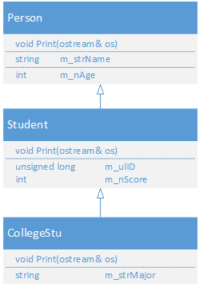
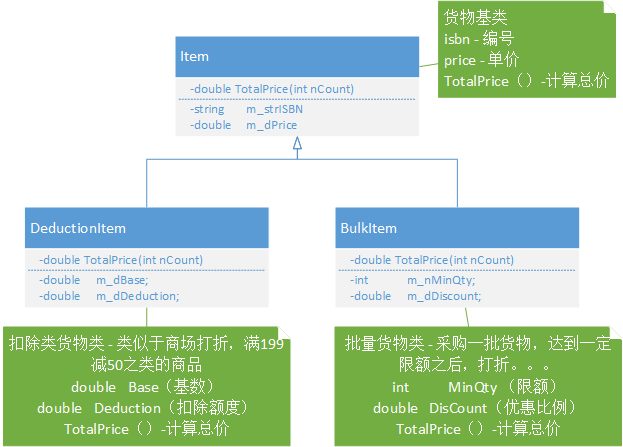
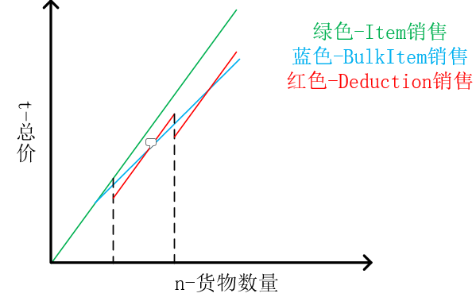

# 实习（六）继承与派生

## 实习目的
- 掌握继承的语法（多重继承、虚继承等）
- 掌握基类和派生类的构造函数
- 理解继承方式的区别
- 掌握基类与派生类的转换
- 理解继承与组合的区别

## 实习题目
### 题目1：实现Person、Student、CollegeStu的继承关系，完成Print功能。

### 题目2：实现Item、BulkItem、DeductionItem的继承关系，实现TotalPrice功能，类图如下所示：

主函数实现功能说明：

- 输入购买商品数量$n$，计算各种购买方式的总价，输出一种最优的购买方式。

**提示**

### 题目3：实现一个虚继承的例子，分析虚继承的目的。

### 题目4：实现一个虚析构函数的示例，理解虚析构函数的作用。
